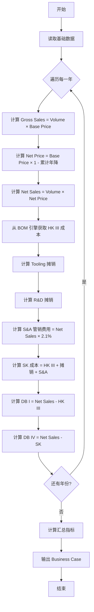

# Business Case 计算逻辑

| 版本号 | 创建时间 | 更新时间 | 文档主题 | 创建人 |
|--------|----------|----------|----------|--------|
| v1.0   | 2026-02-03 | 2026-02-03 | Business Case 计算逻辑 | Randy Luo |

---

## 1. 基础变量定义 (Input Variables)

在开始计算前，系统需要从数据库读取以下基础数据（对应表格头部和 BOM）：

| 变量 | 说明 | 示例值 |
|------|------|--------|
| $Volume_n$ | 第 n 年的销量 | 2026年 = 15,750 |
| $Base\_Price$ | 初始单价 | € 21.76 |
| $Reduction\_Rate_n$ | 第 n 年的年降比例 | 2027年 = -3.0% |
| $Exchange\_Rate$ | 汇率 | 7.83 |
| $Inv_{Tool}$ | 模具一次性投入总额 | € 49,468 |
| $Inv_{R\&D}$ | 研发一次性投入总额 | € 48,079 |

---

## 2. 收入侧逻辑 (Revenue Logic)

对应表格 Business Case 的上半部分：

### 2.1 Gross Sales (未年降销售额)

$$Gross\_Sales_n = Volume_n \times Base\_Price$$

### 2.2 Net Price (年降后单价)

**注意：** 年降通常是累计的（Compound）或基于基价的。表中显示 "Sales reduction total to base price"，通常意味着基于基价计算。

$$Net\_Price_n = Base\_Price \times (1 - \sum_{i=1}^{n} |Reduction\_Rate_i|)$$

> **业务规则确认：** 如果 2027 年降 3%，则价格变为 97%；2028 再降 3%，是基于 97% 降还是基于原价降，需确认业务规则。德系通常按累计复利计算。

### 2.3 Net Sales (净销售额 - 表格核心行)

$$Net\_Sales_n = Volume_n \times Net\_Price_n$$

**图中示例 (2026):** € 342,658

---

## 3. 成本侧逻辑 (Cost Logic - HK vs SK)

这是最容易出错的地方，开发团队必须区分 **HK III** 和 **SK**。

### 3.1 制造成本 (HK III - Herstellkosten III)

对应表格 `Total Costs (HK III)` 行。这是工厂大门的成本。

**计算公式:**

$$HK\_III_n = Volume_n \times (Material\_Cost + Variable\_Process\_Cost + Fixed\_Overhead)$$

**数据来源:** SmartQuote 的 BOM 解析引擎 + 工艺费率库

**图中示例 (2026):** € 316,470

### 3.2 完全成本 (SK - Selbstkosten)

对应表格 `Total Costs (SK)` 行。这是包含了一切分摊后的真实总成本。

**基础计算逻辑:**

$$SK_n = HK\_III_n + Amortization_n (摊销) + S\&A (管销费用)$$

#### Hidden Cost (隐含逻辑)

图中 2026 年数据分析：
- $SK (364,023) - HK\_III (316,470) = 47,553$
- 下方的回收额: $20,369 (Tool) + 19,797 (R\&D) = 40,166$
- **差额:** $47,553 - 40,166 = € 7,387$

**结论:** 这通常是 **S&A (Sales & Administration 销售与管理费)** 或 **Interest (资金利息)**

**开发指令:**

系统必须在后台配置一个 `S&A_Ratio`（如 2%-3%），公式应为：

$$SK_n = HK\_III_n + Recovery_{Tool} + Recovery_{R\&D} + (Net\_Sales_n \times S\&A\_Ratio)$$

**验证:**
$342,658 \times 2.1\% \approx € 7,196 \approx 7,387$ (考虑舍入误差)

---

## 4. 利润分析逻辑 (Margin Logic - DB I vs DB IV)

这是老板看报价单时最关注的两行。

### 4.1 DB I (边际贡献 I - 生产毛利)

衡量工厂生产这个产品赚不赚钱，不考虑研发和模具分摊。

$$DB\_I = Net\_Sales - HK\_III$$

**图中示例 (2026):** $342,658 - 316,470 = 26,188$ (正数，说明生产是赚钱的)

### 4.2 DB IV (净利润 - 最终底线)

衡量整个项目扣除所有投入后赚不赚钱。

$$DB\_IV = Net\_Sales - SK$$

**图中示例 (2026):** $342,658 - 364,023 = -21,365$ (负数)

### 4.3 业务解读

- **2026年亏损:** 因为销量还没爬坡，且前期投入摊销重
- **2028年 DB IV 转正:** 典型的汽车行业"前亏后盈"模型

---

## 5. 投资分摊逻辑 (Investment Amortization)

对应表格中间绿色的 Investment 区域。

### 5.1 Piece Price Calculation (单件摊销额)

$$Piece\_Amort = \frac{Total\_Investment}{Total\_Lifetime\_Volume}$$

### 5.2 摊销验证

**图中逻辑:**
- 模具 € 49,468 / 总销量 56,273 = € 0.88/pc (估算)

**但表格中 2026 年 Recovery Tooling 是 € 20,369:**
- $20,369 \div 15,750 (销量) \approx € 1.29$

**结论:** 客户可能设定了前 3 年摊销完毕，而不是全生命周期摊销。

### 5.3 开发指令

摊销方式需支持两种模式：

| 模式 | 说明 |
|------|------|
| `Per Piece` | 全生命周期平摊 |
| `Fixed Period` | 固定期限摊销（如 SOP 前3年） |

---

## 6. 底部"样件"逻辑 (Sample Logic)

对应表格最底部的 `Sample Raw Material Purchase Budget`。

这行数据**不参与**上面的 DB I / DB IV 计算，是独立的现金流预算。

$$Sample\_Budget = Sample\_Qty \times Sample\_Price$$

> **注意:** Sample Price 通常是 Serial Price 的 3~5 倍

---

## 7. 数据模型定义

### 7.1 BusinessCaseResponse 响应模型

```python
from typing import Literal
from pydantic import BaseModel, Field
from decimal import Decimal

class FinancialYearData(BaseModel):
    """单年度财务数据"""
    year: int
    volume: int
    reduction_rate: Decimal  # 年降比例

    # 收入
    gross_sales: Decimal
    net_sales: Decimal
    net_price: Decimal

    # 成本
    hk_3_cost: Decimal      # 制造成本 HK III
    recovery_tooling: Decimal
    recovery_rnd: Decimal
    overhead_sa: Decimal    # 管销费用
    sk_cost: Decimal        # 完全成本 SK

    # 利润
    db_1: Decimal           # 边际贡献 I
    db_4: Decimal           # 净利润 DB IV

    # 样件（独立预算）
    sample_budget: Decimal | None = None


class AmortizationMode(str):
    """摊销模式"""
    TOTAL_VOLUME = "total_volume_based"  # 全生命周期平摊
    FIXED_3_YEARS = "fixed_3_years"      # 前3年摊销
    FIXED_5_YEARS = "fixed_5_years"      # 前5年摊销


class GlobalParameters(BaseModel):
    """全局参数"""
    tooling_invest: Decimal
    rnd_invest: Decimal
    base_price: Decimal
    exchange_rate: Decimal
    amortization_mode: AmortizationMode
    sa_rate_constant: Decimal = Field(default=Decimal("0.021"), description="管销费用率 ~2.1%")
    sample_price_multiplier: Decimal = Field(default=Decimal("3.0"), description="样件价格倍数")


class BusinessCaseResponse(BaseModel):
    """Business Case 计算响应"""
    project_id: str
    global_parameters: GlobalParameters
    financial_year_data: list[FinancialYearData]

    # 汇总指标
    total_lifetime_volume: int
    total_db_4: Decimal         # 全生命周期净利润
    payback_months: Decimal | None = None  # 投资回收期（月）
    break_even_year: int | None = None     # 盈亏平衡年份
```

### 7.2 JSON 结构示例

```json
{
  "project_id": "PRJ-2026-001",
  "global_parameters": {
    "tooling_invest": 49468.00,
    "rnd_invest": 48079.00,
    "base_price": 21.76,
    "exchange_rate": 7.83,
    "amortization_mode": "total_volume_based",
    "sa_rate_constant": 0.021,
    "sample_price_multiplier": 3.0
  },
  "financial_year_data": [
    {
      "year": 2026,
      "volume": 15750,
      "reduction_rate": 0.0,
      "calculations": {
        "gross_sales": 342658.00,
        "net_sales": 342658.00,
        "net_price": 21.76,
        "hk_3_cost": 316470.00,
        "recovery_tooling": 20369.00,
        "recovery_rnd": 19797.00,
        "overhead_sa": 7196.00,
        "sk_cost": 364023.00,
        "db_1": 26188.00,
        "db_4": -21365.00
      }
    },
    {
      "year": 2027,
      "volume": 18900,
      "reduction_rate": -0.03,
      "calculations": {
        "gross_sales": 411189.00,
        "net_sales": 398853.27,
        "net_price": 21.11,
        "hk_3_cost": 367924.00,
        "recovery_tooling": 24445.00,
        "recovery_rnd": 23781.00,
        "overhead_sa": 8376.00,
        "sk_cost": 424526.00,
        "db_1": 30929.27,
        "db_4": -25672.73
      }
    }
  ],
  "summary": {
    "total_lifetime_volume": 56273,
    "total_db_4": 45680.00,
    "break_even_year": 2028
  }
}
```

---

## 8. 计算流程图



---

## 9. 与 DATABASE_DESIGN.md 的关联

本计算逻辑依赖以下数据表：

| 表名 | 用途 | 相关字段 |
|------|------|---------|
| `projects` | 项目基础数据 | `annual_volume`, `target_margin` |
| `project_products` | 产品数据 | `product_version`, `route_code` |
| `product_materials` | BOM 物料成本 | `std_cost`, `vave_cost` |
| `product_processes` | 工艺成本 | `std_cost`, `vave_cost` |
| `quote_summaries` | 报价汇总 | `total_std_cost`, `total_vave_cost`, `quoted_price` |

**新增建议表（用于存储 Business Case 参数）：**

```sql
-- Business Case 全局参数表
CREATE TABLE business_case_params (
    id CHAR(36) PRIMARY KEY,
    project_id CHAR(36) NOT NULL UNIQUE,
    tooling_invest DECIMAL(14, 4),
    rnd_invest DECIMAL(14, 4),
    base_price DECIMAL(10, 4),
    exchange_rate DECIMAL(8, 4),
    amortization_mode VARCHAR(50),
    sa_rate DECIMAL(5, 4) DEFAULT 0.021,
    FOREIGN KEY (project_id) REFERENCES projects(id)
);

-- Business Case 年度数据表
CREATE TABLE business_case_years (
    id CHAR(36) PRIMARY KEY,
    project_id CHAR(36) NOT NULL,
    year INT NOT NULL,
    volume INT NOT NULL,
    reduction_rate DECIMAL(5, 4),
    net_sales DECIMAL(14, 4),
    hk_3_cost DECIMAL(14, 4),
    sk_cost DECIMAL(14, 4),
    db_1 DECIMAL(14, 4),
    db_4 DECIMAL(14, 4),
    FOREIGN KEY (project_id) REFERENCES projects(id),
    UNIQUE KEY (project_id, year)
);
```

---

**文档结束**
