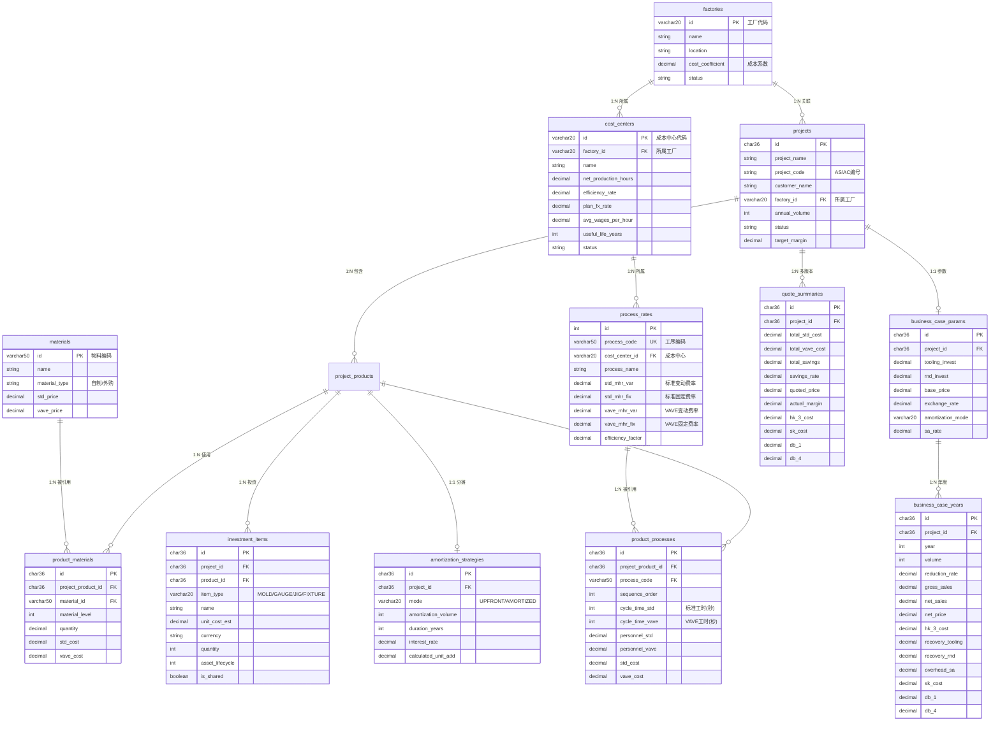

# Dr.aiVOSS 数据库设计文档

| 版本号 | 创建时间 | 更新时间 | 文档主题 | 创建人 |
|--------|----------|----------|----------|--------|
| v1.3   | 2026-02-03 | 2026-02-03 | Dr.aiVOSS 数据库设计 | Randy Luo |

---

## 📋 变更日志 (Changelog)

| 日期 | 版本 | 变更内容 | 影响范围 |
|------|------|---------|---------|
| 2026-02-03 | v1.0 | 初始版本，定义核心表结构 | 全部 |
| 2026-02-03 | v1.2 | 修复前端技术栈描述；更新产品名称 | 全部 |
| 2026-02-03 | v1.3 | 🔴 **破坏性变更**：新增5张表；process_rates 表 MHR 拆分为 var/fix | 全部 |
| 2026-02-04 | v1.4 | 🔴 **破坏性变更**：process_rates 表新增折旧率字段，支持 Payback 现金流计算 | Payback 模块 |
| 2026-02-05 | v1.5 | 🔴 **破坏性变更**：projects 表新增 factory_id；quote_summaries 表新增 version_number；新增 factories 表；新增 std_investment_costs 表 | 多版本报价、工厂管理 |

**变更规范：**
- 任何字段新增/修改/删除必须记录在此
- 影响范围填写：表名 / 模块名
- 破坏性变更使用 🔴 标记

---

## 1. 架构概述 {#architecture}

```
┌─────────────────────────────────────────────────────────────┐
│                      主数据层 (Master Data)                   │
├──────────────┬──────────────┬──────────────────────────────┤
│ materials    │ process_rates│                              │
│ 物料主数据    │ 工序费率主数据│                              │
└──────────────┴──────────────┴──────────────────────────────┘
                              ↓ 引用
┌─────────────────────────────────────────────────────────────┐
│                   交易数据层 (Transaction Data)              │
├──────────────┬──────────────┬──────────────────────────────┤
│ projects     │ project_products │ product_materials        │
│ 项目表        │ 项目-产品关联     │ 产品-物料关联（BOM行）     │
│              ├──────────────┼──────────────────────────────┤
│              │ product_processes │ quote_summaries          │
│              │ 产品工艺路线       │ 报价汇总                   │
└──────────────┴──────────────┴──────────────────────────────┘
```

---

## 2. ER 关系图 {#er-diagram}



---

## 3. 表结构详解 {#table-structure}

### 3.1 主数据表 {#master-data}

#### materials（物料主数据）

| 字段 | 类型 | 约束 | 说明 |
|------|------|------|------|
| id | VARCHAR(50) | PK | 物料编码 |
| name | VARCHAR(200) | NOT NULL | 物料名称 |
| version | VARCHAR(20) | | 版本号 |
| material_type | VARCHAR(20) | | made(自制)/bought(外购) |
| status | VARCHAR(20) | DEFAULT 'active' | active/inactive |
| material | VARCHAR(100) | | 材料描述 |
| supplier | VARCHAR(200) | | 供应商 |
| std_price | DECIMAL(10,4) | | 标准单价 |
| vave_price | DECIMAL(10,4) | | VAVE 单价 |
| remarks | TEXT | | 备注 |
| created_at | DATETIME | DEFAULT NOW() | |
| updated_at | DATETIME | ON UPDATE NOW() | |

#### process_rates（工序费率主数据）- 已扩展

| 字段 | 类型 | 约束 | 说明 |
|------|------|------|------|
| id | INT | PK, AUTO_INCREMENT | |
| process_code | VARCHAR(50) | UNIQUE | 工序编码 |
| **cost_center_id** | **VARCHAR(20)** | **FK** | **🔴 v1.3 新增：关联成本中心** |
| process_name | VARCHAR(100) | NOT NULL | 工序名称 |
| equipment | VARCHAR(100) | | 设备 |
| **std_mhr_var** | DECIMAL(10,2) | | **🔴 v1.3 新增：标准变动费率** |
| **std_mhr_fix** | DECIMAL(10,2) | | **🔴 v1.3 新增：标准固定费率** |
| **std_depreciation_rate** | DECIMAL(8,4) | | **🔴 v1.4 新增：标准折旧率** |
| **vave_mhr_var** | DECIMAL(10,2) | | **🔴 v1.3 新增：VAVE变动费率** |
| **vave_mhr_fix** | DECIMAL(10,2) | | **🔴 v1.3 新增：VAVE固定费率** |
| **vave_depreciation_rate** | DECIMAL(8,4) | | **🔴 v1.4 新增：VAVE折旧率** |
| efficiency_factor | DECIMAL(4,2) | DEFAULT 1.0 | 效率系数 |
| remarks | TEXT | | 备注 |
| created_at | DATETIME | DEFAULT NOW() | |
| updated_at | DATETIME | ON UPDATE NOW() | |

> **兼容性说明：**
> - `std_mhr_var + std_mhr_fix` 等同于原 `std_mhr`，前端可通过计算显示"总费率"
> - **v1.4 折旧说明**：MHR_fix 包含折旧、利息、租金、保险；depreciation_rate 单独存储，用于 Payback 现金流计算（现金流 = 净利 + 折旧）

### 3.2 交易数据表 {#transaction-data}

#### projects（项目表）

| 字段 | 类型 | 约束 | 说明 |
|------|------|------|------|
| id | CHAR(36) | PK | UUID |
| project_name | VARCHAR(200) | NOT NULL | 项目名称 |
| project_code | VARCHAR(50) | | AS/AC 编号 |
| customer_name | VARCHAR(200) | NOT NULL | 客户名称 |
| customer_code | VARCHAR(50) | | 客户编号 |
| annual_volume | INT | | 年量 |
| status | VARCHAR(20) | NOT NULL | 状态值 |
| owner | VARCHAR(50) | | 负责人 |
| remarks | TEXT | | 备注 |
| target_margin | DECIMAL(5,2) | | 目标利润率(%) |
| created_at | DATETIME | DEFAULT NOW() | |
| updated_at | DATETIME | ON UPDATE NOW() | |

**状态值流转:**
```
draft → parsing → (waiting_price | waiting_ie) → (waiting_mhr) →
calculated → sales_review → controlling_review → approved
```

#### project_products（项目-产品关联）

| 字段 | 类型 | 约束 | 说明 |
|------|------|------|------|
| id | CHAR(36) | PK | UUID |
| project_id | CHAR(36) | FK, NOT NULL | 关联项目 |
| product_name | VARCHAR(200) | NOT NULL | 产品名称 |
| product_code | VARCHAR(50) | | 产品编号 |
| product_version | VARCHAR(20) | | 产品版本 |
| route_code | VARCHAR(50) | | 工艺路线编码 |
| bom_file_path | VARCHAR(500) | | BOM 文件路径 |
| created_at | DATETIME | DEFAULT NOW() | |

#### product_materials（BOM 行项目）

| 字段 | 类型 | 约束 | 说明 |
|------|------|------|------|
| id | CHAR(36) | PK | UUID |
| project_product_id | CHAR(36) | FK, NOT NULL | 关联产品 |
| material_id | VARCHAR(50) | FK | 关联物料（可为空） |
| material_level | INT | | 物料层级 |
| material_name | VARCHAR(200) | | 物料名称（快照） |
| material_type | VARCHAR(20) | | made/bought |
| quantity | DECIMAL(10,3) | | 数量 |
| unit | VARCHAR(10) | | 单位 |
| std_cost | DECIMAL(12,4) | | 标准成本 |
| vave_cost | DECIMAL(12,4) | | VAVE 成本 |
| confidence | DECIMAL(5,2) | | 匹配置信度 0-100 |
| ai_suggestion | TEXT | | AI 建议 |
| remarks | TEXT | | 备注（BOM Comments） |
| created_at | DATETIME | DEFAULT NOW() | |

#### product_processes（产品工艺路线）- 已扩展

| 字段 | 类型 | 约束 | 说明 |
|------|------|------|------|
| id | CHAR(36) | PK | UUID |
| project_product_id | CHAR(36) | FK, NOT NULL | 关联产品 |
| process_code | VARCHAR(50) | FK, NOT NULL | 工序编码 |
| sequence_order | INT | NOT NULL | 工序顺序 |
| **cycle_time_std** | INT | | **🔴 新增：标准工时（秒）** |
| **cycle_time_vave** | INT | | **🔴 新增：VAVE 工时（秒）** |
| **personnel_std** | DECIMAL(4,2) | DEFAULT 1.0 | **🔴 新增：标准人工配置（人/机）** |
| **personnel_vave** | DECIMAL(4,2) | | **🔴 新增：VAVE 人工配置** |
| std_mhr | DECIMAL(10,2) | | MHR 快照（保留兼容） |
| vave_mhr | DECIMAL(10,2) | | MHR 快照（保留兼容） |
| std_cost | DECIMAL(12,4) | | 标准成本 |
| vave_cost | DECIMAL(12,4) | | VAVE 成本 |
| remarks | TEXT | | 备注 |
| created_at | DATETIME | DEFAULT NOW() | |

**扩展成本计算公式:**
```
std_cost = (cycle_time_std / 3600) × (std_mhr_var + std_mhr_fix + personnel_std × labor_rate)
vave_cost = (cycle_time_vave / 3600) × (vave_mhr_var + vave_mhr_fix + personnel_vave × labor_rate)
```

#### quote_summaries（报价汇总）

| 字段 | 类型 | 约束 | 说明 |
|------|------|------|------|
| id | CHAR(36) | PK | UUID |
| project_id | CHAR(36) | FK, NOT NULL | 关联项目 |
| total_std_cost | DECIMAL(14,4) | | 总标准成本 |
| total_vave_cost | DECIMAL(14,4) | | 总 VAVE 成本 |
| total_savings | DECIMAL(14,4) | | 节省金额 |
| savings_rate | DECIMAL(5,2) | | 节省率(%) |
| quoted_price | DECIMAL(14,4) | | 报价 |
| actual_margin | DECIMAL(5,2) | | 实际利润率(%) |
| **hk_3_cost** | DECIMAL(14,4) | | **🔴 新增：HK III 制造成本** |
| **sk_cost** | DECIMAL(14,4) | | **🔴 新增：SK 完全成本** |
| **db_1** | DECIMAL(14,4) | | **🔴 新增：DB I 边际贡献 I** |
| **db_4** | DECIMAL(14,4) | | **🔴 新增：DB IV 净利润** |
| created_at | DATETIME | DEFAULT NOW() | |
| updated_at | DATETIME | ON UPDATE NOW() | |

---

### 3.3 主数据扩展表 {#master-data-extension}

#### cost_centers（成本中心主数据）🔴 新增

| 字段 | 类型 | 约束 | 说明 |
|------|------|------|------|
| id | VARCHAR(20) | PK | 成本中心代码 |
| name | VARCHAR(100) | NOT NULL | 成本中心名称 |
| net_production_hours | DECIMAL(8,2) | | 年度额定生产小时数 |
| efficiency_rate | DECIMAL(5,4) | | 稼动率 0-1 |
| plan_fx_rate | DECIMAL(10,6) | | 计划汇率 |
| avg_wages_per_hour | DECIMAL(10,2) | | 平均时薪 |
| useful_life_years | INT | DEFAULT 8 | 折旧年限 |
| status | VARCHAR(20) | DEFAULT 'ACTIVE' | ACTIVE/INACTIVE |
| created_at | DATETIME | DEFAULT NOW() | |
| updated_at | DATETIME | ON UPDATE NOW() | |

---

### 3.4 NRE 投资相关表 {#nre-tables}

#### investment_items（投资项明细）🔴 新增

| 字段 | 类型 | 约束 | 说明 |
|------|------|------|------|
| id | CHAR(36) | PK | UUID |
| project_id | CHAR(36) | FK, NOT NULL | 关联项目 |
| product_id | CHAR(36) | FK | 关联产品 |
| item_type | VARCHAR(20) | | MOLD/GAUGE/JIG/FIXTURE |
| name | VARCHAR(200) | | 投资项名称 |
| unit_cost_est | DECIMAL(12,2) | | 预估单价 |
| currency | VARCHAR(10) | DEFAULT 'CNY' | 币种 |
| quantity | INT | DEFAULT 1 | 数量 |
| asset_lifecycle | INT | | 设计寿命(模次) |
| is_shared | BOOLEAN | DEFAULT FALSE | 是否共享资产 |
| shared_source_id | CHAR(36) | | 共享源 ID |
| status | VARCHAR(20) | DEFAULT 'DRAFT' | DRAFT/CONFIRMED |
| created_at | DATETIME | DEFAULT NOW() | |
| updated_at | DATETIME | ON UPDATE NOW() | |

#### amortization_strategies（分摊策略）🔴 新增

| 字段 | 类型 | 约束 | 说明 |
|------|------|------|------|
| id | CHAR(36) | PK | UUID |
| project_id | CHAR(36) | FK, NOT NULL, UNIQUE | 关联项目 |
| mode | VARCHAR(20) | | UPFRONT/AMORTIZED |
| amortization_volume | INT | | 分摊基数销量 |
| duration_years | INT | DEFAULT 2 | 分摊年限 |
| interest_rate | DECIMAL(5,4) | DEFAULT 0.0600 | 年利率 |
| calculated_unit_add | DECIMAL(10,4) | | 单件分摊额(计算结果) |
| created_at | DATETIME | DEFAULT NOW() | |
| updated_at | DATETIME | ON UPDATE NOW() | |

---

### 3.5 Business Case 相关表 {#business-case-tables}

#### business_case_params（Business Case 参数）🔴 新增

| 字段 | 类型 | 约束 | 说明 |
|------|------|------|------|
| id | CHAR(36) | PK | UUID |
| project_id | CHAR(36) | FK, NOT NULL, UNIQUE | 关联项目 |
| tooling_invest | DECIMAL(14,4) | | 模具投入总额 |
| rnd_invest | DECIMAL(14,4) | | 研发投入总额 |
| base_price | DECIMAL(10,4) | | 基础单价 |
| exchange_rate | DECIMAL(8,4) | | 汇率 |
| amortization_mode | VARCHAR(50) | | total_volume_based/fixed_3_years |
| sa_rate | DECIMAL(5,4) | DEFAULT 0.0210 | 管销费用率 ~2.1% |
| created_at | DATETIME | DEFAULT NOW() | |
| updated_at | DATETIME | ON UPDATE NOW() | |

#### business_case_years（Business Case 年度数据）🔴 新增

| 字段 | 类型 | 约束 | 说明 |
|------|------|------|------|
| id | CHAR(36) | PK | UUID |
| project_id | CHAR(36) | FK, NOT NULL | 关联项目 |
| year | INT | NOT NULL | 年份 |
| volume | INT | NOT NULL | 销量 |
| reduction_rate | DECIMAL(5,4) | | 年降比例 |
| gross_sales | DECIMAL(14,4) | | 毛销售额 |
| net_sales | DECIMAL(14,4) | | 净销售额 |
| net_price | DECIMAL(10,4) | | 净单价 |
| hk_3_cost | DECIMAL(14,4) | | HK III 制造成本 |
| recovery_tooling | DECIMAL(14,4) | | 模具摊销 |
| recovery_rnd | DECIMAL(14,4) | | 研发摊销 |
| overhead_sa | DECIMAL(14,4) | | S&A 管销费用 |
| sk_cost | DECIMAL(14,4) | | SK 完全成本 |
| db_1 | DECIMAL(14,4) | | DB I 边际贡献 I |
| db_4 | DECIMAL(14,4) | | DB IV 净利润 |
| created_at | DATETIME | DEFAULT NOW() | |
| updated_at | DATETIME | ON UPDATE NOW() | |

**唯一索引:** UNIQUE KEY (project_id, year)

---

## 4. 索引设计 {#indexes}

```sql
-- projects
CREATE INDEX idx_projects_status ON projects(status);
CREATE INDEX idx_projects_customer ON projects(customer_code);
CREATE INDEX idx_projects_code ON projects(project_code);
CREATE INDEX idx_projects_created ON projects(created_at DESC);

-- project_products
CREATE INDEX idx_pp_project ON project_products(project_id);

-- materials
CREATE INDEX idx_materials_type ON materials(material_type);
CREATE INDEX idx_materials_status ON materials(status);

-- product_materials
CREATE INDEX idx_pm_product ON product_materials(project_product_id);
CREATE INDEX idx_pm_material ON product_materials(material_id);

-- product_processes
CREATE INDEX idx_pproc_product ON product_processes(project_product_id);
CREATE INDEX idx_pproc_sequence ON product_processes(project_product_id, sequence_order);

-- quote_summaries
CREATE INDEX idx_qs_project ON quote_summaries(project_id);

-- cost_centers (新增)
CREATE INDEX idx_cc_status ON cost_centers(status);

-- investment_items (新增)
CREATE INDEX idx_inv_project ON investment_items(project_id);
CREATE INDEX idx_inv_product ON investment_items(product_id);
CREATE INDEX idx_inv_type ON investment_items(item_type);
CREATE INDEX idx_inv_shared ON investment_items(is_shared, shared_source_id);

-- amortization_strategies (新增)
CREATE INDEX idx_amort_project ON amortization_strategies(project_id);

-- business_case_params (新增)
CREATE INDEX idx_bcp_project ON business_case_params(project_id);

-- business_case_years (新增)
CREATE INDEX idx_bcy_project ON business_case_years(project_id);
CREATE INDEX idx_bcy_year ON business_case_years(year);
```

---

## 5. 设计原则 {#principles}

| 原则 | 实现方式 |
|------|----------|
| **KISS** | 主数据与交易数据分离，结构清晰 |
| **DRY** | 物料和工序作为主数据共享，避免重复 |
| **YAGNI** | 只保留 MVP 必需字段 |
| **可扩展** | 预留 remarks 字段，状态值可扩展 |
| **数据完整性** | 使用外键约束，CASCADE 删除 |
| **审计追踪** | 所有表包含 created_at/updated_at |

---

**文档结束**
