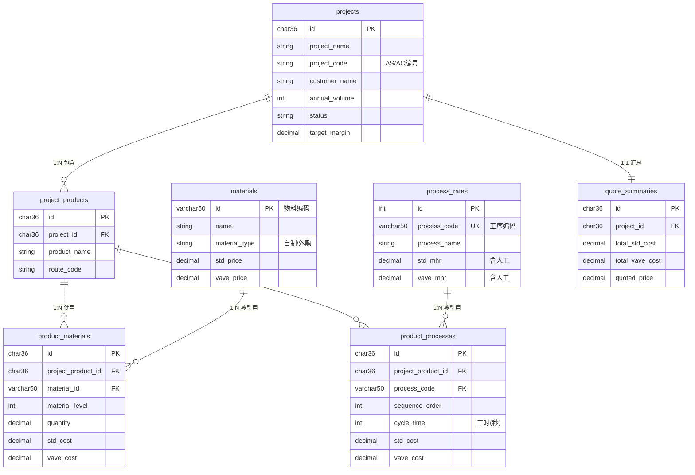

# SmartQuote 数据库设计文档

| 版本号 | 创建时间 | 更新时间 | 文档主题 | 创建人 |
|--------|----------|----------|----------|--------|
| v1.0   | 2026-02-03 | 2026-02-03 | SmartQuote 数据库设计 | Randy Luo |

---

## 1. 架构概述

```
┌─────────────────────────────────────────────────────────────┐
│                      主数据层 (Master Data)                   │
├──────────────┬──────────────┬──────────────────────────────┤
│ materials    │ process_rates│                              │
│ 物料主数据    │ 工序费率主数据│                              │
└──────────────┴──────────────┴──────────────────────────────┘
                              ↓ 引用
┌─────────────────────────────────────────────────────────────┐
│                   交易数据层 (Transaction Data)              │
├──────────────┬──────────────┬──────────────────────────────┤
│ projects     │ project_products │ product_materials        │
│ 项目表        │ 项目-产品关联     │ 产品-物料关联（BOM行）     │
│              ├──────────────┼──────────────────────────────┤
│              │ product_processes │ quote_summaries          │
│              │ 产品工艺路线       │ 报价汇总                   │
└──────────────┴──────────────┴──────────────────────────────┘
```

---

## 2. ER 关系图



---

## 3. 表结构详解

### 3.1 主数据表

#### materials（物料主数据）

| 字段 | 类型 | 约束 | 说明 |
|------|------|------|------|
| id | VARCHAR(50) | PK | 物料编码 |
| name | VARCHAR(200) | NOT NULL | 物料名称 |
| version | VARCHAR(20) | | 版本号 |
| material_type | VARCHAR(20) | | made(自制)/bought(外购) |
| status | VARCHAR(20) | DEFAULT 'active' | active/inactive |
| material | VARCHAR(100) | | 材料描述 |
| supplier | VARCHAR(200) | | 供应商 |
| std_price | DECIMAL(10,4) | | 标准单价 |
| vave_price | DECIMAL(10,4) | | VAVE 单价 |
| remarks | TEXT | | 备注 |
| created_at | DATETIME | DEFAULT NOW() | |
| updated_at | DATETIME | ON UPDATE NOW() | |

#### process_rates（工序费率主数据）

| 字段 | 类型 | 约束 | 说明 |
|------|------|------|------|
| id | INT | PK, AUTO_INCREMENT | |
| process_code | VARCHAR(50) | UNIQUE | 工序编码 |
| process_name | VARCHAR(100) | NOT NULL | 工序名称 |
| equipment | VARCHAR(100) | | 设备 |
| std_mhr | DECIMAL(10,2) | | 标准 MHR（含人工） |
| vave_mhr | DECIMAL(10,2) | | VAVE MHR（含人工） |
| efficiency_factor | DECIMAL(4,2) | DEFAULT 1.0 | 效率系数 |
| remarks | TEXT | | 备注 |
| created_at | DATETIME | DEFAULT NOW() | |
| updated_at | DATETIME | ON UPDATE NOW() | |

### 3.2 交易数据表

#### projects（项目表）

| 字段 | 类型 | 约束 | 说明 |
|------|------|------|------|
| id | CHAR(36) | PK | UUID |
| project_name | VARCHAR(200) | NOT NULL | 项目名称 |
| project_code | VARCHAR(50) | | AS/AC 编号 |
| customer_name | VARCHAR(200) | NOT NULL | 客户名称 |
| customer_code | VARCHAR(50) | | 客户编号 |
| annual_volume | INT | | 年量 |
| status | VARCHAR(20) | NOT NULL | 状态值 |
| owner | VARCHAR(50) | | 负责人 |
| remarks | TEXT | | 备注 |
| target_margin | DECIMAL(5,2) | | 目标利润率(%) |
| created_at | DATETIME | DEFAULT NOW() | |
| updated_at | DATETIME | ON UPDATE NOW() | |

**状态值流转:**
```
draft → parsing → (waiting_price | waiting_ie) → (waiting_mhr) →
calculated → sales_review → controlling_review → approved
```

#### project_products（项目-产品关联）

| 字段 | 类型 | 约束 | 说明 |
|------|------|------|------|
| id | CHAR(36) | PK | UUID |
| project_id | CHAR(36) | FK, NOT NULL | 关联项目 |
| product_name | VARCHAR(200) | NOT NULL | 产品名称 |
| product_code | VARCHAR(50) | | 产品编号 |
| product_version | VARCHAR(20) | | 产品版本 |
| route_code | VARCHAR(50) | | 工艺路线编码 |
| bom_file_path | VARCHAR(500) | | BOM 文件路径 |
| created_at | DATETIME | DEFAULT NOW() | |

#### product_materials（BOM 行项目）

| 字段 | 类型 | 约束 | 说明 |
|------|------|------|------|
| id | CHAR(36) | PK | UUID |
| project_product_id | CHAR(36) | FK, NOT NULL | 关联产品 |
| material_id | VARCHAR(50) | FK | 关联物料（可为空） |
| material_level | INT | | 物料层级 |
| material_name | VARCHAR(200) | | 物料名称（快照） |
| material_type | VARCHAR(20) | | made/bought |
| quantity | DECIMAL(10,3) | | 数量 |
| unit | VARCHAR(10) | | 单位 |
| std_cost | DECIMAL(12,4) | | 标准成本 |
| vave_cost | DECIMAL(12,4) | | VAVE 成本 |
| confidence | DECIMAL(5,2) | | 匹配置信度 0-100 |
| ai_suggestion | TEXT | | AI 建议 |
| remarks | TEXT | | 备注（BOM Comments） |
| created_at | DATETIME | DEFAULT NOW() | |

#### product_processes（产品工艺路线）

| 字段 | 类型 | 约束 | 说明 |
|------|------|------|------|
| id | CHAR(36) | PK | UUID |
| project_product_id | CHAR(36) | FK, NOT NULL | 关联产品 |
| process_code | VARCHAR(50) | FK, NOT NULL | 工序编码 |
| sequence_order | INT | NOT NULL | 工序顺序 |
| cycle_time | INT | | 工时（秒） |
| std_mhr | DECIMAL(10,2) | | MHR 快照 |
| vave_mhr | DECIMAL(10,2) | | MHR 快照 |
| std_cost | DECIMAL(12,4) | | = cycle_time/3600 * std_mhr |
| vave_cost | DECIMAL(12,4) | | VAVE 成本 |
| remarks | TEXT | | 备注 |
| created_at | DATETIME | DEFAULT NOW() | |

**成本计算公式:**
```
std_cost = cycle_time / 3600 * std_mhr
vave_cost = cycle_time / 3600 * vave_mhr
```

#### quote_summaries（报价汇总）

| 字段 | 类型 | 约束 | 说明 |
|------|------|------|------|
| id | CHAR(36) | PK | UUID |
| project_id | CHAR(36) | FK, NOT NULL | 关联项目 |
| total_std_cost | DECIMAL(14,4) | | 总标准成本 |
| total_vave_cost | DECIMAL(14,4) | | 总 VAVE 成本 |
| total_savings | DECIMAL(14,4) | | 节省金额 |
| savings_rate | DECIMAL(5,2) | | 节省率(%) |
| quoted_price | DECIMAL(14,4) | | 报价 |
| actual_margin | DECIMAL(5,2) | | 实际利润率(%) |
| created_at | DATETIME | DEFAULT NOW() | |
| updated_at | DATETIME | ON UPDATE NOW() | |

---

## 4. 索引设计

```sql
-- projects
CREATE INDEX idx_projects_status ON projects(status);
CREATE INDEX idx_projects_customer ON projects(customer_code);
CREATE INDEX idx_projects_code ON projects(project_code);
CREATE INDEX idx_projects_created ON projects(created_at DESC);

-- project_products
CREATE INDEX idx_pp_project ON project_products(project_id);

-- materials
CREATE INDEX idx_materials_type ON materials(material_type);
CREATE INDEX idx_materials_status ON materials(status);

-- product_materials
CREATE INDEX idx_pm_product ON product_materials(project_product_id);
CREATE INDEX idx_pm_material ON product_materials(material_id);

-- product_processes
CREATE INDEX idx_pproc_product ON product_processes(project_product_id);
CREATE INDEX idx_pproc_sequence ON product_processes(project_product_id, sequence_order);

-- quote_summaries
CREATE INDEX idx_qs_project ON quote_summaries(project_id);
```

---

## 5. 设计原则

| 原则 | 实现方式 |
|------|----------|
| **KISS** | 主数据与交易数据分离，结构清晰 |
| **DRY** | 物料和工序作为主数据共享，避免重复 |
| **YAGNI** | 只保留 MVP 必需字段 |
| **可扩展** | 预留 remarks 字段，状态值可扩展 |
| **数据完整性** | 使用外键约束，CASCADE 删除 |
| **审计追踪** | 所有表包含 created_at/updated_at |

---

**文档结束**
