# Dr.aiVOSS 数据库设计文档

| 版本号 | 创建时间 | 更新时间 | 文档主题 | 创建人 |
|--------|----------|----------|----------|--------|
| v1.3   | 2026-02-03 | 2026-02-03 | Dr.aiVOSS 数据库设计 | Randy Luo |

---

## 📋 变更日志 (Changelog)

| 日期 | 版本 | 变更内容 | 影响范围 |
|------|------|---------|---------|
| 2026-02-03 | v1.0 | 初始版本，定义核心表结构 | 全部 |
| 2026-02-03 | v1.2 | 修复前端技术栈描述；更新产品名称 | 全部 |
| 2026-02-03 | v1.3 | 🔴 **破坏性变更**：新增5张表；process_rates 表 MHR 拆分为 var/fix | 全部 |

**变更规范：**
- 任何字段新增/修改/删除必须记录在此
- 影响范围填写：表名 / 模块名
- 破坏性变更使用 🔴 标记

---

## 1. 架构概述 {#architecture}

```
┌─────────────────────────────────────────────────────────────┐
│                      主数据层 (Master Data)                   │
├──────────────┬──────────────┬──────────────────────────────┤
│ materials    │ process_rates│                              │
│ 物料主数据    │ 工序费率主数据│                              │
└──────────────┴──────────────┴──────────────────────────────┘
                              ↓ 引用
┌─────────────────────────────────────────────────────────────┐
│                   交易数据层 (Transaction Data)              │
├──────────────┬──────────────┬──────────────────────────────┤
│ projects     │ project_products │ product_materials        │
│ 项目表        │ 项目-产品关联     │ 产品-物料关联（BOM行）     │
│              ├──────────────┼──────────────────────────────┤
│              │ product_processes │ quote_summaries          │
│              │ 产品工艺路线       │ 报价汇总                   │
└──────────────┴──────────────┴──────────────────────────────┘
```

---

## 2. ER 关系图 {#er-diagram}

```mermaid
erDiagram
    projects ||--o{ project_products : "1:N 包含"
    project_products ||--o{ product_materials : "1:N 使用"
    project_products ||--o{ product_processes : "1:N 工艺路线"
    project_products ||--o{ investment_items : "1:N 投资"
    project_products ||--o| amortization_strategies : "1:1 分摊"

    materials ||--o{ product_materials : "1:N 被引用"
    cost_centers ||--o{ process_rates : "1:N 所属"
    process_rates ||--o{ product_processes : "1:N 被引用"

    projects ||--|| quote_summaries : "1:1 汇总"
    projects ||--o| business_case_params : "1:1 参数"
    business_case_params ||--o{ business_case_years : "1:N 年度"

    projects {
        char36 id PK
        string project_name
        string project_code "AS/AC编号"
        string customer_name
        int annual_volume
        string status
        decimal target_margin
    }

    cost_centers {
        varchar20 id PK "成本中心代码"
        string name
        decimal net_production_hours
        decimal efficiency_rate
        decimal plan_fx_rate
        decimal avg_wages_per_hour
        int useful_life_years
        string status
    }

    materials {
        varchar50 id PK "物料编码"
        string name
        string material_type "自制/外购"
        decimal std_price
        decimal vave_price
    }

    product_materials {
        char36 id PK
        char36 project_product_id FK
        varchar50 material_id FK
        int material_level
        decimal quantity
        decimal std_cost
        decimal vave_cost
    }

    process_rates {
        int id PK
        varchar50 process_code UK "工序编码"
        varchar20 cost_center_id FK "成本中心"
        string process_name
        decimal std_mhr_var "标准变动费率"
        decimal std_mhr_fix "标准固定费率"
        decimal vave_mhr_var "VAVE变动费率"
        decimal vave_mhr_fix "VAVE固定费率"
        decimal efficiency_factor
    }

    product_processes {
        char36 id PK
        char36 project_product_id FK
        varchar50 process_code FK
        int sequence_order
        int cycle_time_std "标准工时(秒)"
        int cycle_time_vave "VAVE工时(秒)"
        decimal personnel_std
        decimal personnel_vave
        decimal std_cost
        decimal vave_cost
    }

    investment_items {
        char36 id PK
        char36 project_id FK
        char36 product_id FK
        varchar20 item_type "MOLD/GAUGE/JIG/FIXTURE"
        string name
        decimal unit_cost_est
        string currency
        int quantity
        int asset_lifecycle
        boolean is_shared
    }

    amortization_strategies {
        char36 id PK
        char36 project_id FK
        varchar20 mode "UPFRONT/AMORTIZED"
        int amortization_volume
        int duration_years
        decimal interest_rate
        decimal calculated_unit_add
    }

    quote_summaries {
        char36 id PK
        char36 project_id FK
        decimal total_std_cost
        decimal total_vave_cost
        decimal total_savings
        decimal savings_rate
        decimal quoted_price
        decimal actual_margin
        decimal hk_3_cost
        decimal sk_cost
        decimal db_1
        decimal db_4
    }

    business_case_params {
        char36 id PK
        char36 project_id FK
        decimal tooling_invest
        decimal rnd_invest
        decimal base_price
        decimal exchange_rate
        varchar20 amortization_mode
        decimal sa_rate
    }

    business_case_years {
        char36 id PK
        char36 project_id FK
        int year
        int volume
        decimal reduction_rate
        decimal gross_sales
        decimal net_sales
        decimal net_price
        decimal hk_3_cost
        decimal recovery_tooling
        decimal recovery_rnd
        decimal overhead_sa
        decimal sk_cost
        decimal db_1
        decimal db_4
    }
```



---

## 3. 表结构详解 {#table-structure}

### 3.1 主数据表 {#master-data}

#### materials（物料主数据）

| 字段 | 类型 | 约束 | 说明 |
|------|------|------|------|
| id | VARCHAR(50) | PK | 物料编码 |
| name | VARCHAR(200) | NOT NULL | 物料名称 |
| version | VARCHAR(20) | | 版本号 |
| material_type | VARCHAR(20) | | made(自制)/bought(外购) |
| status | VARCHAR(20) | DEFAULT 'active' | active/inactive |
| material | VARCHAR(100) | | 材料描述 |
| supplier | VARCHAR(200) | | 供应商 |
| std_price | DECIMAL(10,4) | | 标准单价 |
| vave_price | DECIMAL(10,4) | | VAVE 单价 |
| remarks | TEXT | | 备注 |
| created_at | DATETIME | DEFAULT NOW() | |
| updated_at | DATETIME | ON UPDATE NOW() | |

#### process_rates（工序费率主数据）- 已扩展

| 字段 | 类型 | 约束 | 说明 |
|------|------|------|------|
| id | INT | PK, AUTO_INCREMENT | |
| process_code | VARCHAR(50) | UNIQUE | 工序编码 |
| **cost_center_id** | **VARCHAR(20)** | **FK** | **🔴 新增：关联成本中心** |
| process_name | VARCHAR(100) | NOT NULL | 工序名称 |
| equipment | VARCHAR(100) | | 设备 |
| **std_mhr_var** | DECIMAL(10,2) | | **🔴 新增：标准变动费率** |
| **std_mhr_fix** | DECIMAL(10,2) | | **🔴 新增：标准固定费率** |
| **vave_mhr_var** | DECIMAL(10,2) | | **🔴 新增：VAVE变动费率** |
| **vave_mhr_fix** | DECIMAL(10,2) | | **🔴 新增：VAVE固定费率** |
| efficiency_factor | DECIMAL(4,2) | DEFAULT 1.0 | 效率系数 |
| remarks | TEXT | | 备注 |
| created_at | DATETIME | DEFAULT NOW() | |
| updated_at | DATETIME | ON UPDATE NOW() | |

> **兼容性说明：** `std_mhr_var + std_mhr_fix` 等同于原 `std_mhr`，前端可通过计算显示"总费率"

### 3.2 交易数据表 {#transaction-data}

#### projects（项目表）

| 字段 | 类型 | 约束 | 说明 |
|------|------|------|------|
| id | CHAR(36) | PK | UUID |
| project_name | VARCHAR(200) | NOT NULL | 项目名称 |
| project_code | VARCHAR(50) | | AS/AC 编号 |
| customer_name | VARCHAR(200) | NOT NULL | 客户名称 |
| customer_code | VARCHAR(50) | | 客户编号 |
| annual_volume | INT | | 年量 |
| status | VARCHAR(20) | NOT NULL | 状态值 |
| owner | VARCHAR(50) | | 负责人 |
| remarks | TEXT | | 备注 |
| target_margin | DECIMAL(5,2) | | 目标利润率(%) |
| created_at | DATETIME | DEFAULT NOW() | |
| updated_at | DATETIME | ON UPDATE NOW() | |

**状态值流转:**
```
draft → parsing → (waiting_price | waiting_ie) → (waiting_mhr) →
calculated → sales_review → controlling_review → approved
```

#### project_products（项目-产品关联）

| 字段 | 类型 | 约束 | 说明 |
|------|------|------|------|
| id | CHAR(36) | PK | UUID |
| project_id | CHAR(36) | FK, NOT NULL | 关联项目 |
| product_name | VARCHAR(200) | NOT NULL | 产品名称 |
| product_code | VARCHAR(50) | | 产品编号 |
| product_version | VARCHAR(20) | | 产品版本 |
| route_code | VARCHAR(50) | | 工艺路线编码 |
| bom_file_path | VARCHAR(500) | | BOM 文件路径 |
| created_at | DATETIME | DEFAULT NOW() | |

#### product_materials（BOM 行项目）

| 字段 | 类型 | 约束 | 说明 |
|------|------|------|------|
| id | CHAR(36) | PK | UUID |
| project_product_id | CHAR(36) | FK, NOT NULL | 关联产品 |
| material_id | VARCHAR(50) | FK | 关联物料（可为空） |
| material_level | INT | | 物料层级 |
| material_name | VARCHAR(200) | | 物料名称（快照） |
| material_type | VARCHAR(20) | | made/bought |
| quantity | DECIMAL(10,3) | | 数量 |
| unit | VARCHAR(10) | | 单位 |
| std_cost | DECIMAL(12,4) | | 标准成本 |
| vave_cost | DECIMAL(12,4) | | VAVE 成本 |
| confidence | DECIMAL(5,2) | | 匹配置信度 0-100 |
| ai_suggestion | TEXT | | AI 建议 |
| remarks | TEXT | | 备注（BOM Comments） |
| created_at | DATETIME | DEFAULT NOW() | |

#### product_processes（产品工艺路线）- 已扩展

| 字段 | 类型 | 约束 | 说明 |
|------|------|------|------|
| id | CHAR(36) | PK | UUID |
| project_product_id | CHAR(36) | FK, NOT NULL | 关联产品 |
| process_code | VARCHAR(50) | FK, NOT NULL | 工序编码 |
| sequence_order | INT | NOT NULL | 工序顺序 |
| **cycle_time_std** | INT | | **🔴 新增：标准工时（秒）** |
| **cycle_time_vave** | INT | | **🔴 新增：VAVE 工时（秒）** |
| **personnel_std** | DECIMAL(4,2) | DEFAULT 1.0 | **🔴 新增：标准人工配置（人/机）** |
| **personnel_vave** | DECIMAL(4,2) | | **🔴 新增：VAVE 人工配置** |
| std_mhr | DECIMAL(10,2) | | MHR 快照（保留兼容） |
| vave_mhr | DECIMAL(10,2) | | MHR 快照（保留兼容） |
| std_cost | DECIMAL(12,4) | | 标准成本 |
| vave_cost | DECIMAL(12,4) | | VAVE 成本 |
| remarks | TEXT | | 备注 |
| created_at | DATETIME | DEFAULT NOW() | |

**扩展成本计算公式:**
```
std_cost = (cycle_time_std / 3600) × (std_mhr_var + std_mhr_fix + personnel_std × labor_rate)
vave_cost = (cycle_time_vave / 3600) × (vave_mhr_var + vave_mhr_fix + personnel_vave × labor_rate)
```

#### quote_summaries（报价汇总）

| 字段 | 类型 | 约束 | 说明 |
|------|------|------|------|
| id | CHAR(36) | PK | UUID |
| project_id | CHAR(36) | FK, NOT NULL | 关联项目 |
| total_std_cost | DECIMAL(14,4) | | 总标准成本 |
| total_vave_cost | DECIMAL(14,4) | | 总 VAVE 成本 |
| total_savings | DECIMAL(14,4) | | 节省金额 |
| savings_rate | DECIMAL(5,2) | | 节省率(%) |
| quoted_price | DECIMAL(14,4) | | 报价 |
| actual_margin | DECIMAL(5,2) | | 实际利润率(%) |
| created_at | DATETIME | DEFAULT NOW() | |
| updated_at | DATETIME | ON UPDATE NOW() | |

---

## 4. 索引设计 {#indexes}

```sql
-- projects
CREATE INDEX idx_projects_status ON projects(status);
CREATE INDEX idx_projects_customer ON projects(customer_code);
CREATE INDEX idx_projects_code ON projects(project_code);
CREATE INDEX idx_projects_created ON projects(created_at DESC);

-- project_products
CREATE INDEX idx_pp_project ON project_products(project_id);

-- materials
CREATE INDEX idx_materials_type ON materials(material_type);
CREATE INDEX idx_materials_status ON materials(status);

-- product_materials
CREATE INDEX idx_pm_product ON product_materials(project_product_id);
CREATE INDEX idx_pm_material ON product_materials(material_id);

-- product_processes
CREATE INDEX idx_pproc_product ON product_processes(project_product_id);
CREATE INDEX idx_pproc_sequence ON product_processes(project_product_id, sequence_order);

-- quote_summaries
CREATE INDEX idx_qs_project ON quote_summaries(project_id);
```

---

## 5. 设计原则 {#principles}

| 原则 | 实现方式 |
|------|----------|
| **KISS** | 主数据与交易数据分离，结构清晰 |
| **DRY** | 物料和工序作为主数据共享，避免重复 |
| **YAGNI** | 只保留 MVP 必需字段 |
| **可扩展** | 预留 remarks 字段，状态值可扩展 |
| **数据完整性** | 使用外键约束，CASCADE 删除 |
| **审计追踪** | 所有表包含 created_at/updated_at |

---

**文档结束**
