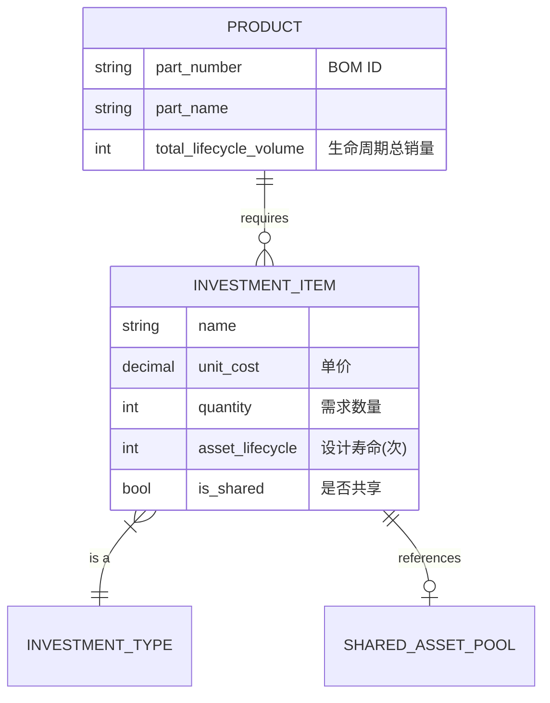
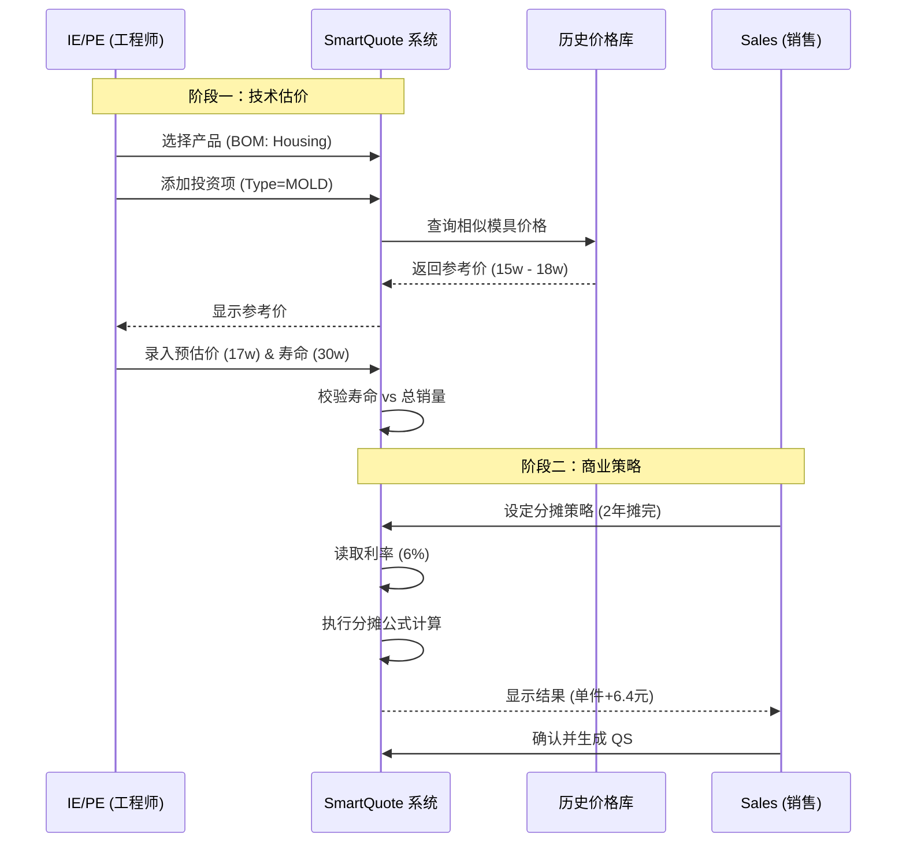

# NRE 投资成本计算逻辑

| 版本号 | 创建时间 | 更新时间 | 文档主题 | 创建人 |
|--------|----------|----------|----------|--------|
| v1.1   | 2026-02-03 | 2026-02-03 | NRE 投资成本计算逻辑 | Randy Luo |

---

## 1. 核心定义与分类

**NRE (Non-Recurring Engineering)** 费用是指为了生产特定产品而发生的一次性投入。在 Dr.aiVOSS 系统中，NRE 不随订单数量线性增加，而是作为**"资产"**进行管理。

系统将 NRE 分为四大类（Enum: `InvestmentType`）：

| 代码 | 名称 | 英文 | 定义与特征 | 典型示例 |
|------|------|------|-----------|---------|
| **MOLD** | 模具 | Molding Tool | **高价值、长周期**。通常一个 BOM 对应一套，有明确的使用寿命（模次） | 注塑模、压铸模、冲压模 |
| **GAUGE** | 检具 | Gauge | **质量控制用**。通常为定制件，数量较少（1-2套） | 通止规、气密测试台、综合检具 |
| **JIG** | 夹具 | Jig | **定位与固定用**。**数量与产线节拍强相关**，可能需要数十个 | 焊接定位座、流水线托盘 |
| **FIXTURE** | 工装 | Fixture | **辅助加工用**。通常安装在设备上 | 去水口刀具、机械手抓手 |

---

## 2. 业务实体关系模型 (ERD 逻辑)

为了简化操作并确保数据准确，采用 **"BOM 挂载"** 模式，而非"工序挂载"模式。



---

## 3. 详细计算逻辑

### 3.1 基础投入计算 (Total Investment)

这是最底层的物理成本计算，由 **IE/PE** 负责录入。

#### 逻辑分支 A：标准数量计算

适用于模具、检具。通常 $Quantity = 1$。

**例外：** 如果是从外部供应商采购，需支持录入"一模多穴"或"备份模具"。

#### 逻辑分支 B：基于寿命的重置计算 (Replacement Logic)

**业务痛点：** 模具只能打 30 万次，但客户要买 50 万个产品。第 2 套模具谁出钱？

**输入：**
- $V_{total}$ = 项目生命周期总销量 (来自 Sales)
- $L_{asset}$ = 资产设计寿命 (来自 PE，如 300,000 模次)

**系统逻辑：**
1. 如果 $L_{asset}$ 为空，默认为无限（不计算重置）
2. 计算所需套数 $N_{sets} = \lceil V_{total} / L_{asset} \rceil$ (向上取整)
3. 如果 $N_{sets} > 1$，系统自动将 $Quantity$ 更新为 $N_{sets}$，并弹出提示：

> **"销量超出模具寿命，已自动增加重置模具费"**

#### 逻辑分支 C：基于节拍的夹具数量计算 (Jig Quantity Logic)

**业务痛点：** 流水线越快，需要的托盘越多。

**输入：**
- $T_{cycle}$ = 产线节拍 (秒)
- $N_{stations}$ = 工位数/循环数

**系统逻辑：** 支持 IE 手动输入数量，或者提供辅助计算器：

$$Quantity_{jig} = \lceil \frac{CycleTime_{process}}{T_{cycle}} \times N_{stations} \rceil$$

---

### 3.2 分摊与报价计算 (Amortization & Pricing)

这是财务视角的成本计算，由 **Sales/Controlling** 决定策略，影响 QS 表。

#### 模式 A：一次性支付 (NRE / Upfront)

客户单独付费，不计入零件单价。

- **QS 体现：** `Tooling Cost` 列为 0
- **输出：** 生成独立的 NRE 报价单

#### 模式 B：分摊进单价 (Amortized in Piece Price) —— *VOSS 默认模式*

公司垫资开模，客户通过买零件分期还款（含利息）。

**输入参数：**
- $I_{total}$ = 投资总额 (计算得出的 Total Invest)
- $V_{amort}$ = 分摊总销量 (通常为前 2-3 年销量，由 Sales 设定)
- $Y_{amort}$ = 分摊年限 (如 2 年)
- $R_{interest}$ = 资金年利率 (如 6%，由 Controlling 配置)

**核心公式 (VOSS 单利逻辑)：**

$$UnitAmort = \frac{I_{total} \times (1 + R_{interest} \times Y_{amort})}{V_{amort}}$$

**示例计算：**
- 模具费 17 万，分摊 2 年，利率 6%，分摊量 29,750 件
- 含息总额 = $170,000 \times (1 + 0.06 \times 2) = 190,400$
- 单件分摊 = $190,400 / 29,750 = 6.40$ 元

---

## 4. 数据库设计规范 (Schema)

建议在 MySQL 中创建以下表结构：

### 表 1: `investment_items` (项目投资明细)

| 字段名 | 类型 | 说明 | 示例值 |
|--------|------|------|--------|
| `id` | CHAR(36) | PK, UUID | - |
| `project_id` | CHAR(36) | FK, 关联项目 | - |
| `product_id` | CHAR(36) | **FK, 关联 BOM/产品** | 指向 Housing |
| `item_type` | VARCHAR(20) | 枚举: MOLD, GAUGE, JIG, FIXTURE | MOLD |
| `name` | VARCHAR(200) | 投资项名称 | Housing Injection Mold |
| `unit_cost_est` | DECIMAL(12,2) | 预估单价 | 170000.00 |
| `currency` | VARCHAR(10) | 币种 | CNY |
| `quantity` | INT | 数量 | 1 |
| `asset_lifecycle` | INT | 设计寿命 (模次) | 300000 |
| `is_shared` | BOOLEAN | 是否共享资产 | FALSE |
| `shared_source_id` | CHAR(36) | 若共享，指向源 ID | NULL |
| `status` | VARCHAR(20) | 状态: DRAFT / CONFIRMED | DRAFT |
| `created_at` | DATETIME | 创建时间 | DEFAULT NOW() |
| `updated_at` | DATETIME | 更新时间 | ON UPDATE NOW() |

### 表 2: `amortization_strategies` (分摊策略)

| 字段名 | 类型 | 说明 | 示例值 |
|--------|------|------|--------|
| `id` | CHAR(36) | PK, UUID | - |
| `project_id` | CHAR(36) | FK, 关联项目 | - |
| `mode` | VARCHAR(20) | UPFRONT / AMORTIZED | AMORTIZED |
| `amortization_volume` | INT | 分摊基数销量 | 29750 |
| `duration_years` | INT | 分摊年限 | 2 |
| `interest_rate` | DECIMAL(5,4) | 年利率 | 0.0600 |
| `calculated_unit_add` | DECIMAL(10,4) | **计算结果：单件分摊额** | 6.4038 |
| `created_at` | DATETIME | 创建时间 | DEFAULT NOW() |

---

## 5. 数据模型定义

### 5.1 Pydantic 模型

```python
from enum import Enum
from typing import Literal
from pydantic import BaseModel, Field
from decimal import Decimal

class InvestmentType(str, Enum):
    """投资类型"""
    MOLD = "MOLD"       # 模具
    GAUGE = "GAUGE"     # 检具
    JIG = "JIG"         # 夹具
    FIXTURE = "FIXTURE" # 工装


class InvestmentItem(BaseModel):
    """投资项"""
    id: str | None = None
    project_id: str
    product_id: str
    item_type: InvestmentType
    name: str
    unit_cost_est: Decimal
    currency: str = "CNY"
    quantity: int = 1
    asset_lifecycle: int | None = None  # 设计寿命（模次），空表示无限
    is_shared: bool = False
    shared_source_id: str | None = None
    status: Literal["DRAFT", "CONFIRMED"] = "DRAFT"

    @property
    def total_investment(self) -> Decimal:
        """总投资"""
        return self.unit_cost_est * self.quantity


class AmortizationMode(str, Enum):
    """分摊模式"""
    UPFRONT = "UPFRONT"           # 一次性支付
    AMORTIZED = "AMORTIZED"       # 分摊进单价


class AmortizationStrategy(BaseModel):
    """分摊策略"""
    id: str | None = None
    project_id: str
    mode: AmortizationMode
    amortization_volume: int | None = None   # 分摊基数销量
    duration_years: int = 2                  # 分摊年限
    interest_rate: Decimal = Field(default=Decimal("0.06"))
    calculated_unit_add: Decimal | None = None  # 计算结果：单件分摊额

    def calculate_unit_amort(self, total_investment: Decimal) -> Decimal:
        """计算单件分摊额（含息）"""
        if self.mode == AmortizationMode.UPFRONT:
            return Decimal("0")

        if not self.amortization_volume or self.amortization_volume <= 0:
            return Decimal("0")

        # VOSS 单利公式: I × (1 + R × Y) / V
        interest_factor = Decimal("1") + self.interest_rate * self.duration_years
        return total_investment * interest_factor / self.amortization_volume


class InvestmentCalculationResult(BaseModel):
    """投资计算结果"""
    items: list[InvestmentItem]
    strategy: AmortizationStrategy
    total_investment: Decimal
    unit_amortization: Decimal
    replacement_warning: list[str] = []  # 寿命不足警告
```

---

## 6. 系统交互流程



---

## 7. 开发实施 Checklist

| 任务 | 责任方 | 状态 |
|------|--------|------|
| 后端：实现 `InvestmentItem` CRUD 接口 | 后端开发 | ⬜ |
| 后端：实现"寿命自动计算数量"逻辑 (`lifecycle_check`) | 后端开发 | ⬜ |
| 后端：实现 VOSS 特有的"含息分摊"算法 | 后端开发 | ⬜ |
| 前端：开发 IE 工作台的"投资录入卡片"（四分类） | 前端开发 | ⬜ |
| 前端：开发 Sales 端的"分摊计算器"（实时变动） | 前端开发 | ⬜ |
| 数据库：完成 `investment_items` 表的建表与索引 | DBA | ⬜ |

---

## 8. 与其他文档的关联

| 文档 | 关联点 |
|------|--------|
| `DATABASE_DESIGN.md` | 依赖 `projects`, `project_products` 表 |
| `QUOTATION_SUMMARY_LOGIC.md` | 分摊结果影响 QS 表的 Tooling 列 |
| `PAYBACK_LOGIC.md` | 投资总额是 Payback 计算的输入 |
| `BUSINESS_CASE_LOGIC.md` | 分摊策略影响 BC 表的年度成本 |

### 8.1 数据流向

```
┌─────────────────────────────────────────────────────────────┐
│                    IE/PE 工作台                              │
│  录入: Type, Unit Cost, Quantity, Lifecycle                  │
└─────────────────────────────────────────────────────────────┘
                              ↓
┌─────────────────────────────────────────────────────────────┐
│                 NRE 计算引擎                                 │
│  计算: Total Invest, Replacement Check                      │
└─────────────────────────────────────────────────────────────┘
                              ↓
┌─────────────────────────────────────────────────────────────┐
│                 Sales 分摊配置                               │
│  设定: Mode, Amortization Volume, Duration, Interest Rate   │
└─────────────────────────────────────────────────────────────┘
                              ↓
┌─────────────────────────────────────────────────────────────┐
│                 单件分摊计算                                 │
│  输出: Unit Amort = I × (1 + R × Y) / V                     │
└─────────────────────────────────────────────────────────────┘
                              ↓
┌─────────────────────────────────────────────────────────────┐
│                 Quotation Summary                           │
│  Tooling 列 = Unit Amort                                    │
└─────────────────────────────────────────────────────────────┘
```

---

## 9. API 端点定义

### 9.1 投资项管理

| 方法 | 端点 | 功能 |
|------|------|------|
| GET | `/api/v1/investments/{project_id}` | 获取项目投资列表 |
| POST | `/api/v1/investments` | 创建投资项 |
| PUT | `/api/v1/investments/{id}` | 更新投资项 |
| DELETE | `/api/v1/investments/{id}` | 删除投资项 |

### 9.2 分摊计算

| 方法 | 端点 | 功能 |
|------|------|------|
| POST | `/api/v1/investments/calculate-amort` | 计算分摊策略 |
| GET | `/api/v1/investments/{project_id}/amort-strategy` | 获取当前分摊策略 |
| PUT | `/api/v1/investments/{project_id}/amort-strategy` | 更新分摊策略 |

### 9.3 响应示例

```json
{
  "project_id": "PRJ-2026-001",
  "total_investment": 170000.00,
  "items": [
    {
      "id": "INV-001",
      "item_type": "MOLD",
      "name": "Housing Injection Mold",
      "unit_cost_est": 170000.00,
      "quantity": 1,
      "asset_lifecycle": 300000,
      "total": 170000.00
    }
  ],
  "strategy": {
    "mode": "AMORTIZED",
    "amortization_volume": 29750,
    "duration_years": 2,
    "interest_rate": 0.06,
    "unit_amortization": 6.40
  },
  "warnings": [
    "销量 50,000 超出模具寿命 30,000，已自动增加重置模具费"
  ]
}
```

---

**文档结束**
