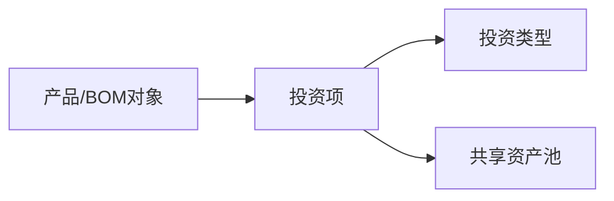
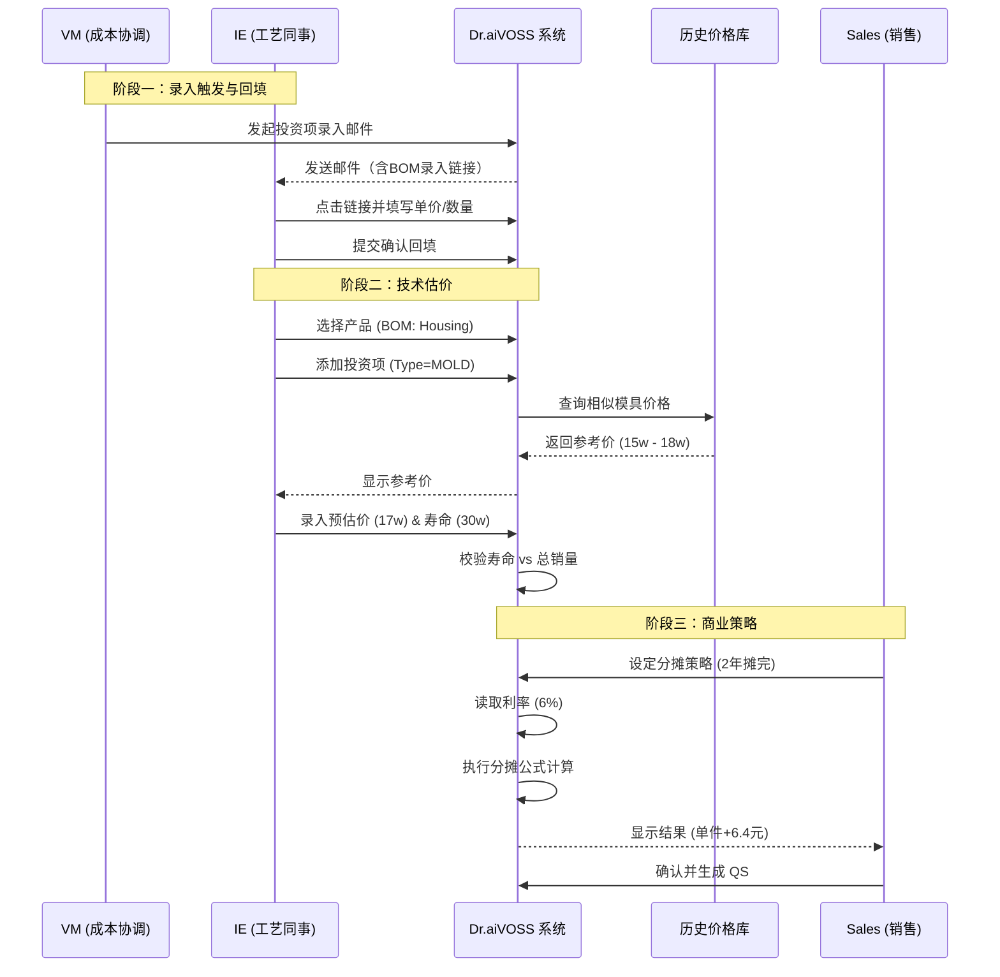

# NRE 投资成本计算逻辑

| 版本号 | 创建时间 | 更新时间 | 文档主题 | 创建人 |
|--------|----------|----------|----------|--------|
| v2.3   | 2026-02-03 | 2026-03-13 | NRE 投资成本计算逻辑 | Randy Luo |

---

**版本变更记录：**
| 版本 | 日期 | 变更内容 |
|------|------|----------|
| v2.3 | 2026-03-13 | 🔄 **文档定位收敛**：移除 API、Schema、Pydantic、开发实施清单等开发定义，仅保留业务逻辑、计算原理与流程 |
| v2.2 | 2026-03-13 | 🔴 **录入流程调整**：投资项单价/数量由工艺部（IE）通过 VM 触发的邮件链接录入并回填项目；收件人按产线后台配置自动匹配 |
| v2.1 | 2026-02-25 | 🆕 **新增功能**：NRE 费用支持"销售溢价加成 (Markup)"与"混合分摊规则设定"，支持一次性支付与按件分摊的组合模式 |
| v2.0 | 2026-02-15 | 🆕 **新增投资项计算公式**：定义四种投资类型的详细计算规则（检具=点位数×单价，工装=功能模块数×单价，成型工装=长度×单价，模具=产品特征×单价）；新增计算参数字段 |
| v1.3 | 2026-02-05 | 同步 v2.0 流程变更；移除 VAVE 相关引用 |
| v1.2 | 2026-02-05 | 同步 v2.0 流程变更；新增投资项标准库引用（std_investment_costs 表） |
| v1.1 | 2026-02-03 | 初始版本 |

---

## 1. 核心定义与分类

**NRE (Non-Recurring Engineering)** 费用是指为了生产特定产品而发生的一次性投入。在 Dr.aiVOSS 系统中，NRE 不随订单数量线性增加，而是作为**"资产"**进行管理。

系统将 NRE 分为五大类，每类有特定的计算公式：

| 代码 | 名称 | 英文 | 计算公式 | 典型示例 |
|------|------|------|----------|---------|
| **MOLD** | 模具 | Molding Tool | $Cost = 产品特征 \times 单价$ | 注塑模、压铸模、冲压模 |
| **GAUGE** | 检具 | Gauge | $Cost = 点位数 \times 单价$ | 通止规、气密测试台、综合检具 |
| **JIG** | 夹具 | Jig | $Cost = 单价 \times 数量$ | 焊接定位座、流水线托盘 |
| **FIXTURE** | 工装 | Fixture | $Cost = 功能模块数 \times 单价$ | 去水口刀具、机械手抓手 |
| **FORMING_TOOL** | 成型工装 | Forming Tool | $Cost = 长度 \times 单价$ | 折弯成型、拉伸成型工装 |

### 1.1 各类型详细计算规则

#### 模具 (MOLD)

**计算公式：** $Cost_{mold} = 产品特征 \times 单价_{std}$

**产品特征说明：**
| 特征类型 | 单位 | 适用场景 | 示例 |
|----------|------|----------|------|
| 重量 | kg | 压铸模、锻造模 | 模具重量 500kg × ¥300/kg = ¥150,000 |
| 体积 | cm³ | 注塑模 | 模具体积 100,000cm³ × ¥1.5/cm³ = ¥150,000 |
| 吨位 | 吨 | 冲压模 | 冲压吨位 200吨 × ¥800/吨 = ¥160,000 |

**单价来源：** 投资项标准库，根据材质类型、复杂度、吨位等参数查询标准单价范围。

---

#### 检具 (GAUGE)

**计算公式：** $Cost_{gauge} = 点位数 \times 单价_{point}$

**参数说明：**
| 参数 | 说明 | 示例 |
|------|------|------|
| 点位数 | 检测点/测量点数量 | 32 个检测点 |
| 单价 | 每个点的标准成本 | ¥500/点 |

**示例计算：**
- 综合检具，32 个检测点
- 成本 = 32 × ¥500 = ¥16,000

---

#### 工装 (FIXTURE)

**计算公式：** $Cost_{fixture} = 功能模块数 \times 单价_{module}$

**参数说明：**
| 参数 | 说明 | 示例 |
|------|------|------|
| 功能模块数 | 独立功能单元数量 | 4 个功能模块（切割+定位+夹紧+推出） |
| 单价 | 每个模块的标准成本 | ¥8,000/模块 |

**示例计算：**
- 去水口工装，4 个功能模块
- 成本 = 4 × ¥8,000 = ¥32,000

---

#### 成型工装 (FORMING_TOOL) 🆕

**计算公式：** $Cost_{forming} = 长度 \times 单价_{length}$

**参数说明：**
| 参数 | 说明 | 示例 |
|------|------|------|
| 长度 | 工装有效工作长度 | 1200mm |
| 单价 | 每毫米标准成本 | ¥25/mm |

**示例计算：**
- 折弯成型工装，长度 1200mm
- 成本 = 1200 × ¥25 = ¥30,000

---

#### 夹具 (JIG)

**计算公式：** $Cost_{jig} = 单价 \times 数量$

**数量计算规则：** 基于产线节拍和工位数自动计算（见 §3.1 逻辑分支 C）

**参数说明：**
| 参数 | 说明 | 示例 |
|------|------|------|
| 单价 | 单个夹具成本 | ¥1,200/个 |
| 数量 | 需求数量（节拍相关） | 15 个 |

**示例计算：**
- 焊接定位座，15 个，单价 ¥1,200
- 成本 = 15 × ¥1,200 = ¥18,000

---

## 2. 业务对象关系逻辑

为了简化操作并确保数据准确，采用 **"BOM 挂载"** 模式，而非"工序挂载"模式。



---

## 3. 详细计算逻辑

### 3.0 录入责任与触发流程（v2.2）

投资项成本参数（单价、数量）由**工艺部（IE）**录入，VM 负责触发与闭环确认。

**流程：**
1. VM 在项目内发起"投资项录入邮件"。
2. 系统根据项目所属产线，读取后台配置的工艺同事收件人。
3. 邮件发送 BOM 表格录入链接（带有效期）。
4. 工艺同事点击链接，按当前投资项录入方法填写单价与数量并提交确认。
5. 系统自动回填投资项到项目，并通知 VM 进入后续汇总。

### 3.1 基础投入计算 (Total Investment)

这是最底层的物理成本计算，由 **IE** 负责录入（VM 负责邮件触发与进度确认）。

#### 逻辑分支 A：标准数量计算

适用于模具、检具。通常 $Quantity = 1$。

**例外：** 如果是从外部供应商采购，需支持录入"一模多穴"或"备份模具"。

#### 逻辑分支 B：基于寿命的重置计算 (Replacement Logic)

**业务痛点：** 模具只能打 30 万次，但客户要买 50 万个产品。第 2 套模具谁出钱？

**输入：**
- $V_{total}$ = 项目生命周期总销量 (来自 Sales)
- $L_{asset}$ = 资产设计寿命 (来自 IE，如 300,000 模次)

**系统逻辑：**
1. 如果 $L_{asset}$ 为空，默认为无限（不计算重置）
2. 计算所需套数 $N_{sets} = \lceil V_{total} / L_{asset} \rceil$ (向上取整)
3. 如果 $N_{sets} > 1$，系统自动将 $Quantity$ 更新为 $N_{sets}$，并弹出提示：

> **"销量超出模具寿命，已自动增加重置模具费"**

#### 逻辑分支 C：基于节拍的夹具数量计算 (Jig Quantity Logic)

**业务痛点：** 流水线越快，需要的托盘越多。

**输入：**
- $T_{cycle}$ = 产线节拍 (秒)
- $N_{stations}$ = 工位数/循环数

**系统逻辑：** 支持 IE 手动输入数量，或者提供辅助计算器：

$$Quantity_{jig} = \lceil \frac{CycleTime_{process}}{T_{cycle}} \times N_{stations} \rceil$$

---

### 3.2 分摊与报价计算 (Amortization & Pricing)

这是财务视角的成本计算，由 **Sales/Controlling** 决定策略，影响 QS 表。

#### 模式 A：一次性支付 (NRE / Upfront)

客户单独付费，不计入零件单价。

- **QS 体现：** `Tooling Cost` 列为 0
- **输出：** 生成独立的 NRE 报价单

#### 模式 B：分摊进单价 (Amortized in Piece Price) —— *VOSS 默认模式*

公司垫资开模，客户通过买零件分期还款（含 **Capital Interest / 资本利息**）。

> **⚠️ 重要区分：**
> - **Capital Interest（资本利息）**：模具投资本身的资金成本，**已打包进 Tooling 分摊费用中**
> - **Working Capital Interest（营运资金利息）**：基于销售账期的资金占用，**独立列示于 QS 表**
> - 两者是不同的成本项，**不可重复计算**

**输入参数：**
- $I_{total}$ = 投资总额 (计算得出的 Total Invest)
- $V_{amort}$ = 分摊总销量 (通常为前 2-3 年销量，由 Sales 设定)
- $Y_{amort}$ = 分摊年限 (如 2 年)
- $R_{interest}$ = 资本年利率 (如 6%，由 Controlling 配置)

**核心公式 (VOSS 单利逻辑，含 Capital Interest)：**

$$UnitAmort = \frac{I_{total} \times (1 + R_{interest} \times Y_{amort})}{V_{amort}}$$

其中 `(1 + R_{interest} × Y_{amort})` 为 **Capital Interest 因子**。

**示例计算：**
- 模具费 17 万，分摊 2 年，资本利率 6%，分摊量 29,750 件
- Capital Interest 因子 = $1 + 0.06 \times 2 = 1.12$
- 含息总额 = $170,000 \times 1.12 = 190,400$
- 单件分摊 = $190,400 / 29,750 = 6.40$ 元

**注意**：这 6.40 元已包含 Capital Interest，在 QS 表的 Tooling 列中列示，**不再额外计算利息**。

#### 🆕 内部成本与外部报价隔离 (Cost vs Quote Isolation) v2.1

**业务背景：** VM 内部核算的投资成本（如供应商报价、工时成本）与向客户收取的费用存在差异。公司需要在此过程中加入**溢价系数 (Markup Rate)** 以覆盖仓储管理费、风险溢价、项目管理成本等。

**核心公式：**

$$溢价后总额 (Adjusted\_Amount) = VM内部核算成本 (Raw\_Cost) \times 溢价系数 (Markup\_Rate)$$

**字段定义：**

| 字段 | 说明 | 示例值 |
|------|------|--------|
| `raw_cost` | VM 内部核算成本（供应商报价/估算成本） | ¥150,000 |
| `markup_rate` | 溢价系数（1.3 代表 30% 加成） | 1.30 |
| `adjusted_amount` | 溢价后总金额（向客户收取的基础费用） | ¥195,000 |

**溢价系数参考标准：**

| 投资类型 | 典型溢价范围 | 说明 |
|----------|-------------|------|
| 模具 (MOLD) | 1.20 - 1.35 | 含仓储管理、质量检验 |
| 检具 (GAUGE) | 1.15 - 1.25 | 含校准维护 |
| 夹具 (JIG) | 1.10 - 1.20 | 项目管理费 |
| 工装 (FIXTURE) | 1.10 - 1.20 | 项目管理费 |

---

#### 🆕 混合分摊规则设定 (Hybrid Amortization) v2.1

**业务背景：** 客户可能要求 NRE 费用采用"**部分一次性支付 + 部分按件分摊**"的混合模式，以平衡现金流压力和单件成本。

**支付方式拆分公式：**

$$待分摊金额 (Amortized\_Amount) = 溢价后总额 (Adjusted\_Amount) - 一次性支付金额 (Lump\_Sum\_Amount)$$

**字段定义：**

| 字段 | 说明 | 示例值 |
|------|------|--------|
| `adjusted_amount` | 溢价后总金额（上文计算） | ¥195,000 |
| `lump_sum_amount` | 一次性支付金额（PPAP 节点收取） | ¥50,000 |
| `amortized_amount` | 实际需按件分摊的金额 | ¥145,000 |

**分摊金额计算更新：**

单件分摊额的计算基数从原先的总投资额，变更为 `待分摊金额 (Amortized_Amount)`：

$$UnitAmort = \frac{Amortized\_Amount \times (1 + R_{interest} \times Y_{amort})}{V_{amort}}$$

**示例计算：**

| 步骤 | 计算 | 结果 |
|------|------|------|
| 1. VM 内部成本 | 供应商报价 | ¥150,000 |
| 2. 溢价后总额 | 150,000 × 1.30 | ¥195,000 |
| 3. 一次性支付 | 客户协商 | ¥50,000 |
| 4. 待分摊金额 | 195,000 - 50,000 | ¥145,000 |
| 5. 含息总额 | 145,000 × 1.12 (6% × 2年) | ¥162,400 |
| 6. 单件分摊 | 162,400 ÷ 29,750 | **¥5.46** |

**对比传统模式：**

| 模式 | 单件分摊 | 客户现金流 |
|------|---------|-----------|
| 传统全额分摊 | 195,000 × 1.12 ÷ 29,750 = ¥7.34 | 每件支付 |
| 混合分摊 | 145,000 × 1.12 ÷ 29,750 = ¥5.46 | PPAP ¥50K + 每件 ¥5.46 |

> **业务优势：**
> - 降低单件成本，提升产品竞争力
> - 提前回笼部分资金，改善公司现金流
> - 灵活应对客户的不同付款偏好

---

#### 🆕 投资项分组分摊 (Amortization Group)

**业务场景：** 当项目存在多个不同设计寿命或归属的模具/夹具时，Sales 可以将它们分配到不同的 **Group** 进行独立分摊。

**分组规则：**

| Group 名称 | 适用场景 | 分摊策略 |
|-----------|---------|---------|
| **Tooling 1** | 主模具（设计寿命 3 年） | 分摊 2 年 |
| **Tooling 2** | 辅助模具（设计寿命 5 年） | 分摊 3 年 |
| **Tooling 3** | 后期追加投资 | 按实际情况分摊 |

**实现方式：**

1. 在 `amortization_strategies` 表中，通过 `group_name` 字段区分不同分组
2. 每个分组独立计算 `UnitAmort` 值
3. 在 QS 报表中，各分组独立成列（Tooling 1, Tooling 2, ...）

**示例：**

| 投资项 | Group | 投资额 | 分摊量 | 单件分摊 |
|--------|-------|--------|--------|---------|
| Housing Mold | Tooling 1 | ¥170,000 | 29,750 | ¥6.40 |
| Gauge Set | Tooling 2 | ¥48,000 | 40,000 | ¥1.20 |
| **合计** | - | ¥218,000 | - | **¥7.60** |

**JSON 存储格式（business_case_years.tooling_amortizations）：**

```json
{
  "Tooling 1": 6.40,
  "Tooling 2": 1.20
}
```

**SK-2 计算公式：**

$$SK\text{-}2 = SK\text{-}1 + \sum_{i=1}^{n} UnitAmort_i + SAP + Logistics + R\&D + Interest + Consign$$

其中 $\sum_{i=1}^{n} UnitAmort_i$ 为所有分摊分组的单件分摊额合计。

---

## 4. 系统交互流程



---

## 5. 与其他文档的关联

| 文档 | 关联点 |
|------|--------|
| [报价汇总计算逻辑.md](报价汇总计算逻辑.md) | 分摊结果影响 QS 表的 Tooling 列 |
| [投资回收期计算逻辑.md](投资回收期计算逻辑.md) | 投资总额是 Payback 计算的输入 |
| [商业案例计算逻辑.md](商业案例计算逻辑.md) | 分摊策略影响 BC 表的年度成本 |

### 5.1 数据流向

```
┌─────────────────────────────────────────────────────────────┐
│                    IE 工作台                              │
│  录入: Type, Unit Cost, Quantity, Lifecycle                  │
└─────────────────────────────────────────────────────────────┘
                              ↓
┌─────────────────────────────────────────────────────────────┐
│                 NRE 计算引擎                                 │
│  计算: Total Invest, Replacement Check                      │
└─────────────────────────────────────────────────────────────┘
                              ↓
┌─────────────────────────────────────────────────────────────┐
│                 Sales 分摊配置                               │
│  设定: Mode, Amortization Volume, Duration, Interest Rate   │
└─────────────────────────────────────────────────────────────┘
                              ↓
┌─────────────────────────────────────────────────────────────┐
│                 单件分摊计算                                 │
│  输出: Unit Amort = I × (1 + R × Y) / V                     │
└─────────────────────────────────────────────────────────────┘
                              ↓
┌─────────────────────────────────────────────────────────────┐
│                 Quotation Summary                           │
│  Tooling 列 = Unit Amort                                    │
└─────────────────────────────────────────────────────────────┘
```

---

**文档结束**
