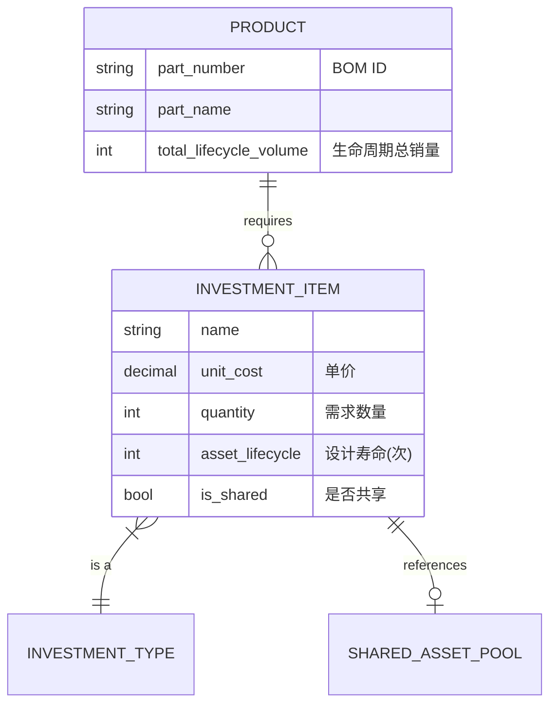
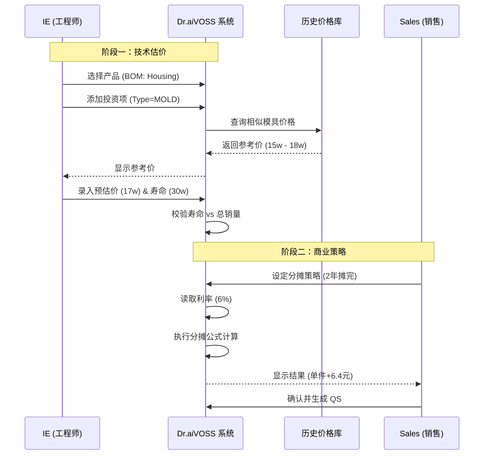

# NRE 投资成本计算逻辑

| 版本号 | 创建时间 | 更新时间 | 文档主题 | 创建人 |
|--------|----------|----------|----------|--------|
| v2.0   | 2026-02-03 | 2026-02-15 | NRE 投资成本计算逻辑 | Randy Luo |

---

**版本变更记录：**
| 版本 | 日期 | 变更内容 |
|------|------|----------|
| v2.0 | 2026-02-15 | 🆕 **新增投资项计算公式**：定义四种投资类型的详细计算规则（检具=点位数×单价，工装=功能模块数×单价，成型工装=长度×单价，模具=产品特征×单价）；新增计算参数字段 |
| v1.3 | 2026-02-05 | 同步 v2.0 流程变更；移除 VAVE 相关引用 |
| v1.2 | 2026-02-05 | 同步 v2.0 流程变更；新增投资项标准库引用（std_investment_costs 表） |
| v1.1 | 2026-02-03 | 初始版本 |

---

## 1. 核心定义与分类

**NRE (Non-Recurring Engineering)** 费用是指为了生产特定产品而发生的一次性投入。在 Dr.aiVOSS 系统中，NRE 不随订单数量线性增加，而是作为**"资产"**进行管理。

系统将 NRE 分为四大类（Enum: `InvestmentType`），每类有特定的计算公式：

| 代码 | 名称 | 英文 | 计算公式 | 典型示例 |
|------|------|------|----------|---------|
| **MOLD** | 模具 | Molding Tool | $Cost = 产品特征 \times 单价$ | 注塑模、压铸模、冲压模 |
| **GAUGE** | 检具 | Gauge | $Cost = 点位数 \times 单价$ | 通止规、气密测试台、综合检具 |
| **JIG** | 夹具 | Jig | $Cost = 单价 \times 数量$ | 焊接定位座、流水线托盘 |
| **FIXTURE** | 工装 | Fixture | $Cost = 功能模块数 \times 单价$ | 去水口刀具、机械手抓手 |
| **FORMING_TOOL** | 成型工装 | Forming Tool | $Cost = 长度 \times 单价$ | 折弯成型、拉伸成型工装 |

### 1.1 各类型详细计算规则

#### 模具 (MOLD)

**计算公式：** $Cost_{mold} = 产品特征 \times 单价_{std}$

**产品特征说明：**
| 特征类型 | 单位 | 适用场景 | 示例 |
|----------|------|----------|------|
| 重量 | kg | 压铸模、锻造模 | 模具重量 500kg × ¥300/kg = ¥150,000 |
| 体积 | cm³ | 注塑模 | 模具体积 100,000cm³ × ¥1.5/cm³ = ¥150,000 |
| 吨位 | 吨 | 冲压模 | 冲压吨位 200吨 × ¥800/吨 = ¥160,000 |

**单价来源：** `std_investment_costs` 表，根据材质类型、复杂度、吨位等参数查询标准单价范围。

---

#### 检具 (GAUGE)

**计算公式：** $Cost_{gauge} = 点位数 \times 单价_{point}$

**参数说明：**
| 参数 | 说明 | 示例 |
|------|------|------|
| 点位数 | 检测点/测量点数量 | 32 个检测点 |
| 单价 | 每个点的标准成本 | ¥500/点 |

**示例计算：**
- 综合检具，32 个检测点
- 成本 = 32 × ¥500 = ¥16,000

---

#### 工装 (FIXTURE)

**计算公式：** $Cost_{fixture} = 功能模块数 \times 单价_{module}$

**参数说明：**
| 参数 | 说明 | 示例 |
|------|------|------|
| 功能模块数 | 独立功能单元数量 | 4 个功能模块（切割+定位+夹紧+推出） |
| 单价 | 每个模块的标准成本 | ¥8,000/模块 |

**示例计算：**
- 去水口工装，4 个功能模块
- 成本 = 4 × ¥8,000 = ¥32,000

---

#### 成型工装 (FORMING_TOOL) 🆕

**计算公式：** $Cost_{forming} = 长度 \times 单价_{length}$

**参数说明：**
| 参数 | 说明 | 示例 |
|------|------|------|
| 长度 | 工装有效工作长度 | 1200mm |
| 单价 | 每毫米标准成本 | ¥25/mm |

**示例计算：**
- 折弯成型工装，长度 1200mm
- 成本 = 1200 × ¥25 = ¥30,000

---

#### 夹具 (JIG)

**计算公式：** $Cost_{jig} = 单价 \times 数量$

**数量计算规则：** 基于产线节拍和工位数自动计算（见 §3.1 逻辑分支 C）

**参数说明：**
| 参数 | 说明 | 示例 |
|------|------|------|
| 单价 | 单个夹具成本 | ¥1,200/个 |
| 数量 | 需求数量（节拍相关） | 15 个 |

**示例计算：**
- 焊接定位座，15 个，单价 ¥1,200
- 成本 = 15 × ¥1,200 = ¥18,000

---

## 2. 业务实体关系模型 (ERD 逻辑)

为了简化操作并确保数据准确，采用 **"BOM 挂载"** 模式，而非"工序挂载"模式。



---

## 3. 详细计算逻辑

### 3.1 基础投入计算 (Total Investment)

这是最底层的物理成本计算，由 **IE** 负责录入。

#### 逻辑分支 A：标准数量计算

适用于模具、检具。通常 $Quantity = 1$。

**例外：** 如果是从外部供应商采购，需支持录入"一模多穴"或"备份模具"。

#### 逻辑分支 B：基于寿命的重置计算 (Replacement Logic)

**业务痛点：** 模具只能打 30 万次，但客户要买 50 万个产品。第 2 套模具谁出钱？

**输入：**
- $V_{total}$ = 项目生命周期总销量 (来自 Sales)
- $L_{asset}$ = 资产设计寿命 (来自 IE，如 300,000 模次)

**系统逻辑：**
1. 如果 $L_{asset}$ 为空，默认为无限（不计算重置）
2. 计算所需套数 $N_{sets} = \lceil V_{total} / L_{asset} \rceil$ (向上取整)
3. 如果 $N_{sets} > 1$，系统自动将 $Quantity$ 更新为 $N_{sets}$，并弹出提示：

> **"销量超出模具寿命，已自动增加重置模具费"**

#### 逻辑分支 C：基于节拍的夹具数量计算 (Jig Quantity Logic)

**业务痛点：** 流水线越快，需要的托盘越多。

**输入：**
- $T_{cycle}$ = 产线节拍 (秒)
- $N_{stations}$ = 工位数/循环数

**系统逻辑：** 支持 IE 手动输入数量，或者提供辅助计算器：

$$Quantity_{jig} = \lceil \frac{CycleTime_{process}}{T_{cycle}} \times N_{stations} \rceil$$

---

### 3.2 分摊与报价计算 (Amortization & Pricing)

这是财务视角的成本计算，由 **Sales/Controlling** 决定策略，影响 QS 表。

#### 模式 A：一次性支付 (NRE / Upfront)

客户单独付费，不计入零件单价。

- **QS 体现：** `Tooling Cost` 列为 0
- **输出：** 生成独立的 NRE 报价单

#### 模式 B：分摊进单价 (Amortized in Piece Price) —— *VOSS 默认模式*

公司垫资开模，客户通过买零件分期还款（含 **Capital Interest / 资本利息**）。

> **⚠️ 重要区分：**
> - **Capital Interest（资本利息）**：模具投资本身的资金成本，**已打包进 Tooling 分摊费用中**
> - **Working Capital Interest（营运资金利息）**：基于销售账期的资金占用，**独立列示于 QS 表**
> - 两者是不同的成本项，**不可重复计算**

**输入参数：**
- $I_{total}$ = 投资总额 (计算得出的 Total Invest)
- $V_{amort}$ = 分摊总销量 (通常为前 2-3 年销量，由 Sales 设定)
- $Y_{amort}$ = 分摊年限 (如 2 年)
- $R_{interest}$ = 资本年利率 (如 6%，由 Controlling 配置)

**核心公式 (VOSS 单利逻辑，含 Capital Interest)：**

$$UnitAmort = \frac{I_{total} \times (1 + R_{interest} \times Y_{amort})}{V_{amort}}$$

其中 `(1 + R_{interest} × Y_{amort})` 为 **Capital Interest 因子**。

**示例计算：**
- 模具费 17 万，分摊 2 年，资本利率 6%，分摊量 29,750 件
- Capital Interest 因子 = $1 + 0.06 \times 2 = 1.12$
- 含息总额 = $170,000 \times 1.12 = 190,400$
- 单件分摊 = $190,400 / 29,750 = 6.40$ 元

**注意**：这 6.40 元已包含 Capital Interest，在 QS 表的 Tooling 列中列示，**不再额外计算利息**。

#### 🆕 投资项分组分摊 (Amortization Group)

**业务场景：** 当项目存在多个不同设计寿命或归属的模具/夹具时，Sales 可以将它们分配到不同的 **Group** 进行独立分摊。

**分组规则：**

| Group 名称 | 适用场景 | 分摊策略 |
|-----------|---------|---------|
| **Tooling 1** | 主模具（设计寿命 3 年） | 分摊 2 年 |
| **Tooling 2** | 辅助模具（设计寿命 5 年） | 分摊 3 年 |
| **Tooling 3** | 后期追加投资 | 按实际情况分摊 |

**实现方式：**

1. 在 `amortization_strategies` 表中，通过 `group_name` 字段区分不同分组
2. 每个分组独立计算 `UnitAmort` 值
3. 在 QS 报表中，各分组独立成列（Tooling 1, Tooling 2, ...）

**示例：**

| 投资项 | Group | 投资额 | 分摊量 | 单件分摊 |
|--------|-------|--------|--------|---------|
| Housing Mold | Tooling 1 | ¥170,000 | 29,750 | ¥6.40 |
| Gauge Set | Tooling 2 | ¥48,000 | 40,000 | ¥1.20 |
| **合计** | - | ¥218,000 | - | **¥7.60** |

**JSON 存储格式（business_case_years.tooling_amortizations）：**

```json
{
  "Tooling 1": 6.40,
  "Tooling 2": 1.20
}
```

**SK-2 计算公式：**

$$SK\text{-}2 = SK\text{-}1 + \sum_{i=1}^{n} UnitAmort_i + SAP + Logistics + R\&D + Interest + Consign$$

其中 $\sum_{i=1}^{n} UnitAmort_i$ 为所有分摊分组的单件分摊额合计。

---

## 4. 数据库设计规范 (Schema)

> **文档职责说明**：完整的数据库表结构定义请参考 [数据库设计.md](数据库设计.md)，本文档仅提供计算相关字段的补充说明。

### 表 1: `investment_items` (项目投资明细)

| 字段名 | 类型 | 说明 | 示例值 |
|--------|------|------|--------|
| `id` | CHAR(36) | PK, UUID | - |
| `project_id` | CHAR(36) | FK, 关联项目 | - |
| `product_id` | CHAR(36) | **FK, 关联 BOM/产品** | 指向 Housing |
| `item_type` | VARCHAR(20) | 枚举: MOLD, GAUGE, JIG, FIXTURE, FORMING_TOOL | MOLD |
| `name` | VARCHAR(200) | 投资项名称 | Housing Injection Mold |
| `unit_cost_est` | DECIMAL(12,2) | **计算后单价**（= calc_param × unit_price_std） | 170000.00 |
| `currency` | VARCHAR(10) | 币种 | CNY |
| `quantity` | INT | 数量 | 1 |
| `asset_lifecycle` | INT | 设计寿命 (模次) | 300000 |
| `is_shared` | BOOLEAN | 是否共享资产 | FALSE |
| `shared_source_id` | CHAR(36) | 若共享，指向源 ID | NULL |
| `status` | VARCHAR(20) | 状态: DRAFT / CONFIRMED | DRAFT |

#### 🆕 计算参数字段（v2.0 新增）

| 字段名 | 类型 | 适用类型 | 说明 | 示例值 |
|--------|------|----------|------|--------|
| `calc_method` | VARCHAR(20) | ALL | 计算方法: FEATURE / POINTS / MODULES / LENGTH / FIXED | FEATURE |
| `calc_param` | DECIMAL(10,2) | ALL | **计算参数值**（点位数/模块数/长度/特征值） | 32.00 |
| `calc_param_unit` | VARCHAR(20) | ALL | 参数单位: kg / cm3 / ton / points / modules / mm | points |
| `unit_price_std` | DECIMAL(10,2) | ALL | **标准单价**（从标准库获取或手动输入） | 500.00 |
| `feature_type` | VARCHAR(20) | MOLD | 模具特征类型: WEIGHT / VOLUME / TONNAGE | WEIGHT |

**计算逻辑：**
```
unit_cost_est = calc_param × unit_price_std
total_cost = unit_cost_est × quantity
```

**各类型字段映射：**
| 投资类型 | calc_method | calc_param | calc_param_unit | feature_type |
|----------|-------------|------------|-----------------|--------------|
| MOLD (模具) | FEATURE | 重量/体积/吨位 | kg / cm³ / ton | WEIGHT / VOLUME / TONNAGE |
| GAUGE (检具) | POINTS | 点位数 | points | - |
| FIXTURE (工装) | MODULES | 功能模块数 | modules | - |
| FORMING_TOOL (成型工装) | LENGTH | 长度 | mm | - |
| JIG (夹具) | FIXED | 1 | unit | - |

### 表 2: `amortization_strategies` (分摊策略)

| 字段名 | 类型 | 说明 | 示例值 |
|--------|------|------|--------|
| `id` | CHAR(36) | PK, UUID | - |
| `project_id` | CHAR(36) | FK, 关联项目 | - |
| `mode` | VARCHAR(20) | UPFRONT / AMORTIZED | AMORTIZED |
| `amortization_volume` | INT | 分摊基数销量 | 29750 |
| `duration_years` | INT | 分摊年限 | 2 |
| `interest_rate` | DECIMAL(5,4) | 年利率 | 0.0600 |
| `calculated_unit_add` | DECIMAL(10,4) | **计算结果：单件分摊额** | 6.4038 |
| `created_at` | DATETIME | 创建时间 | DEFAULT NOW() |

---

## 5. 数据模型定义

### 5.1 Pydantic 模型

```python
from enum import Enum
from typing import Literal, Optional
from pydantic import BaseModel, Field, field_validator
from decimal import Decimal

class InvestmentType(str, Enum):
    """投资类型"""
    MOLD = "MOLD"               # 模具
    GAUGE = "GAUGE"             # 检具
    JIG = "JIG"                 # 夹具
    FIXTURE = "FIXTURE"         # 工装
    FORMING_TOOL = "FORMING_TOOL"  # 成型工装 🆕


class CalcMethod(str, Enum):
    """计算方法"""
    FEATURE = "FEATURE"   # 产品特征（模具）
    POINTS = "POINTS"     # 点位数（检具）
    MODULES = "MODULES"   # 功能模块数（工装）
    LENGTH = "LENGTH"     # 长度（成型工装）
    FIXED = "FIXTED"      # 固定价格（夹具）


class FeatureType(str, Enum):
    """模具特征类型"""
    WEIGHT = "WEIGHT"     # 重量 (kg)
    VOLUME = "VOLUME"     # 体积 (cm³)
    TONNAGE = "TONNAGE"   # 吨位 (ton)


class InvestmentItem(BaseModel):
    """投资项"""
    id: str | None = None
    project_id: str
    product_id: str
    item_type: InvestmentType
    name: str

    # 🆕 v2.0 计算参数
    calc_method: CalcMethod
    calc_param: Decimal = Field(default=Decimal("1"), description="计算参数值（点位数/模块数/长度/特征值）")
    calc_param_unit: str = Field(default="unit", description="参数单位")
    unit_price_std: Decimal = Field(description="标准单价（从标准库获取或手动输入）")

    # 计算后的单价
    unit_cost_est: Decimal | None = Field(default=None, description="计算后单价 = calc_param × unit_price_std")

    currency: str = "CNY"
    quantity: int = 1
    asset_lifecycle: int | None = None  # 设计寿命（模次），空表示无限
    is_shared: bool = False
    shared_source_id: str | None = None
    status: Literal["DRAFT", "CONFIRMED"] = "DRAFT"

    # 模具专用字段
    feature_type: FeatureType | None = None

    def model_post_init(self, __context):
        """自动计算单价"""
        if self.unit_cost_est is None:
            self.unit_cost_est = self.calc_param * self.unit_price_std

    @property
    def total_investment(self) -> Decimal:
        """总投资"""
        return (self.unit_cost_est or self.calc_param * self.unit_price_std) * self.quantity

    @field_validator('calc_method', mode='before')
    @classmethod
    def set_default_calc_method(cls, v, info):
        """根据投资类型自动设置计算方法"""
        if v is None:
            item_type = info.data.get('item_type')
            mapping = {
                InvestmentType.MOLD: CalcMethod.FEATURE,
                InvestmentType.GAUGE: CalcMethod.POINTS,
                InvestmentType.FIXTURE: CalcMethod.MODULES,
                InvestmentType.FORMING_TOOL: CalcMethod.LENGTH,
                InvestmentType.JIG: CalcMethod.FIXED,
            }
            return mapping.get(item_type, CalcMethod.FIXED)
        return v


class InvestmentItemCreate(BaseModel):
    """创建投资项请求"""
    project_id: str
    product_id: str
    item_type: InvestmentType
    name: str

    # 计算参数
    calc_param: Decimal = Field(default=Decimal("1"), description="计算参数值")
    calc_param_unit: str = Field(default="unit", description="参数单位")
    unit_price_std: Decimal = Field(description="标准单价")

    # 可选参数
    quantity: int = 1
    asset_lifecycle: int | None = None
    feature_type: FeatureType | None = None
    is_shared: bool = False
    shared_source_id: str | None = None


class AmortizationMode(str, Enum):
    """分摊模式"""
    UPFRONT = "UPFRONT"           # 一次性支付
    AMORTIZED = "AMORTIZED"       # 分摊进单价


class AmortizationStrategy(BaseModel):
    """分摊策略"""
    id: str | None = None
    project_id: str
    mode: AmortizationMode
    amortization_volume: int | None = None   # 分摊基数销量
    duration_years: int = 2                  # 分摊年限
    interest_rate: Decimal = Field(default=Decimal("0.06"), description="资本利率（Capital Interest Rate）")
    calculated_unit_add: Decimal | None = None  # 计算结果：单件分摊额（含 Capital Interest）

    def calculate_unit_amort(self, total_investment: Decimal) -> Decimal:
        """计算单件分摊额（含 Capital Interest）

        注意：此利息为模具投资的资本成本，与 QS 表中的 Working Capital Interest 是不同的概念。
        """
        if self.mode == AmortizationMode.UPFRONT:
            return Decimal("0")

        if not self.amortization_volume or self.amortization_volume <= 0:
            return Decimal("0")

        # VOSS 单利公式: I × (1 + R × Y) / V
        # 其中 (1 + R × Y) 为 Capital Interest 因子
        interest_factor = Decimal("1") + self.interest_rate * self.duration_years
        return total_investment * interest_factor / self.amortization_volume


class InvestmentCalculationResult(BaseModel):
    """投资计算结果"""
    items: list[InvestmentItem]
    strategy: AmortizationStrategy
    total_investment: Decimal
    unit_amortization: Decimal
    replacement_warning: list[str] = []  # 寿命不足警告

    # 🆕 v2.0 计算明细
    calculation_details: list[dict] = []  # 各投资项的计算明细
```

---

## 6. 系统交互流程



---

## 7. 开发实施 Checklist

| 任务 | 责任方 | 状态 |
|------|--------|------|
| 后端：实现 `InvestmentItem` CRUD 接口 | 后端开发 | ⬜ |
| 后端：实现"寿命自动计算数量"逻辑 (`lifecycle_check`) | 后端开发 | ⬜ |
| 后端：实现 VOSS 特有的"含息分摊"算法 | 后端开发 | ⬜ |
| **🆕 后端：实现投资项计算公式逻辑（v2.0）** | 后端开发 | ⬜ |
| **🆕 后端：实现标准单价查询（std_investment_costs 表）** | 后端开发 | ⬜ |
| 前端：开发 IE 工作台的"投资录入卡片"（五分类） | 前端开发 | ⬜ |
| 前端：开发 Sales 端的"分摊计算器"（实时变动） | 前端开发 | ⬜ |
| **🆕 前端：开发投资项计算参数输入组件** | 前端开发 | ⬜ |
| 数据库：完成 `investment_items` 表的建表与索引 | DBA | ⬜ |
| **🆕 数据库：添加 v2.0 计算参数字段（calc_method, calc_param, unit_price_std 等）** | DBA | ⬜ |

---

## 8. 与其他文档的关联

| 文档 | 关联点 |
|------|--------|
| [数据库设计.md](数据库设计.md) | 依赖 `projects`, `project_products` 表 |
| [报价汇总计算逻辑.md](报价汇总计算逻辑.md) | 分摊结果影响 QS 表的 Tooling 列 |
| [投资回收期计算逻辑.md](投资回收期计算逻辑.md) | 投资总额是 Payback 计算的输入 |
| [商业案例计算逻辑.md](商业案例计算逻辑.md) | 分摊策略影响 BC 表的年度成本 |

### 8.1 数据流向

```
┌─────────────────────────────────────────────────────────────┐
│                    IE 工作台                              │
│  录入: Type, Unit Cost, Quantity, Lifecycle                  │
└─────────────────────────────────────────────────────────────┘
                              ↓
┌─────────────────────────────────────────────────────────────┐
│                 NRE 计算引擎                                 │
│  计算: Total Invest, Replacement Check                      │
└─────────────────────────────────────────────────────────────┘
                              ↓
┌─────────────────────────────────────────────────────────────┐
│                 Sales 分摊配置                               │
│  设定: Mode, Amortization Volume, Duration, Interest Rate   │
└─────────────────────────────────────────────────────────────┘
                              ↓
┌─────────────────────────────────────────────────────────────┐
│                 单件分摊计算                                 │
│  输出: Unit Amort = I × (1 + R × Y) / V                     │
└─────────────────────────────────────────────────────────────┘
                              ↓
┌─────────────────────────────────────────────────────────────┐
│                 Quotation Summary                           │
│  Tooling 列 = Unit Amort                                    │
└─────────────────────────────────────────────────────────────┘
```

---

## 9. API 端点定义

### 9.1 投资项管理

| 方法 | 端点 | 功能 |
|------|------|------|
| GET | `/api/v1/investments/{project_id}` | 获取项目投资列表 |
| POST | `/api/v1/investments` | 创建投资项 |
| PUT | `/api/v1/investments/{id}` | 更新投资项 |
| DELETE | `/api/v1/investments/{id}` | 删除投资项 |

### 9.2 分摊计算

| 方法 | 端点 | 功能 |
|------|------|------|
| POST | `/api/v1/investments/calculate-amort` | 计算分摊策略 |
| GET | `/api/v1/investments/{project_id}/amort-strategy` | 获取当前分摊策略 |
| PUT | `/api/v1/investments/{project_id}/amort-strategy` | 更新分摊策略 |

### 9.3 响应示例

**v2.0 更新：包含计算参数明细**

```json
{
  "project_id": "PRJ-2026-001",
  "total_investment": 218000.00,
  "items": [
    {
      "id": "INV-001",
      "item_type": "MOLD",
      "name": "Housing Injection Mold",
      "calc_method": "FEATURE",
      "calc_param": 500.00,
      "calc_param_unit": "kg",
      "unit_price_std": 300.00,
      "unit_cost_est": 150000.00,
      "feature_type": "WEIGHT",
      "quantity": 1,
      "asset_lifecycle": 300000,
      "total": 150000.00
    },
    {
      "id": "INV-002",
      "item_type": "GAUGE",
      "name": "综合检具",
      "calc_method": "POINTS",
      "calc_param": 32.00,
      "calc_param_unit": "points",
      "unit_price_std": 500.00,
      "unit_cost_est": 16000.00,
      "quantity": 1,
      "total": 16000.00
    },
    {
      "id": "INV-003",
      "item_type": "FIXTURE",
      "name": "去水口工装",
      "calc_method": "MODULES",
      "calc_param": 4.00,
      "calc_param_unit": "modules",
      "unit_price_std": 8000.00,
      "unit_cost_est": 32000.00,
      "quantity": 1,
      "total": 32000.00
    },
    {
      "id": "INV-004",
      "item_type": "FORMING_TOOL",
      "name": "折弯成型工装",
      "calc_method": "LENGTH",
      "calc_param": 1200.00,
      "calc_param_unit": "mm",
      "unit_price_std": 25.00,
      "unit_cost_est": 30000.00,
      "quantity": 1,
      "total": 30000.00
    }
  ],
  "strategy": {
    "mode": "AMORTIZED",
    "amortization_volume": 29750,
    "duration_years": 2,
    "capital_interest_rate": 0.06,
    "unit_amortization": 8.20
  },
  "calculation_details": [
    {
      "item_id": "INV-001",
      "formula": "calc_param × unit_price_std",
      "calculation": "500 kg × ¥300/kg = ¥150,000"
    },
    {
      "item_id": "INV-002",
      "formula": "calc_param × unit_price_std",
      "calculation": "32 points × ¥500/point = ¥16,000"
    },
    {
      "item_id": "INV-003",
      "formula": "calc_param × unit_price_std",
      "calculation": "4 modules × ¥8,000/module = ¥32,000"
    },
    {
      "item_id": "INV-004",
      "formula": "calc_param × unit_price_std",
      "calculation": "1200 mm × ¥25/mm = ¥30,000"
    }
  ],
  "warnings": [
    "销量 50,000 超出模具寿命 30,000，已自动增加重置模具费"
  ]
}
```

---

**文档结束**
