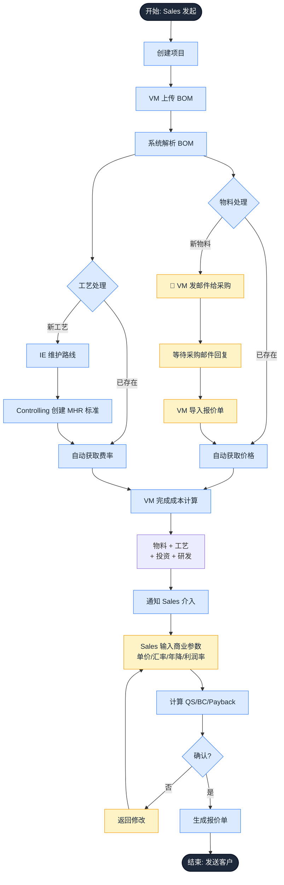
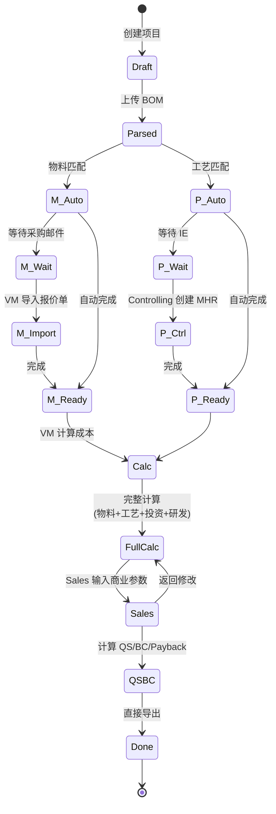

# Dr.aiVOSS 智能快速报价助手 - 产品需求文档 (PRD)

| 版本号 | 创建时间 | 更新时间 | 文档主题 | 创建人 |
|--------|----------|----------|----------|--------|
| v1.9   | 2026-02-03 | 2026-02-05 | Dr.aiVOSS 智能快速报价助手 PRD | Randy Luo |

---

## 📋 文档修订历史

| 版本 | 日期 | 修订人 | 修订内容 |
|------|------|--------|----------|
| v1.0 | 2026-02-03 | Randy Luo | 初始版本，定义 MVP 核心功能 |
| v1.1 | 2026-02-03 | Randy Luo | 优化流程图：物料/工艺并行计算，自动化邮件通知，调整审核顺序为 Sales→Controlling |
| v1.2 | 2026-02-03 | Randy Luo | 修复技术栈描述（Next.js → Vite），补充业务概念（HK III/SK/DB），更新参考资料引用 |
| v1.3 | 2026-02-03 | Randy Luo | 统一产品名称为 Dr.aiVOSS 智能快速报价助手 (Quoting-Copilot) |
| v1.4 | 2026-02-03 | Randy Luo | 删除开发计划章节；统一金额单位为人民币(¥) |
| v1.5 | 2026-02-03 | Randy Luo | 精简业务概念章节：移除计算公式（改为引用逻辑文档），明确文档职责分离 |
| v1.6 | 2026-02-03 | Randy Luo | 应用 SPEC 原则完善功能规范：添加具体的性能指标、验收标准和完整定义 |
| v1.7 | 2026-02-05 | Randy Luo | 🔴 v2.0 流程变更：VM/Sales/Controlling 职责重新划分；移除 Controlling 审核；新增多版本报价支持；v2.1 采购询价邮件化：采购无需登录系统，VM 导入报价单识别价格 |
| v1.8 | 2026-02-05 | Randy Luo | 架构调整：移除双轨计价功能，简化为单一标准成本计算 |
| **v1.9** | **2026-02-05** | **Randy Luo** | **✅ 重写 Payback 功能：从 VAVE 增量回收期改为项目静态回收期** |

---

## 1. 产品愿景与目标

### 1.1 产品愿景

> **"Dr.aiVOSS 智能快速报价助手 (Quoting-Copilot) 是汽车零部件企业的智能报价中台，通过数据驱动的自动化计算，消除跨部门报价中的'水分'，实现标准化、透明化、可追溯的成本核算，帮助企业在保持竞争力的同时最大化利润空间。"**

### 1.2 核心目标

| 目标维度 | 当前状态 | 目标状态 | 改善幅度 |
|----------|----------|----------|----------|
| **报价周期** | 3-5 天 | < 1 天 | **80% 缩减** |
| **报价准确性** | 标准偏差 15-20% | < 5% | **70% 提升** |
| **人力投入** | 5-8 人次/报价 | 2-3 人次/报价 | **60% 减少** |
| **流程透明度** | 黑盒操作，依赖邮件 | 全流程可视化 | **质的飞跃** |

### 1.3 核心价值主张

**"智能自动化"** - 通过 AI 辅助的 BOM 解析和自动化成本计算，消除人工计算的误差和低效，实现快速、准确的报价响应。

---

## 2. 用户画像

### 2.1 VM (Value Management) - 成本报价协调者

**角色定位：** 核心协调者，报价流程的中枢

**主要职责：**
- 创建报价项目并上传 BOM（Bill of Materials）
- 维护物料库和工艺费率库
- 自动计算标准成本
- **完成投资成本计算**（模具、检具、夹具、工装）
- **完成研发成本计算**
- **成本计算完成后通知 Sales 介入**
- 协调跨部门评审

**痛点：**
- 需要向 5 个部门收集数据，沟通成本高
- Excel 计算公式容易出错
- 无法追溯历史报价数据
- 报价"水分"难以识别

**核心需求：**
- 一键上传 BOM，自动解析
- 实时查看各部门评审状态
- 自动计算标准成本
- **完整的成本计算（物料+工艺+投资+研发）**

---

### 2.2 Sales - 项目发起者

**角色定位：** 项目发起与商业参数把控者

**主要职责：**
- 发起报价项目，输入客户需求
- 设定目标利润率
- **输入商业参数：单价、汇率、年降比例**
- **计算 QS（Quote Summary，报价摘要）**
- **计算 BC（Breakdown，成本分解）**
- **计算 Payback（投资回报期）**
- **直接导出报价单**（无需 Controlling 审核）

**痛点：**
- 不知道合理的利润率应该是多少
- 缺乏历史报价数据参考
- 客户催单时无法快速响应
- **商业参数分散在不同系统中**

**核心需求：**
- 快速创建项目
- **统一输入商业参数**
- **自助计算 QS/BC/Payback**
- **快速导出报价单（PDF）**

---

### 2.3 IE (Industrial Engineering) - 工艺专家

**角色定位：** 工艺路线库维护者

**主要职责：**
- 维护工艺路线模板（如：机加工、焊接、装配）
- 预估新工艺的标准工时
- 审核 AI 预估的工时是否合理

**痛点：**
- 重复回答相同工艺的工时问题
- 缺乏标准化的工时数据库

**核心需求：**
- 工艺路线库 CRUD 操作
- 查看相似工艺的历史工时参考

---

### 2.4 Controlling - 成本标准维护者

**角色定位：** MHR 标准创建者与费率维护者

**主要职责：**
- **创建/维护 MHR（Machine Hour Rate，机时费率）标准**
- **当 IE 定义新工艺路线涉及新设备时，创建新的 MHR 标准**
- 维护价格系数（汇率、通胀系数等）
- **维护 SK/HK 转换系数（S&A、物流包装、其他制造费用）**
- 维护工艺有效工时范围

**痛点：**
- 无法验证各部门给出的报价是否合理
- 缺乏历史数据对比
- **新设备 MHR 标准缺乏参考**

**核心需求：**
- **MHR 标准库管理**
- 设置费率阈值，超值自动预警
- 查看同类项目的历史报价对比

---

### 2.6 采购询价流程（邮件化）🔴 v2.0 变更

**流程说明：**
- 采购**不需要登录系统**
- VM 通过系统自动发送询价邮件给采购
- 采购联系供应商获取报价后，通过邮件回复报价单
- VM 导入报价单，系统自动识别物料价格并入库

**询价邮件内容：**
- 物料编码、物料名称
- 汇总数量（项目级）
- 推荐供应商列表
- 预计回复日期

**报价单导入：**
- 支持格式：Excel/CSV/PDF
- 自动识别：物料编码、单价、供应商
- 价格验证：超出历史范围 ±20% 自动预警

---

## 3. 核心功能规范（SPEC 原则）

> **SPEC 原则说明：**
> - **S**pecific（具体的）：明确的功能描述
> - **P**erformance（绩效）：可衡量的性能指标
> - **E**xecutable（可执行的）：可测试的验收标准
> - **C**omplete（完整的）：完整的输入输出定义

### 3.1 功能优先级总览

基于 RICE 评分模型（Reach × Impact × Confidence / Effort）：

| 优先级 | 功能模块 | RICE 评分 | 说明 |
|--------|----------|----------|------|
| **P0** | BOM 上传与解析 | 🔥 128 | MVP 核心，必须支持 Excel/CSV 解析 |
| **P0** | 自动计算工艺成本 | 🔥 125 | 核心算法，标准成本计算 |
| **P0** | 物料库管理 | 🔥 120 | 基础数据 CRUD |
| **P0** | 工艺费率库管理 | 🔥 118 | 基础数据 CRUD |
| **P0** | 项目创建与流转 | 🔥 115 | 主流程引擎 |
| **P1** | 审批流程引擎 | ⭐ 90 | 节点配置，状态机 |
| **P1** | 报价单导出 (PDF) | ⭐ 88 | 模板化导出 |
| **P1** | MHR 审核 | ⭐ 85 | Controlling 专用功能 |
| **P2** | QS/BC 计算 | 💡 72 | 高级分析功能（Payback 功能暂时下架） |
| **P2** | AI 语义匹配物料 | 💡 65 | 模糊匹配，提升体验 |
| **P3** | 历史数据 BI 分析 | 💡 50 | 后续优化 |

---

### 3.2 P0 功能详细规范

#### 3.2.1 BOM 上传与解析

| SPEC 维度 | 内容 |
|-----------|------|
| **Specific（具体功能）** | 用户上传 Excel/CSV 格式的 BOM 文件，系统自动解析并识别物料和工艺信息 |
| **Performance（性能指标）** | • 解析速度：< 5 秒/1000 行<br/>• 解析准确率：> 95%（格式标准时）<br/>• 支持最大文件：10 MB |
| **Executable（验收标准）** | • 能正确解析包含以下列的 Excel：物料号、物料名、数量、单位、工序、工时<br/>• 对空行、格式错误能给出明确提示<br/>• 解析结果以表格形式展示，支持手动编辑 |
| **Complete（完整定义）** | **输入**：Excel/CSV 文件（拖拽或点击上传）<br/>**处理**：格式验证 → 数据提取 → AI 特征识别（Comments 列）<br/>**输出**：结构化物料列表 + 工艺列表 |

---

#### 3.2.2 自动计算工艺成本

| SPEC 维度 | 内容 |
|-----------|------|
| **Specific（具体功能）** | 根据 BOM 数据和知识库，自动计算每个工序的 Standard Cost |
| **Performance（性能指标）** | • 计算时间：< 2 秒/100 行 BOM<br/>• 计算精度：小数点后 2 位 |
| **Executable（验收标准）** | • 物料有历史价格时自动填充<br/>• 工艺有对应 MHR 时自动计算成本<br/>• 新物料/新工艺标记为"待确认"<br/>• 计算结果实时展示，支持参数调整后重新计算 |
| **Complete（完整定义）** | **输入**：BOM 数据 + 物料库 + 工艺费率库<br/>**公式**：`Cost = (Material × Qty) + (CycleTime / 3600) × (mhr_var + mhr_fix + personnel × labor_rate)`<br/>**输出**：Standard Cost |

---

#### 3.2.3 物料库管理

| SPEC 维度 | 内容 |
|-----------|------|
| **Specific（具体功能）** | 维护物料主数据，支持标准价格录入 |
| **Performance（性能指标）** | • 查询响应：< 500 ms<br/>• 支持数据量：> 10,000 条<br/>• 批量导入：> 1000 条/次 |
| **Executable（验收标准）** | • 支持物料号唯一性校验<br/>• 支持物料分类（原材料/外购件/半成品）<br/>• 价格变更时记录历史版本<br/>• 支持物料号模糊搜索 |
| **Complete（完整定义）** | **数据字段**：物料号、物料名、规格、材质、单位、Standard Price、供应商、更新时间<br/>**操作**：Create / Read / Update / Delete / Batch Import |

---

#### 3.2.4 工艺费率库管理

| SPEC 维度 | 内容 |
|-----------|------|
| **Specific（具体功能）** | 维护工序费率（MHR），支持标准费率录入 |
| **Performance（性能指标）** | • 费率查询：< 300 ms<br/>• 支持工序数：> 500 种<br/>• 费率精度：0.01 元 |
| **Executable（验收标准）** | • 工序编码唯一性校验<br/>• 支持按成本中心分类管理<br/>• 费率变更需 Controlling 审批<br/>• 支持费率生效日期管理 |
| **Complete（完整定义）** | **数据字段**：工序编码、工序名称、成本中心、Standard MHR、生效日期、状态<br/>**操作**：Create / Read / Update / Delete / Approve |

---

#### 3.2.5 项目创建与流转

| SPEC 维度 | 内容 |
|-----------|------|
| **Specific（具体功能）** | 创建报价项目，支持跨部门审批流转，状态机管理 |
| **Performance（性能指标）** | • 项目创建：< 3 秒<br/>• 状态流转实时通知：< 1 分钟内<br/>• 支持并发项目数：> 100 |
| **Executable（验收标准）** | • 必填字段校验（项目名、客户、年量）<br/>• 状态流转不可逆（除"返回修改"）<br/>• 每次状态变更记录操作日志<br/>• 支持项目暂存草稿 |
| **Complete（完整定义）** | **状态流转 v2.0**：draft → parsing → (waiting_price | waiting_ie) → waiting_mhr → calculated → sales_input → completed<br/>**角色权限**：Sales（发起/输入商业参数）、VM（成本计算）、Controlling（创建/维护 MHR 标准）<br/>**通知机制**：邮件 + 站内消息 |

---

### 3.3 P1 功能详细规范

#### 3.3.1 审批流程引擎

| SPEC 维度 | 内容 |
|-----------|------|
| **Specific（具体功能）** | 可配置的多级审批流程，支持并行/串行审批 |
| **Performance（性能指标）** | • 审批操作响应：< 500 ms<br/>• 审批历史查询：< 1 秒 |
| **Executable（验收标准）** | • 支持审批节点动态配置<br/>• 支持审批意见必填/选填<br/>• 支持审批超时提醒（48 小时） |
| **Complete（完整定义）** | **审批节点**：Sales 审核 → Controlling 审核<br/>**审批操作**：批准 / 驳回（需填写原因）<br/>**通知规则**：审批通过通知下一节点，被驳回通知发起人 |

---

#### 3.3.2 报价单导出（PDF）

| SPEC 维度 | 内容 |
|-----------|------|
| **Specific（具体功能）** | 根据项目数据生成标准格式的 PDF 报价单 |
| **Performance（性能指标）** | • PDF 生成时间：< 5 秒<br/>• 文件大小：< 1 MB（单页） |
| **Executable（验收标准）** | • 支持中文显示<br/>• 支持公司 Logo 和签名<br/>• 支持预览后下载 |
| **Complete（完整定义）** | **模板内容**：项目信息、报价汇总、成本分解、有效期、条款<br/>**导出方式**：预览 → 下载 PDF |

---

#### 3.3.3 MHR 审核（Controlling）

| SPEC 维度 | 内容 |
|-----------|------|
| **Specific（具体功能）** | Controlling 审核新工艺的机时费率是否合理 |
| **Performance（性能指标）** | • 审核响应：< 500 ms<br/>• 历史数据查询：< 1 秒 |
| **Executable（验收标准）** | • 支持查看同类工艺的历史 MHR 参考<br/>• MHR 超出阈值（±20%）自动预警<br/>• 审核意见必填 |
| **Complete（完整定义）** | **输入**：待审核的 MHR 值 + 工艺描述<br/>**参考数据**：同类工艺历史 MHR 区间<br/>**输出**：批准 / 驳回（附原因） |

---

### 3.4 P2 功能详细规范

#### 3.4.1 QS/BC 计算

| SPEC 维度 | 内容 |
|-----------|------|
| **Specific（具体功能）** | 计算报价摘要（QS）、成本分解（BC） |
| **Performance（性能指标）** | • 计算时间：< 2 秒<br/>• 数据准确性：100% |
| **Executable（验收标准）** | • QS 包含含税报价、利润率、交货周期<br/>• BC 包含物料/工艺成本占比 |
| **Complete（完整定义）** | **输入**：Standard Cost + 利润率参数<br/>**输出**：QS 报价 / BC 分解图<br/>**注意**：Payback 功能暂时下架<br/>**参考**：详细计算逻辑见逻辑文档 |

---

#### 3.4.2 AI 语义匹配物料

| SPEC 维度 | 内容 |
|-----------|------|
| **Specific（具体功能）** | 当物料号不完全匹配时，使用 LLM 语义相似度匹配 |
| **Performance（性能指标）** | • 匹配响应：< 3 秒<br/>• 匹配准确率：> 70%（相似物料） |
| **Executable（验收标准）** | • 展示相似度评分（0-100）<br/>• 支持用户确认/拒绝<br/>• 拒绝后记录作为训练数据 |
| **Complete（完整定义）** | **输入**：物料名称 + 规格<br/>**匹配逻辑**：向量相似度 + LLM 语义理解<br/>**输出**：Top 3 候选物料 + 相似度评分 |

---

### 3.5 P3 功能规划

| 功能 | 说明 | 预计实现时间 |
|------|------|-------------|
| 历史数据 BI 分析 | 报价趋势分析、成本结构分析、供应商绩效分析 | Growth 阶段后 |
| 移动端适配 | 支持手机查看/审批报价 | Growth 阶段后 |
| 多语言支持 | 英文/德文界面 | 国际化阶段 |

---

## 4. 成功指标 (OKR)

### 4.1 北极星指标

> **报价周期 < 1 天，且标准偏差率 < 5%**

### 4.2 分阶段 OKR

#### MVP 阶段（3 个月）

| Objective | Key Results | 目标值 |
|-----------|-------------|--------|
| **O1: 实现基础报价自动化** | KR1: BOM 解析准确率 | > 95% |
| | KR2: 自动计算覆盖率 | > 80% |
| | KR3: 报价周期缩短 | < 1 天 |
| **O2: 建立数据基础** | KR1: 物料库数据量 | > 1000 条 |
| | KR2: 工艺费率库完整度 | > 90% |
| **O3: 用户满意度** | KR1: 用户采用率 | > 70% |
| | KR2: 用户 NPS | > 40 |

#### Growth 阶段（6 个月）

| Objective | Key Results | 目标值 |
|-----------|-------------|--------|
| **O1: 提升报价准确性** | KR1: 标准偏差率 | < 5% |
| | KR2: 成本计算准确率 | > 95% |
| **O2: 扩展使用场景** | KR1: 月活报价项目数 | > 50 |
| | KR2: 跨部门采用率 | 100% (5 个部门) |

---

## 5. 报价流程

### 5.1 标准流程（主流程）v2.1



### 5.2 状态流转 v2.1



### 5.3 角色参与矩阵 v2.1

| 流程节点 | Sales | VM | Controlling | IE | 采购 |
|----------|-------|----|-------------|----|----|
| 创建项目 | ✅ 主导 | ❌ | ❌ | ❌ | ❌ |
| 上传 BOM | ❌ | ✅ 主导 | ❌ | ❌ | ❌ |
| 物料价格匹配 | ❌ | 🔶 自动 | ❌ | ❌ | ❌ |
| **新物料询价** | ❌ | ✅ **主导**<br/>触发邮件/导入报价单 | ❌ | ❌ | 📧 邮件回复 |
| 工艺费率匹配 | ❌ | 🔶 自动 | ❌ | ❌ | ❌ |
| 新工艺路线维护 | ❌ | ❌ | ❌ | ✅ 主导 | ❌ |
| **创建 MHR 标准（新工艺）** | ❌ | ❌ | ✅ **主导** | ❌ | ❌ |
| **完成成本计算** | ❌ | ✅ **主导**<br/>物料+工艺+投资+研发 | ❌ | ❌ | ❌ |
| **输入商业参数** | ✅ **主导**<br/>单价/汇率/年降/利润率 | ❌ | ❌ | ❌ | ❌ |
| **计算 QS/BC/Payback** | ✅ **主导** | ❌ | ❌ | ❌ | ❌ |
| **导出报价单** | ✅ **主导** | ❌ | ❌ | ❌ | ❌ |

*注：🔶 表示系统自动执行；📧 表示邮件交互（无需登录系统）*

### 5.4 核心流程变更说明（v2.0 更新）

#### VM 职责增强
**变更前**：VM 完成物料和工艺成本计算后，即可通知 Sales 介入。
**变更后**：VM 必须**完成所有成本计算**（物料 + 工艺 + 投资 + 研发）后，才能通知 Sales 介入。

> **理由**：Sales 需要完整的成本数据作为输入，才能准确计算 QS/BC/Payback。

#### Controlling 职责变更
| 变更前 | 变更后 |
|--------|--------|
| 审核 MHR（新工艺） | ❌ 移除 |
| 审核利润率是否合理 | ❌ 移除 |
| 审核 BC 是否合理 | ❌ 移除 |
| **正确职责** | **创建/维护 MHR 标准**<br/>**维护 SK/HK 转换系数** |

> **理由**：Controlling 的核心价值在于建立和维护成本标准，而非审批每个报价。新流程让 Sales 能够更快速响应客户需求。

#### Sales 职责增强
| 变更前 | 变更后 |
|--------|--------|
| 设定目标利润率 | 保持 |
| 审核 QS/BC | ✅ 改为**自行计算** |
| 等待 Controlling 审核通过 | ❌ **移除** |
| **新增职责** | **输入商业参数：单价、汇率、年降**<br/>**计算 QS/BC/Payback**<br/>**直接导出报价单** |

#### 并行处理架构（保持）
**物料和工艺解析后并行处理**，大幅缩短整体处理时间。

#### 物料处理自动化（保持）
| 场景 | 处理方式 |
|------|----------|
| 无新物料 | ✅ **系统自动**获取物料价格并计算 |
| 有新物料 | ✅ **VM 发邮件**通知采购询价 |
| 物料成本审核 | ❌ **不需要审核**，直接计入成本 |

#### 工艺处理流程（调整）
| 场景 | 变更前 | 变更后 |
|------|--------|--------|
| 无新工艺 | 系统自动获取工艺费率 | 保持 |
| 有新工艺 | IE → PE → Controlling 审核 MHR | ✅ IE → **Controlling 创建 MHR 标准** |

#### 项目级汇总询价（邮件化）
**变更前**：按 BOM 行逐个发送询价邮件，同一物料重复询价。
**变更后**：
- **项目级汇总询价**，系统自动抓取整个项目中相同的物料进行汇总
- **采购无需登录系统**，通过邮件完成询价交互
- VM **导入报价单**，系统自动识别物料价格并入库

**邮件化询价流程：**
```
VM 点击"一键询价" → VM 发邮件给采购 → 采购联系供应商 → 采购邮件回复报价单 → VM 导入报价单 → 系统自动识别价格入库
```

#### 关键价值
1. **效率提升**：物料/工艺并行处理，节省 40-50% 处理时间
2. **自动化增强**：系统自动邮件通知，减少人工沟通成本
3. **流程简化**：移除 Controlling 审核环节，Sales 可直接导出报价单
4. **职责清晰**：Controlling 专注于标准维护，Sales 专注于商业决策
5. **询价优化**：项目级汇总询价，避免重复询价
6. **采购零门槛**：采购无需登录系统，通过邮件即可完成询价

---

## 6. 业务概念详解

### 6.1 QS (Quote Summary) - 报价摘要

**定义：** 客户视角的报价总览

**核心字段：**
- 总报价金额（含税）
- 目标利润率
- 预计交货周期
- 付款条件
- 质保条款

**示例：**
> **QS 报价摘要**
> - 项目：VOSS-2026-001（制动管路总成）
> - 总报价：¥ 125,000
> - 目标利润率：15%
> - 交货周期：12 周

---

### 6.2 BC (Breakdown) - 成本分解

**定义：** 内部视角的成本结构透明化

**核心层级：**
```
Total Cost（总成本）
├── Material Cost（物料成本）
│   ├── Raw Materials（原材料）
│   └── Purchased Parts（外购件）
└── Process Cost（工艺成本）
    ├── Machine Cost（机台成本）
    └── Labor Cost（人工成本）
```

**示例：**
> **BC 成本分解**
> - 总成本：¥ 106,250
> - 物料成本：¥ 65,000 (61.2%)
> - 工艺成本：¥ 41,250 (38.8%)
>   - 机台成本：¥ 28,000
>   - 人工成本：¥ 13,250

---

### 6.3 Payback - 项目静态投资回收期 🔴 v1.5

**定义：** 客户购买此产品后，需要多长时间收回全部投资成本

**核心公式：**
$$ Payback\ (月数) = \frac{项目总投资}{项目月度净利} $$

**业务场景：**
- 客户需要购买新设备/产线
- 客户需要承担模具开发费用
- 报价中需要体现"设备能帮客户多快回本"

**计算理念：**
- 采用静态回收期方法，不考虑货币时间价值
- 简单直观，易于向客户解释
- 结果偏保守，有利于风险控制

**推荐等级：**
| 等级 | 回收期 | 建议 |
|------|--------|------|
| 极力推荐 | ≤ 12 个月 | 回收期极短，投资回报快 |
| 推荐 | 12 - 24 个月 | 回收期适中，风险可控 |
| 谨慎 | 24 - 36 个月 | 回收期较长，需评估风险 |
| 不推荐 | > 36 个月 | 回收期过长，建议调整策略 |

> **详细计算逻辑：** [docs/PAYBACK_LOGIC.md](PAYBACK_LOGIC.md)

---

### 6.4 MHR (Machine Hour Rate) - 机时费率

**定义：** 每小时机器运行的综合成本

**包含内容：**
- 设备折旧
- 能源消耗
- 维护成本
- 厂房分摊

**示例：**
> **MHR 费率表**
> | 工艺 | Standard MHR |
> |------|-------------|
> | CNC 加工 | ¥ 85/h |
> | 焊接 | ¥ 65/h |

---

### 6.5 HK III (Herstellkosten III) - 制造成本

**定义：** 工厂大门的制造成本，不含研发和模具分摊

**包含内容：**
- 物料成本（Raw Materials + Purchased Parts）
- 工艺成本（Machine Cost + Labor Cost）

**业务意义：** 衡量工厂生产这个产品是否赚钱的核心指标

> **详细计算逻辑：** [docs/BUSINESS_CASE_LOGIC.md](BUSINESS_CASE_LOGIC.md) §3 HK III 计算

---

### 6.6 SK (Selbstkosten) - 完全成本

**定义：** 包含一切分摊后的真实总成本

**包含内容：**
- HK III（制造成本）
- 摊销（Amortization）：模具、研发
- S&A（管销费用）：通常为净销售额的 2-3%

**业务意义：** 企业真实承担的总成本，是定价决策的底线

> **详细计算逻辑：** [docs/BUSINESS_CASE_LOGIC.md](BUSINESS_CASE_LOGIC.md) §4 SK 计算

---

### 6.7 DB I & DB IV (Deckungsbeitrag) - 边际贡献

**DB I - 边际贡献 I（生产毛利）：**
- **意义：** 衡量工厂生产这个产品赚不赚钱，不考虑研发和模具分摊

**DB IV - 净利润：**
- **意义：** 衡量整个项目扣除所有投入后赚不赚钱

**业务解读：**
- 项目初期亏损：因为销量还没爬坡，且前期投入摊销重
- 后期 DB IV 转正：典型的汽车行业"前亏后盈"模型

> **详细计算逻辑：** [docs/BUSINESS_CASE_LOGIC.md](BUSINESS_CASE_LOGIC.md) §5 DB 计算

---

### 6.8 NRE (Non-Recurring Engineering) - 一次性工程费用

**定义：** 项目启动时的一次性投资费用

**包含内容：**
- 模具投入（Tooling Investment）
- 检具投入（Gauge Investment）
- 夹具投入（Fixture Investment）
- 研发投入（R&D Investment）

**摊销方式：**
| 模式 | 说明 | 适用场景 |
|------|------|----------|
| Per Piece | 全生命周期平摊 | 稳定量产项目 |
| Fixed 3 Years | 前3年摊销 | 客户要求快速回收 |

---

### 6.9 S&A (Sales & Administration) - 管销费用

**定义：** 销售与管理费用的分摊

**参数说明：**
- S&A Rate 通常为 2% - 3%
- 基数为净销售额（Net Sales）

**包含内容：**
- 销售人员工资
- 管理费用分摊
- 办公场地租金
- 其他运营费用

> **详细计算逻辑：** [docs/BUSINESS_CASE_LOGIC.md](BUSINESS_CASE_LOGIC.md) §6 S&A 计算

---

## 7. 非功能性需求

### 8.1 性能要求

| 指标 | 目标值 |
|------|--------|
| BOM 解析速度 | < 5 秒/1000 行 |
| 页面加载时间 | < 2 秒 |
| 并发用户数 | > 50 用户 |

### 8.2 安全性要求

- 用户认证：支持 SSO（单点登录）
- 权限控制：RBAC（基于角色的访问控制）
- 数据加密：传输层 TLS 1.3，存储层 AES-256
- 审计日志：所有操作可追溯

### 8.3 可用性要求

- 系统可用性：> 99.5%（月度）
- 数据备份：每日自动备份，保留 30 天
- 灾难恢复：RPO < 1 小时，RTO < 4 小时

---

## 8. 技术架构概述

### 9.1 技术栈

| 层级 | 技术选型 | 说明 |
|------|----------|------|
| **前端** | Vite + React 18 + TypeScript + ShadcnUI | B 端极简 UI |
| **后端** | Python + FastAPI | 高性能异步 API |
| **数据库** | MySQL（主库）+ PostgreSQL（向量库） | 关系型 + 向量搜索 |
| **缓存** | Redis | 会话管理 + 计算缓存 |
| **部署** | Docker + Nginx | 容器化部署 |

### 9.2 核心算法概述

**标准成本计算机制：** 系统对所有物料和工艺计算 Standard Cost，提供准确的成本核算基础。

**计算模块：**
- 物料成本计算
- 工艺成本计算（MHR 费率 × Cycle Time）
- HK III / SK / DB 汇总计算
- Payback 投资回收期计算（暂时下架）

> **详细算法实现：** 参考各业务逻辑文档（见附录 11.2）

---

## 9. 风险与依赖

### 10.1 技术风险

| 风险 | 影响 | 缓解措施 |
|------|------|----------|
| Excel 解析格式不统一 | 高 | 提供标准模板 + AI 智能识别 |
| 计算精度问题 | 中 | 使用 Decimal 类型，单元测试覆盖 |
| 并发计算性能 | 中 | 异步任务队列（Celery） |

### 10.2 业务风险

| 风险 | 影响 | 缓解措施 |
|------|------|----------|
| 用户抵触新系统 | 高 | 分阶段推广，提供培训 |
| 历史数据迁移 | 中 | 先导入核心数据，其余手动录入 |
| 部门协作阻力 | 中 | 由管理层推动，制定流程规范 |

---

## 10. 附录

### 11.1 术语表

> 完整的项目术语表请参考：**[docs/GLOSSARY.md](docs/GLOSSARY.md)**

| 术语 | 英文全称 | 简要说明 |
|------|----------|----------|
| BOM | Bill of Materials | 物料清单 |
| QS | Quote Summary | 报价摘要 |
| BC | Breakdown | 成本分解 |
| MHR | Machine Hour Rate | 机时费率 |
| HK III | Herstellkosten III | 制造成本（工厂大门成本） |
| SK | Selbstkosten | 完全成本（含所有分摊） |
| DB I | Deckungsbeitrag I | 边际贡献 I（生产毛利） |
| DB IV | Deckungsbeitrag IV | 净利润（扣除所有投入） |

### 11.2 参考资料

**核心文档：**
- [PROJECT_CONTEXT.md](../PROJECT_CONTEXT.md) - 业务逻辑核心契约
- [CLAUDE.md](../CLAUDE.md) - 开发协作指南
- [README.md](../README.md) - 项目概览与入门

**数据库与逻辑文档：**
- [docs/DATABASE_DESIGN.md](DATABASE_DESIGN.md) - 数据库结构唯一真理源
- [docs/GLOSSARY.md](GLOSSARY.md) - 项目术语表（完整版）
- [docs/BUSINESS_CASE_LOGIC.md](BUSINESS_CASE_LOGIC.md) - Business Case 计算逻辑 (HK/SK/DB)
- [docs/PROCESS_COST_LOGIC.md](PROCESS_COST_LOGIC.md) - 工艺成本计算逻辑 (MHR/标准成本)
- [docs/NRE_INVESTMENT_LOGIC.md](NRE_INVESTMENT_LOGIC.md) - NRE 投资成本计算逻辑
- [docs/PAYBACK_LOGIC.md](PAYBACK_LOGIC.md) - 投资回收期计算逻辑
- [docs/QUOTATION_SUMMARY_LOGIC.md](QUOTATION_SUMMARY_LOGIC.md) - 报价汇总计算逻辑

**运维与测试：**
- [docs/DEPLOYMENT.md](DEPLOYMENT.md) - 部署运维指南
- [docs/TESTING_STRATEGY.md](TESTING_STRATEGY.md) - 测试策略指南
- [docs/API_REFERENCE.md](API_REFERENCE.md) - API 完整参考

**变更记录：**
- [docs/CHANGELOG.md](CHANGELOG.md) - 文档变更日志

---

## 11. 审批记录

| 角色 | 姓名 | 审批意见 | 日期 |
|------|------|----------|------|
| 产品负责人 | - | 待审批 | - |
| 技术负责人 | - | 待审批 | - |
| 业务代表 | - | 待审批 | - |

---

**文档结束**

*如有疑问，请联系产品团队：luoxin@jshine.cc*
