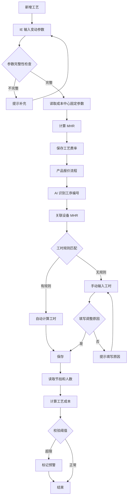

# 工艺成本计算逻辑

| 版本号 | 创建时间 | 更新时间 | 文档主题 | 创建人 |
|--------|----------|----------|----------|--------|
| v2.1   | 2026-02-03 | 2026-02-13 | 工艺成本计算逻辑 | Randy Luo |

---

**版本变更记录：**
| 版本 | 日期 | 变更内容 |
|------|------|----------|
| v2.1 | 2026-02-13 | 🆕 新增工时版本管理、新工作中心建立流程、工时计算规则维护 |
| v2.0 | 2026-02-13 | 🔴 **重大重构**：新增工序编码规则；重构参数分类为固定/变动成本；更新 MHR 计算公式；新增负载系数 |
| v1.4 | 2026-02-05 | 移除双轨计价逻辑，仅保留 Standard Cost 计算；简化 MHR 费率模型 |
| v1.3 | 2026-02-05 | 同步 v2.0 流程变更：移除 Controlling 审核；新增 sales_input 状态；MHR 费率拆分为 var/fix |
| v1.2 | 2026-02-04 | 初始版本 |

---

## 1. 工艺评估核心录入参数

根据业务场景，参数录入分为**固定成本参数**（由 Controlling 维护）和**变动成本参数**（由 IE/工艺输入）。

### 1.1 固定成本参数（Controlling 维护）

这些参数通常每年更新一次，作为全公司报价的底座。

| 参数 | 说明 | 单位 | 变化频率 |
|------|------|------|---------|
| **租金单价** | 厂房租金成本 | 元/㎡/年 | 年度更新 |
| **能源单价** | 电力单价 | 元/kWh | 年度更新 |
| **折旧年限** | 设备折旧年限 | 年 | 因成本中心不同有差异 |
| **利率** | 年利率 | % | 年度更新 |
| **小时工资** | 操作员时薪 | 元/小时 | 每个成本中心每年变化 |

### 1.2 变动成本参数（IE/工艺输入）

由 IE 或 VM 针对具体设备/工艺进行录入，**在新增工艺时触发 MHR 计算**。

| 参数 | 说明 | 单位 |
|------|------|------|
| **设备购置原值** | 设备采购价格 | 元 |
| **占用面积** | 设备占地面积 | ㎡ |
| **额定功率** | 设备额定功率 | kW |
| **计划小时数** | 年度计划运行时间 | 小时 |
| **负载系数** | 实际功率与额定功率比率 | 0-1（默认 0.7） |

**计划小时数计算：**
```
计划小时数 = 天数 × 班次小时 × 稼动率
```

**负载系数使用规则：**
| 场景 | 负载系数 | 说明 |
|------|---------|------|
| 默认值 | 0.7 | 针对成熟工序如注塑机 |
| 低负载 | 0.5-0.6 | 保压、冷却占比较长的工序 |
| 高负载 | 0.8-1.0 | 全速冲压、持续加热的高能耗工序 |

> **注意：** 在"新增工艺"或"高精度报价"时，IE 可以调整负载系数。

### 1.3 工序编码规则 🆕

#### 工序编号格式

- **格式**：`字母 + 两位数字`
- **字母**：代表工作中心
- **数字**：该工作中心下的工序序号（01-99）

**示例**：`I01` = 注塑工作中心的第1个工序

#### 工作中心字母映射表

| 字母 | 英文全称 | 中文 | 说明 |
|------|---------|------|------|
| **I** | Injection | 注塑 | VOSS 核心工序，通常关联注塑机 |
| **A** | Assembly | 装配 | 包含手动、半自动、全自动装配线 |
| **M** | Machining | 机加 | 涉及切管、倒角、打孔等 |
| **T** | Testing | 检测 | 气密性检查、水检、视觉检测 |
| **P** | Packing | 包装 | 称重、贴标、入库前处理 |
| **S** | Surface | 表处 | 涂层、清洗、丝印 |

#### 工艺路线编码规则

- **格式**：`产线名称 + 工序1编号 + 工序2编号 + ...`
- **示例**：`LINE-I01A02M03` = 产线 LINE，经过注塑 I01 → 装配 A02 → 机加 M03

---

## 2. 工艺评估计算逻辑 (Calculation Logic)

### 2.1 工艺成本快速计算流程

```
AI 解析 BOM/工艺路径
       ↓
识别工序编号（如"I01"、"M02"）
       ↓
自动关联该设备的 MHR
       ↓
乘以工艺定额（人工 + 节拍）
       ↓
得出设备部分工艺成本
```

### 2.2 MHR (机时费率) 计算公式 🆕

**触发时机**：新增工艺/设备时

#### 固定成本/小时

```
租金成本 = 租金单价 × 占用面积 / 计划小时数
折旧成本 = 设备购置原值 / 折旧年限 / 计划小时数
利息成本 = [（购置原值 / 2）× 利率] / 计划小时数
```

#### 变动成本/小时

```
能源成本 = 能源单价 × 额定功率 × 负载系数
```

#### MHR 费率汇总

```
MHR_fix = 租金成本 + 折旧成本 + 利息成本
MHR_var = 能源成本
MHR_total = MHR_fix + MHR_var
```

### 2.3 人工成本（单独计算）

```
人工成本/小时 = 小时工资 × 人数
```

### 2.4 单工序工艺成本汇总

对于报价单中的每一行工艺，成本计算如下：

$$Cost_{std} = (MHR_{total} + Rate_{labor}) \times \frac{Cycle\ Time}{3600}$$

> **注意：** Cycle Time 以秒为单位，需除以 3600 转换为小时

---

## 3. 系统校验与风险预警

为防止录入错误导致报价亏损，系统需设置以下"软硬闸口"：

### 3.1 除零保护 (Zero Division Protection)

| 条件 | 触发动作 |
|------|---------|
| 计划小时数 = 0 | 禁止计算，提示"计划小时数不能为0" |
| 折旧年限 = 0 | 禁止计算，提示"折旧年限不能为0" |

### 3.2 阈值拦截 (Threshold Validation)

| 条件 | 触发动作 |
|------|---------|
| $MHR_{total}$ 偏离同类成本中心均值 $\pm 15\%$ | 自动标记为"需重点审核" |
| 负载系数 < 0.5 或 > 1.0 | 弹出警告确认 |

### 3.3 同步性检查 (Data Consistency)

| 条件 | 触发动作 |
|------|---------|
| 设备购置原值 > 0 但未填写占用面积 | 弹出警告 |
| 新增工艺但未触发 MHR 计算 | 不允许进入 Sales 审核环节 |

---

## 4. 工时版本管理 🆕

### 4.1 工时来源分类

| 工时来源 | 标记 | 原因说明 | 适用场景 |
|---------|------|---------|---------|
| 系统自动计算 | `auto` | 无需填写原因，仅做验证 | 成熟工艺，工时规则库已配置 |
| 手动调整 | `manual` | **必须填写调整原因** | 新工艺、特殊情况、经验修正 |

### 4.2 手动调整规则

**触发条件：**
- 工时规则库未覆盖的新工艺
- 实际工时与系统计算差异较大
- 特殊产品需要经验修正

**操作流程：**
```
手动修改工时 → 弹出原因输入框 → 填写调整原因 → 保存
```

**校验规则：**
- `cycle_time_source = 'manual'` 时，`cycle_time_adjustment_reason` 必填
- 系统自动记录调整人和调整时间

---

## 5. 新工作中心建立流程 🆕

### 5.1 流程图

```
临时编号(IE录入参数) → MHR自动计算 → 实际投产后 → IE将状态改为"正式"
```

### 5.2 状态说明

| 状态 | 英文 | 说明 | 操作人 |
|------|------|------|--------|
| **临时** | `TEMPORARY` | MHR 已计算但设备未实际投产 | IE 创建 |
| **正式** | `ACTIVE` | 设备已实际投产，可用于正式报价 | IE 确认 |
| **停用** | `INACTIVE` | 设备已退役或不再使用 | Controlling |

### 5.3 临时工作中心管理

**创建时机：**
- 识别到新工艺且库中无对应工作中心
- 需要先计算 MHR 进行报价评估

**转正条件：**
- 设备已实际采购并安装
- 完成试生产验证
- IE 在工作中心维护界面手动确认

---

## 6. 工时计算规则维护 🆕

### 6.1 规则配置

每个工作中心可定义独立的工时计算方法：

| 计算方法 | 英文 | 输入变量 | 示例 |
|---------|------|---------|------|
| **长度法** | `LENGTH` | 管子长度 → 标准时间 | 光管切管：8秒/根 |
| **点数法** | `COUNT` | 压桩点数 → 标准时间 | 压桩：12~15秒/点 |
| **时间法** | `TIME` | 直接输入时间 | 成型：2.7~5秒 |

### 6.2 规则示例

**切管工时规则（长度法）：**
| 工作中心 | 输入变量 | 范围 | 标准工时 | 单位 |
|---------|---------|------|---------|------|
| M01 (切管) | 管子类型 | 光管 | 8 | 秒/根 |
| M01 (切管) | 管子类型 | 波纹管 | 8 | 秒/根 |

**压桩工时规则（点数法）：**
| 工作中心 | 输入变量 | 范围 | 标准工时 | 单位 |
|---------|---------|------|---------|------|
| A01 (压桩) | 管径 | < 25mm | 12 | 秒/点 |
| A01 (压桩) | 管径 | ≥ 25mm | 15 | 秒/点 |

**成型工时规则（时间法）：**
| 工作中心 | 输入变量 | 范围 | 标准工时 | 单位 |
|---------|---------|------|---------|------|
| M02 (成型) | 管子长度 | ≤ 1m | 2.7 | 秒 |
| M02 (成型) | 管子长度 | ≤ 2m | 5.0 | 秒 |

### 6.3 数据库存储

工时规则存储在 `work_center_time_rules` 表中，详见 §7.4。

### 6.4 维护职责

| 角色 | 职责 |
|------|------|
| **IE** | 维护工时计算规则（方法、范围、标准工时） |
| **Controlling** | 审核 MHR 计算结果合理性 |

---

## 7. 数据库设计规范 (Schema)

### 7.1 cost_centers (成本中心主数据)

| 字段名 | 类型 | 说明 | 示例值 |
|--------|------|------|--------|
| `id` | VARCHAR(20) | PK, 成本中心代码 | CC001 |
| `factory_id` | VARCHAR(20) | FK, 所属工厂 | F001 |
| `name` | VARCHAR(100) | 成本中心名称 | 注塑车间A线 |
| `net_production_hours` | DECIMAL(8,2) | 年度额定生产小时数 | 4800.00 |
| `efficiency_rate` | DECIMAL(5,4) | 稼动率 (0-1) | 0.8000 |
| `plan_fx_rate` | DECIMAL(10,6) | 计划汇率 | 7.830000 |
| `avg_wages_per_hour` | DECIMAL(10,2) | **小时工资** | 85.50 |
| `useful_life_years` | INT | **折旧年限** | 8 |
| `rent_unit_price` | DECIMAL(10,4) | **🆕 租金单价（元/㎡/年）** | 1200.00 |
| `energy_unit_price` | DECIMAL(8,4) | **🆕 能源单价（元/kWh）** | 0.85 |
| `interest_rate` | DECIMAL(5,4) | **🆕 利率（年）** | 0.0600 |
| `status` | VARCHAR(20) | **🆕 TEMPORARY / ACTIVE / INACTIVE** | ACTIVE |
| `created_at` | DATETIME | 创建时间 | DEFAULT NOW() |

> **status 字段说明**：
> - `TEMPORARY`：临时工作中心，MHR 已计算但设备未投产
> - `ACTIVE`：正式工作中心，已实际投产
> - `INACTIVE`：停用，设备已退役

### 7.2 process_rates (工序费率主数据) - 扩展

| 字段名 | 类型 | 说明 | 示例值 |
|--------|------|------|--------|
| `id` | INT | PK, AUTO_INCREMENT | - |
| `process_code` | VARCHAR(50) | UNIQUE, **工序编号**（字母+数字） | I01 |
| `cost_center_id` | VARCHAR(20) | FK, 关联成本中心 | CC001 |
| `process_name` | VARCHAR(100) | 工序名称 | 注塑成型 |
| `work_center` | VARCHAR(1) | **🆕 工作中心字母** | I |
| `equipment_origin_value` | DECIMAL(14,2) | **🆕 设备购置原值** | 1500000.00 |
| `floor_area` | DECIMAL(8,2) | **🆕 占用面积（㎡）** | 50.00 |
| `rated_power` | DECIMAL(8,2) | **🆕 额定功率（kW）** | 120.00 |
| `planned_hours` | DECIMAL(10,2) | **🆕 计划小时数** | 3840.00 |
| `load_factor` | DECIMAL(3,2) | **🆕 负载系数** | 0.70 |
| `std_mhr_var` | DECIMAL(10,2) | 标准变动费率（计算值） | 71.40 |
| `std_mhr_fix` | DECIMAL(10,2) | 标准固定费率（计算值） | 85.00 |
| `std_mhr_total` | DECIMAL(10,2) | **🆕 标准总费率** | 156.40 |
| `efficiency_factor` | DECIMAL(4,2) | 效率系数 | 1.00 |
| `status` | VARCHAR(20) | ACTIVE / INACTIVE | ACTIVE |
| `created_at` | DATETIME | 创建时间 | DEFAULT NOW() |

### 7.3 product_processes (产品工艺路线) - 扩展

| 字段名 | 类型 | 说明 | 示例值 |
|--------|------|------|--------|
| `id` | CHAR(36) | PK, UUID | - |
| `project_product_id` | CHAR(36) | FK, 关联产品 | - |
| `process_code` | VARCHAR(50) | FK, 工序编号 | I01 |
| `sequence_order` | INT | 工序顺序 | 10 |
| `cycle_time_std` | INT | 标准工时（秒） | 45 |
| **`cycle_time_source`** | **VARCHAR(10)** | **🆕 工时来源：auto / manual** | auto |
| **`cycle_time_adjustment_reason`** | **TEXT** | **🆕 手动调整原因（manual 时必填）** | - |
| `personnel_std` | DECIMAL(4,2) | 标准人工配置 | 1.0 |
| `labor_rate` | DECIMAL(10,2) | **🆕 人工费率快照** | 85.50 |
| `mhr_snapshot` | DECIMAL(10,2) | **🆕 MHR 快照** | 156.40 |
| `std_cost` | DECIMAL(12,4) | 标准成本 | 3.0125 |
| `remarks` | TEXT | 备注 | - |
| `created_at` | DATETIME | 创建时间 | DEFAULT NOW() |

### 7.4 work_center_time_rules (工作中心工时规则) 🆕

| 字段名 | 类型 | 说明 | 示例值 |
|--------|------|------|--------|
| `id` | INT | PK, AUTO_INCREMENT | - |
| `cost_center_id` | VARCHAR(20) | FK, 关联成本中心 | M01 |
| `calc_method` | VARCHAR(20) | 计算方法：LENGTH / COUNT / TIME | COUNT |
| `input_variable` | VARCHAR(50) | 输入变量名 | 管径 |
| `range_min` | DECIMAL(10,2) | 范围下限 | 0 |
| `range_max` | DECIMAL(10,2) | 范围上限（NULL 表示无上限） | 25 |
| `std_time_seconds` | DECIMAL(10,2) | 标准工时（秒） | 12 |
| `unit` | VARCHAR(20) | 单位 | 秒/点 |
| `status` | VARCHAR(20) | ACTIVE / INACTIVE | ACTIVE |
| `created_at` | DATETIME | 创建时间 | DEFAULT NOW() |

> **规则匹配逻辑**：
> 1. 根据成本中心 ID 查询所有 ACTIVE 规则
> 2. 根据 `calc_method` 确定输入变量类型
> 3. 匹配 `range_min` 和 `range_max` 范围
> 4. 返回对应的 `std_time_seconds`

---

## 8. 数据模型定义

### 8.1 Pydantic 模型

```python
from decimal import Decimal
from pydantic import BaseModel, Field, validator
from enum import Enum
from typing import Literal


class WorkCenter(str, Enum):
    """工作中心枚举"""
    INJECTION = "I"   # 注塑
    ASSEMBLY = "A"    # 装配
    MACHINING = "M"   # 机加
    TESTING = "T"     # 检测
    PACKING = "P"     # 包装
    SURFACE = "S"     # 表处


class CostCenterStatus(str, Enum):
    """成本中心状态 🆕"""
    TEMPORARY = "TEMPORARY"  # 临时
    ACTIVE = "ACTIVE"        # 正式
    INACTIVE = "INACTIVE"    # 停用


class CycleTimeSource(str, Enum):
    """工时来源 🆕"""
    AUTO = "auto"      # 系统自动计算
    MANUAL = "manual"  # 手动调整


class CalcMethod(str, Enum):
    """工时计算方法 🆕"""
    LENGTH = "LENGTH"  # 长度法
    COUNT = "COUNT"    # 点数法
    TIME = "TIME"      # 时间法


class CostCenter(BaseModel):
    """成本中心"""
    id: str
    name: str
    net_production_hours: Decimal = Field(gt=0)
    efficiency_rate: Decimal = Field(gt=0, le=1)
    plan_fx_rate: Decimal = Field(gt=0)
    avg_wages_per_hour: Decimal = Field(gt=0, description="小时工资")
    useful_life_years: int = Field(default=8, ge=1, description="折旧年限")
    rent_unit_price: Decimal = Field(gt=0, description="租金单价（元/㎡/年）")
    energy_unit_price: Decimal = Field(gt=0, description="能源单价（元/kWh）")
    interest_rate: Decimal = Field(ge=0, le=1, description="年利率")
    status: CostCenterStatus = Field(default=CostCenterStatus.TEMPORARY)  # 🆕

    @property
    def effective_hours(self) -> Decimal:
        """年度有效产能"""
        return self.net_production_hours * self.efficiency_rate


class ProcessRate(BaseModel):
    """工序费率"""
    process_code: str = Field(..., pattern=r"^[IAMTPS]\d{2}$", description="工序编号")
    cost_center_id: str
    process_name: str
    work_center: WorkCenter
    equipment_origin_value: Decimal = Field(gt=0, description="设备购置原值")
    floor_area: Decimal = Field(gt=0, description="占用面积（㎡）")
    rated_power: Decimal = Field(gt=0, description="额定功率（kW）")
    planned_hours: Decimal = Field(gt=0, description="计划小时数")
    load_factor: Decimal = Field(default=Decimal("0.7"), ge=0.5, le=1.0, description="负载系数")

    # 计算字段
    std_mhr_var: Decimal | None = None
    std_mhr_fix: Decimal | None = None
    std_mhr_total: Decimal | None = None

    def calculate_mhr(self, cost_center: CostCenter) -> None:
        """计算 MHR 费率"""
        # 固定成本/小时
        rent_cost = cost_center.rent_unit_price * self.floor_area / self.planned_hours
        depreciation_cost = self.equipment_origin_value / cost_center.useful_life_years / self.planned_hours
        interest_cost = (self.equipment_origin_value / 2 * cost_center.interest_rate) / self.planned_hours

        # 变动成本/小时
        energy_cost = cost_center.energy_unit_price * self.rated_power * self.load_factor

        # 汇总
        self.std_mhr_fix = (rent_cost + depreciation_cost + interest_cost).quantize(Decimal("0.01"))
        self.std_mhr_var = energy_cost.quantize(Decimal("0.01"))
        self.std_mhr_total = (self.std_mhr_fix + self.std_mhr_var).quantize(Decimal("0.01"))

    @property
    def mhr_total(self) -> Decimal:
        """获取总费率"""
        return self.std_mhr_total or Decimal("0")


class ProductProcess(BaseModel):
    """产品工艺"""
    id: str | None = None
    project_product_id: str
    process_code: str
    sequence_order: int
    cycle_time_std: int = Field(gt=0, description="标准工时（秒）")
    cycle_time_source: CycleTimeSource = Field(default=CycleTimeSource.AUTO)  # 🆕
    cycle_time_adjustment_reason: str | None = None  # 🆕
    personnel_std: Decimal = Field(default=Decimal("1.0"), ge=0)
    labor_rate: Decimal = Field(gt=0, description="人工费率快照")
    mhr_snapshot: Decimal = Field(gt=0, description="MHR 快照")

    @validator('cycle_time_adjustment_reason')
    def validate_adjustment_reason(cls, v, values):
        """手动调整时必须填写原因 🆕"""
        if values.get('cycle_time_source') == CycleTimeSource.MANUAL and not v:
            raise ValueError('手动调整工时时必须填写调整原因')
        return v

    def calculate_cost(self) -> Decimal:
        """计算工艺成本

        公式: Cost = (MHR + 人工成本) × (节拍 / 3600)
        """
        labor_cost_per_hour = self.labor_rate * self.personnel_std
        total_rate = self.mhr_snapshot + labor_cost_per_hour
        hours = Decimal(self.cycle_time_std) / Decimal("3600")

        return (total_rate * hours).quantize(Decimal("0.0001"))


class WorkCenterTimeRule(BaseModel):
    """工作中心工时规则 🆕"""
    id: int | None = None
    cost_center_id: str
    calc_method: CalcMethod
    input_variable: str = Field(..., description="输入变量名")
    range_min: Decimal = Field(description="范围下限")
    range_max: Decimal | None = Field(default=None, description="范围上限（NULL 表示无上限）")
    std_time_seconds: Decimal = Field(gt=0, description="标准工时（秒）")
    unit: str = Field(..., description="单位")
    status: str = "ACTIVE"

    def matches(self, value: Decimal) -> bool:
        """检查输入值是否匹配规则范围"""
        if value < self.range_min:
            return False
        if self.range_max is not None and value > self.range_max:
            return False
        return True


class ProcessCostValidation(BaseModel):
    """工艺成本校验结果"""
    is_valid: bool
    warnings: list[str] = []
    errors: list[str] = []

    @classmethod
    def validate_mhr_deviation(
        cls,
        calculated: Decimal,
        benchmark: Decimal,
        threshold: Decimal = Decimal("0.15")
    ) -> "ProcessCostValidation":
        """校验 MHR 偏离度"""
        deviation = abs((calculated - benchmark) / benchmark)
        warnings = []
        if deviation > threshold:
            warnings.append(f"MHR 偏离基准 {deviation*100:.1f}%，需重点审核")

        return cls(is_valid=len(warnings) == 0, warnings=warnings)
```

---

## 9. 计算流程图



---

## 10. 与其他文档的关联

| 文档 | 关联点 |
|------|--------|
| `DATABASE_DESIGN.md` | 依赖 `cost_centers`, `process_rates`, `product_processes`, `work_center_time_rules` 表 |
| `NRE_INVESTMENT_LOGIC.md` | 设备投资影响 MHR 固定费率计算 |
| `PAYBACK_LOGIC.md` | 折旧成本用于现金流计算 |
| `BUSINESS_CASE_LOGIC.md` | 工艺成本汇总为 HK III |
| `QUOTATION_SUMMARY_LOGIC.md` | 工艺成本影响 SK1/SK2 |

### 10.1 数据流向

```
┌─────────────────────────────────────────────────────────────┐
│                 Controlling (财务)                           │
│  维护: 租金单价, 能源单价, 折旧年限, 利率, 小时工资           │
└─────────────────────────────────────────────────────────────┘
                              ↓
┌─────────────────────────────────────────────────────────────┐
│                 IE/工艺工程师                                │
│  录入: 设备原值, 占用面积, 额定功率, 计划小时数, 负载系数     │
│  维护: 工时计算规则（长度法/点数法/时间法）                    │
│  触发: 新增工艺时自动计算 MHR                                │
└─────────────────────────────────────────────────────────────┘
                              ↓
┌─────────────────────────────────────────────────────────────┐
│                 工艺成本计算引擎                              │
│  计算: MHR_fix + MHR_var + 人工成本 = 总费率                 │
│        工艺成本 = 总费率 × (节拍 / 3600)                      │
│        工时: 自动计算 或 手动调整（需填原因）                  │
└─────────────────────────────────────────────────────────────┘
                              ↓
┌─────────────────────────────────────────────────────────────┐
│                 AI 识别层                                    │
│  识别: 工序编号 (I01, A02, M03...)                          │
│  关联: 自动匹配设备 MHR                                      │
└─────────────────────────────────────────────────────────────┘
                              ↓
┌─────────────────────────────────────────────────────────────┐
│                 Business Case                                │
│  汇总: HK III = Σ Process Cost                              │
└─────────────────────────────────────────────────────────────┘
```

---

## 11. 开发实施 Checklist

| 任务 | 责任方 | 状态 |
|------|--------|------|
| 后端：更新 `CostCenter` 模型新增字段 | 后端开发 | ⬜ |
| 后端：更新 `ProcessRate` 模型新增字段 | 后端开发 | ⬜ |
| 后端：实现 MHR 自动计算逻辑 | 后端开发 | ⬜ |
| 后端：实现工序编号格式校验 | 后端开发 | ⬜ |
| 后端：实现阈值校验与预警机制 | 后端开发 | ⬜ |
| 后端：新增 `work_center_time_rules` 表及 API | 后端开发 | ⬜ |
| 后端：实现工时自动计算规则匹配 | 后端开发 | ⬜ |
| 后端：实现工时版本管理（auto/manual） | 后端开发 | ⬜ |
| 前端：开发新增工艺 MHR 计算界面 | 前端开发 | ⬜ |
| 前端：实现工序编号自动生成 | 前端开发 | ⬜ |
| 前端：实现工时规则维护界面 | 前端开发 | ⬜ |
| 前端：实现手动调整工时原因输入 | 前端开发 | ⬜ |
| AI：实现工序编号识别与 MHR 关联 | AI 开发 | ⬜ |

---

## 12. API 端点定义

### 9.1 成本中心管理

| 方法 | 端点 | 功能 |
|------|------|------|
| GET | `/api/v1/cost-centers` | 获取成本中心列表 |
| POST | `/api/v1/cost-centers` | 创建成本中心 |
| PUT | `/api/v1/cost-centers/{id}` | 更新成本中心 |

### 9.2 工艺费率管理

| 方法 | 端点 | 功能 |
|------|------|------|
| GET | `/api/v1/process-rates` | 获取工序费率列表 |
| POST | `/api/v1/process-rates` | **创建工序费率（触发 MHR 计算）** |
| PUT | `/api/v1/process-rates/{id}` | 更新工序费率 |
| POST | `/api/v1/process-rates/{id}/recalculate` | **重新计算 MHR** |

### 9.3 工艺成本计算

| 方法 | 端点 | 功能 |
|------|------|------|
| POST | `/api/v1/process-cost/calculate` | 计算工艺成本 |
| GET | `/api/v1/process-cost/{project_product_id}` | 获取产品工艺成本 |

### 9.4 响应示例

```json
{
  "project_product_id": "PROD-001",
  "processes": [
    {
      "process_code": "I01",
      "process_name": "注塑成型",
      "work_center": "I",
      "sequence_order": 10,
      "cycle_time_std": 45,
      "personnel_std": 1.0,
      "mhr_snapshot": 156.40,
      "labor_rate": 85.50,
      "std_cost": 3.0125
    }
  ],
  "total_std_cost": 3.0125,
  "validation": {
    "is_valid": true,
    "warnings": [],
    "errors": []
  }
}
```

---

**文档结束**
