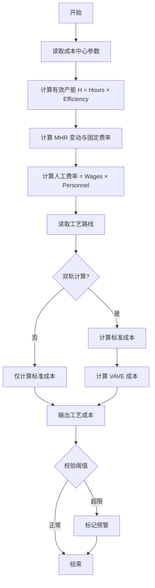

# 工艺成本计算逻辑

| 版本号 | 创建时间 | 更新时间 | 文档主题 | 创建人 |
|--------|----------|----------|----------|--------|
| v1.4   | 2026-02-03 | 2026-02-05 | 工艺成本计算逻辑 | Randy Luo |

---

**版本变更记录：**
| 版本 | 日期 | 变更内容 |
|------|------|----------|
| v1.4 | 2026-02-05 | 移除双轨计价逻辑，仅保留 Standard Cost 计算；简化 MHR 费率模型 |
| v1.3 | 2026-02-05 | 同步 v2.0 流程变更：移除 Controlling 审核；新增 sales_input 状态；MHR 费率拆分为 var/fix |
| v1.2 | 2026-02-04 | 初始版本 |

---

## 1. 工艺评估核心录入参数

根据业务场景，参数录入分为基础环境参数（由财务/Controlling 维护）和项目特定参数（由 IE/VM 维护）。

### 1.1 基础环境与成本中心参数 (Master Data)

这些参数通常每年更新一次，作为全公司报价的底座。

| 参数 | 说明 | 数据类型 |
|------|------|----------|
| **成本中心 (Cost Center)** | 标识工艺所属的生产单元 | VARCHAR |
| **有效工作时间** | 年度额定生产小时数 | DECIMAL |
| **稼动率 (Efficiency %)** | 考虑设备故障、换模等因素后的实际产出率 | DECIMAL |
| **计划汇率 (Plan fx rate)** | 如 CNY 兑 EUR，用于跨国报价 | DECIMAL |
| **平均时薪 (Avg Wages/Hour)** | 该成本中心操作员的综合时薪 | DECIMAL |
| **折旧年限 (Useful life)** | 通常为 8 年 | INT |

### 1.2 项目特定参数 (Project Specific)

由 IE 或 VM 针对具体零件的工艺路径进行录入。

| 参数 | 说明 | 数据类型 |
|------|------|----------|
| **设备/工装投资 (Investment)** | 针对该零件新增的设备、模具或检具投入 | DECIMAL |
| **工位数 (Workstation nr.)** | 该工艺涉及的工位编号 | VARCHAR |
| **每机台人数 (Personnel/machine)** | 操作该设备所需的人力配置 | DECIMAL |
| **节拍工时 (Cycle Time)** | 完成单件产品所需的生产时长（秒） | DECIMAL |
| **能源需求 (Energy/hour)** | 机器每小时运行的电/气等能耗量（kWh） | DECIMAL |

---

## 2. 工艺评估计算逻辑 (Calculation Logic)

系统采用级联计算模式，自动处理从单机费率到总工艺成本的转化。

### 2.1 年度有效产能计算

$$H_{effective} = Net\ production\ hours \times Efficiency\%$$

### 2.2 MHR (机时费率) 拆解逻辑

MHR 被拆分为变动与固定两个维度。

#### 机器变动费率 (MHR Variable)

包含：能源、维修、刀具、操作辅料

$$MHR_{var} = \frac{\sum (能源成本 + 维保成本 + 刀具成本)}{H_{effective}}$$

#### 机器固定费率 (MHR Fixed)

包含：折旧、利息、厂房租金、保险费

$$MHR_{fix} = \frac{\sum (折旧 + 租金 + 管理分摊)}{H_{effective}}$$

> **⚠️ v1.4 重要更新：折旧数据单独存储**
> - 从 v1.4 开始，折旧率字段 `depreciation_rate` 从 MHR_fix 中单独剥离
> - MHR_fix 仍包含折旧作为其组成部分之一
> - `depreciation_rate` 字段独立存储，用于 Payback 现金流计算（现金流 = 净利 + 折旧）
> - 可通过 `fix_excluding_depreciation` 属性获取不含折旧的固定费率

#### 人工费率 (Labor Rate)

$$Rate_{labor} = Average\ Wages\ per\ Hour \times Personnel\ per\ machine$$

### 2.3 单工序工艺成本汇总

对于报价单中的每一行工艺，成本计算如下：

$$Cost_{std} = (std\_mhr\_var + std\_mhr\_fix + Rate_{labor}) \times \frac{Cycle\ Time}{3600}$$

> **注意：** Cycle Time 以秒为单位，需除以 3600 转换为小时

---

## 3. 系统校验与风险预警

为防止录入错误导致报价亏损，系统需设置以下"软硬闸口"：

### 3.1 除零保护 (Zero Division Protection)

| 条件 | 触发动作 |
|------|---------|
| Net production hours = 0 | 禁止计算，弹出 `#DIV/0!` 预警 |
| Efficiency % = 0 | 禁止计算，提示"稼动率不能为0" |

### 3.2 阈值拦截 (Threshold Validation)

| 条件 | 触发动作 |
|------|---------|
| $MHR_{total}$ 偏离同类成本中心均值 $\pm 15\%$ | 自动标记为"需重点审核" |
| 产能利用率超过 110% | 提示"需增加投资成本（如新扩产线）" |

### 3.3 同步性检查 (Data Consistency)

| 条件 | 触发动作 |
|------|---------|
| 检测到新设备投资（Investment）但无对应 MHR 输入 | 不允许进入 Sales 审核环节 |
| Investment > 0 但未填写折旧年限 | 弹出警告并阻止保存 |

---

## 4. 数据库设计规范 (Schema)

### 表 1: `cost_centers` (成本中心主数据)

| 字段名 | 类型 | 说明 | 示例值 |
|--------|------|------|--------|
| `id` | VARCHAR(20) | PK, 成本中心代码 | CC001 |
| `name` | VARCHAR(100) | 成本中心名称 | 注塑车间A线 |
| `net_production_hours` | DECIMAL(8,2) | 年度额定生产小时数 | 4800.00 |
| `efficiency_rate` | DECIMAL(5,4) | 稼动率 (0-1) | 0.8000 |
| `plan_fx_rate` | DECIMAL(10,6) | 计划汇率 | 7.830000 |
| `avg_wages_per_hour` | DECIMAL(10,2) | 平均时薪 | 85.50 |
| `useful_life_years` | INT | 折旧年限 | 8 |
| `status` | VARCHAR(20) | ACTIVE / INACTIVE | ACTIVE |
| `created_at` | DATETIME | 创建时间 | DEFAULT NOW() |

### 表 2: `process_rates` (工序费率主数据) - 扩展

| 字段名 | 类型 | 说明 | 示例值 |
|--------|------|------|--------|
| `id` | INT | PK, AUTO_INCREMENT | - |
| `process_code` | VARCHAR(50) | UNIQUE, 工序编码 | INJECTION_001 |
| `cost_center_id` | VARCHAR(20) | FK, 关联成本中心 | CC001 |
| `process_name` | VARCHAR(100) | 工序名称 | 注塑成型 |
| `std_mhr_var` | DECIMAL(10,2) | 标准变动费率 | 45.00 |
| `std_mhr_fix` | DECIMAL(10,2) | 标准固定费率 | 30.00 |
| `std_depreciation_rate` | DECIMAL(8,4) | **🔴 v1.4 新增：标准折旧率** | 8.50 |
| `efficiency_factor` | DECIMAL(4,2) | 效率系数 | 1.00 |
| `created_at` | DATETIME | 创建时间 | DEFAULT NOW() |

> **v1.4 折旧率说明：**
> - `depreciation_rate` 单独存储，用于 Payback 现金流计算
> - 折旧额 = `depreciation_rate × (cycle_time / 3600)`
> - 不含折旧的固定费率 = `MHR_fix - depreciation_rate`

### 表 3: `product_processes` (产品工艺路线) - 扩展

| 字段名 | 类型 | 说明 | 示例值 |
|--------|------|------|--------|
| `id` | CHAR(36) | PK, UUID | - |
| `project_product_id` | CHAR(36) | FK, 关联产品 | - |
| `process_code` | VARCHAR(50) | FK, 工序编码 | INJECTION_001 |
| `sequence_order` | INT | 工序顺序 | 10 |
| `cycle_time` | INT | 标准工时（秒） | 45 |
| `personnel` | DECIMAL(4,2) | 标准人工配置 | 1.0 |
| `std_cost` | DECIMAL(12,4) | 标准成本 | 3.3750 |
| `remarks` | TEXT | 备注 | - |
| `created_at` | DATETIME | 创建时间 | DEFAULT NOW() |

---

## 5. 数据模型定义

### 6.1 Pydantic 模型

```python
from decimal import Decimal
from pydantic import BaseModel, Field, validator

class CostCenter(BaseModel):
    """成本中心"""
    id: str
    name: str
    net_production_hours: Decimal = Field(gt=0)
    efficiency_rate: Decimal = Field(gt=0, le=1)
    plan_fx_rate: Decimal = Field(gt=0)
    avg_wages_per_hour: Decimal = Field(gt=0)
    useful_life_years: int = Field(default=8, ge=1)

    @property
    def effective_hours(self) -> Decimal:
        """年度有效产能"""
        return self.net_production_hours * self.efficiency_rate


class ProcessRate(BaseModel):
    """工序费率"""
    process_code: str
    cost_center_id: str
    process_name: str
    std_mhr_var: Decimal
    std_mhr_fix: Decimal
    std_depreciation_rate: Decimal = Field(default=Decimal("0"))  # v1.4 新增
    vave_mhr_var: Decimal | None = None
    vave_mhr_fix: Decimal | None = None
    vave_depreciation_rate: Decimal = Field(default=Decimal("0"))  # v1.4 新增
    efficiency_factor: Decimal = Field(default=Decimal("1.0"))

    @property
    def std_mhr_total(self) -> Decimal:
        """标准总费率"""
        return self.std_mhr_var + self.std_mhr_fix

    @property
    def vave_mhr_total(self) -> Decimal:
        """VAVE 总费率"""
        var = self.vave_mhr_var or self.std_mhr_var
        fix = self.vave_mhr_fix or self.std_mhr_fix
        return (var + fix) * self.efficiency_factor

    @property
    def std_depreciation_per_hour(self) -> Decimal:
        """标准折旧额/小时（用于 Payback 现金流计算）"""
        return self.std_depreciation_rate

    @property
    def vave_depreciation_per_hour(self) -> Decimal:
        """VAVE 折旧额/小时（用于 Payback 现金流计算）"""
        return self.vave_depreciation_rate

    @property
    def std_fix_excluding_depreciation(self) -> Decimal:
        """标准固定费率（不含折旧）"""
        return self.std_mhr_fix - self.std_depreciation_rate

    @property
    def vave_fix_excluding_depreciation(self) -> Decimal:
        """VAVE 固定费率（不含折旧）"""
        fix = self.vave_mhr_fix or self.std_mhr_fix
        return fix - self.vave_depreciation_rate


class ProductProcess(BaseModel):
    """产品工艺"""
    id: str | None = None
    project_product_id: str
    process_code: str
    sequence_order: int
    cycle_time_std: int = Field(gt=0, description="标准工时（秒）")
    cycle_time_vave: int | None = Field(None, description="VAVE 工时（秒）")
    personnel_std: Decimal = Field(default=Decimal("1.0"), ge=0)
    personnel_vave: Decimal | None = Field(None, ge=0)

    def calculate_cost(self, rate: ProcessRate, labor_rate: Decimal, use_vave: bool = False) -> Decimal:
        """计算工艺成本"""
        if use_vave:
            mhr = rate.vave_mhr_total
            cycle_time = self.cycle_time_vave or self.cycle_time_std
            personnel = self.personnel_vave or self.personnel_std
        else:
            mhr = rate.std_mhr_total
            cycle_time = self.cycle_time_std
            personnel = self.personnel_std

        # 成本 = (MHR + Labor) × (CycleTime / 3600)
        labor_cost = labor_rate * personnel
        total_rate = mhr + labor_cost
        hours = Decimal(cycle_time) / Decimal("3600")

        return total_rate * hours


class ProcessCostValidation(BaseModel):
    """工艺成本校验结果"""
    is_valid: bool
    warnings: list[str] = []
    errors: list[str] = []

    @classmethod
    def validate_mhr_deviation(cls, calculated: Decimal, benchmark: Decimal, threshold: Decimal = Decimal("0.15")) -> "ProcessCostValidation":
        """校验 MHR 偏离度"""
        deviation = abs((calculated - benchmark) / benchmark)
        warnings = []
        if deviation > threshold:
            warnings.append(f"MHR 偏离基准 {deviation*100:.1f}%，需重点审核")

        return cls(is_valid=len(warnings) == 0, warnings=warnings)
```

---

## 7. 计算流程图



---

## 8. 与其他文档的关联

| 文档 | 关联点 |
|------|--------|
| `DATABASE_DESIGN.md` | 依赖 `cost_centers`, `process_rates`, `product_processes` 表 |
| `NRE_INVESTMENT_LOGIC.md` | 设备投资影响 MHR 固定费率计算 |
| `PAYBACK_LOGIC.md` | `depreciation_rate` 用于现金流计算（现金流 = 净利 + 折旧） |
| `BUSINESS_CASE_LOGIC.md` | 工艺成本汇总为 HK III |
| `QUOTATION_SUMMARY_LOGIC.md` | 工艺成本影响 SK1/SK2 |

### 8.1 数据流向

```
┌─────────────────────────────────────────────────────────────┐
│                 Controlling (财务)                           │
│  维护: Cost Center, MHR 费率, 汇率, 折旧年限                  │
└─────────────────────────────────────────────────────────────┘
                              ↓
┌─────────────────────────────────────────────────────────────┐
│                 IE/VM (工艺工程师)                           │
│  录入: Cycle Time, Personnel, Investment                     │
└─────────────────────────────────────────────────────────────┘
                              ↓
┌─────────────────────────────────────────────────────────────┐
│                 工艺成本计算引擎                              │
│  计算: Effective Hours, MHR, Labor Rate, Process Cost       │
└─────────────────────────────────────────────────────────────┘
                              ↓
┌─────────────────────────────────────────────────────────────┐
│                 双轨成本对比                                  │
│  输出: Std Cost, VAVE Cost, Savings                         │
└─────────────────────────────────────────────────────────────┘
                              ↓
┌─────────────────────────────────────────────────────────────┐
│                 Business Case                                │
│  汇总: HK III = Σ Process Cost                              │
└─────────────────────────────────────────────────────────────┘
```

---

## 9. 开发实施 Checklist

| 任务 | 责任方 | 状态 |
|------|--------|------|
| 后端：实现 `CostCenter` CRUD 接口 | 后端开发 | ⬜ |
| 后端：实现 MHR 费率拆解计算逻辑 | 后端开发 | ⬜ |
| 后端：实现双轨工艺成本计算引擎 | 后端开发 | ⬜ |
| 后端：实现阈值校验与预警机制 | 后端开发 | ⬜ |
| 前端：开发成本中心参数维护页面 | 前端开发 | ⬜ |
| 前端：开发工艺录入卡片（支持双轨输入） | 前端开发 | ⬜ |
| 前端：实现实时成本计算预览 | 前端开发 | ⬜ |

---

## 10. API 端点定义

### 10.1 成本中心管理

| 方法 | 端点 | 功能 |
|------|------|------|
| GET | `/api/v1/cost-centers` | 获取成本中心列表 |
| POST | `/api/v1/cost-centers` | 创建成本中心 |
| PUT | `/api/v1/cost-centers/{id}` | 更新成本中心 |

### 10.2 工艺费率管理

| 方法 | 端点 | 功能 |
|------|------|------|
| GET | `/api/v1/process-rates` | 获取工序费率列表 |
| POST | `/api/v1/process-rates` | 创建工序费率 |
| PUT | `/api/v1/process-rates/{id}` | 更新工序费率 |

### 10.3 工艺成本计算

| 方法 | 端点 | 功能 |
|------|------|------|
| POST | `/api/v1/process-cost/calculate` | 计算工艺成本 |
| GET | `/api/v1/process-cost/{project_product_id}` | 获取产品工艺成本 |

### 10.4 响应示例

```json
{
  "project_product_id": "PROD-001",
  "processes": [
    {
      "process_code": "INJECTION_001",
      "sequence_order": 10,
      "cycle_time_std": 45,
      "cycle_time_vave": 40,
      "personnel_std": 1.0,
      "personnel_vave": 0.5,
      "std_cost": 3.3750,
      "vave_cost": 2.8000,
      "savings": 0.5750,
      "savings_rate": 17.04
    }
  ],
  "total_std_cost": 3.3750,
  "total_vave_cost": 2.8000,
  "total_savings": 0.5750,
  "validation": {
    "is_valid": true,
    "warnings": [],
    "errors": []
  }
}
```

---

**文档结束**
