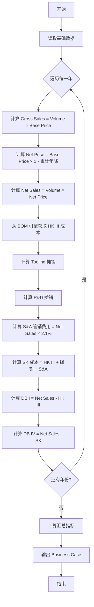

# Business Case 计算逻辑

| 版本号 | 创建时间 | 更新时间 | 文档主题 | 创建人 |
|--------|----------|----------|----------|--------|
| v1.9   | 2026-02-03 | 2026-03-10 | Business Case 计算逻辑 | Randy Luo |

---

**版本变更记录：**
| 版本 | 日期 | 变更内容 |
|------|------|----------|
| v1.9 | 2026-03-10 | 🔴 **固定DB4反推VP公式修正**：1）物流费、寄售库存改为基于VP计算；2）修正反推公式为 VP=(SK-1+模具+SAP+R&D)÷(1-各项比例-DB4)；3）与QS计算逻辑对齐 |
| v1.8 | 2026-03-10 | 🆕 **新增间接成本参数**：新增 MGK（间接材料成本）、FGK（间接生产成本）、Risk（风险/废料成本）三个独立计算参数；支持每年独立配置 |
| v1.7 | 2026-03-10 | 🔴 **SG&A 架构重构**：SK-1 公式从 `HK_III_n × (1 + S&A_Ratio)` 改为 `HK_III_n × SG&A_Rate`；支持每年独立配置 SG&A 系数 |
| v1.5 | 2026-02-25 | 🔴 **算法重构**：修复目标单价反推公式的循环引用地雷；SK-1 剥离销售额依赖改用成本基数；收入侧引入价格瀑布 (Price Waterfall) 模型 |
| v1.4 | 2026-02-25 | 🔴 **架构重构**：新增"项目级聚合逻辑"，支持多产品组合报价的加权平均单价与汇总利润率计算 |
| v1.3 | 2026-02-05 | 移除 VAVE 相关引用 |
| v1.2 | 2026-02-05 | 同步 v2.0 流程变更；SK 计算公式添加物流包装费和其他制造费用；统一摊销模式枚举值 |
| v1.1 | 2026-02-03 | 初始版本 |

---

## 1. 基础变量定义 (Input Variables)

在开始计算前，系统需要从数据库读取以下基础数据（对应表格头部和 BOM）：

| 变量 | 说明 | 示例值 |
|------|------|--------|
| **$Project\_Vol_n$** | **🔴 v1.6 泛化：第 n 年的项目总体需求量** | 2026年 = 105,000 套 |
| **$Usage\_per\_System$** | **🔴 v1.6 泛化：单套用量/项目用量** | 0.15 件/套 |
| $Volume_n$ | 第 n 年的销量（= 项目需求量 × 单套用量） | 2026年 = 15,750 |
| $Base\_Price$ | 初始单价 | € 21.76 |
| **$LTA\_Rate$** | **年降比例** | 3.0% |
| **$LTA\_Duration$** | **年降年限**（持续几年） | 3 年 |
| **$LTA\_Start\_Year$** | **年降开始年份**（相对于 SOP） | 2（第二年开始） |
| $Exchange\_Rate$ | 汇率 | 7.83 |
| $Inv_{Tool}$ | 模具一次性投入总额 | € 49,468 |
| $Inv_{R\&D}$ | 研发一次性投入总额 | € 48,079 |
| **$SAP\_Surcharge\_Rate$** | **🆕 SAP 系统附加费率** | 0.5% |
| **$Consign\_Stock\_Rate$** | **🆕 寄售库存成本率** | 2% |
| **$Target\_DB4$** | **🆕 目标 DB4 净利率** | 8% |

> **年降参数说明：** 大部分客户要求从**第二年开始**年降，而非第一年（SOP 年）就开始。

**🔴 v1.6 销量计算公式（泛化版）：**

$$Volume_n = Project\_Vol_n \times Usage\_per\_System$$

**示例：**
- 项目总体需求量：105,000 套/年（储能系统/数据中心/汽车平台等）
- 单套用量：0.15 件/套
- 销量：105,000 × 0.15 = 15,750 件/年

- **系统提示：** `计算该产品当年总数量 = 项目总体需求量 × 单套用量`

---

## 2. 收入侧逻辑 (Revenue Logic)

对应表格 Business Case 的上半部分：

### 2.1 Gross Sales (未年降销售额)

$$Gross\_Sales_n = Volume_n \times Base\_Price$$

### 2.2 Net Price (年降后单价)

**年降计算规则（三参数）：**

> **参考：** [报价汇总计算逻辑.md](报价汇总计算逻辑.md#年降参数定义)

| 参数 | 说明 | 默认值 |
|------|------|--------|
| $LTA\_Rate$ | 年降比例 | 3% |
| $LTA\_Duration$ | 年降年限 | 3 年 |
| $LTA\_Start\_Year$ | 开始年份（相对于 SOP） | 2（第二年） |

**计算公式：**

$$Net\_Price_n = Base\_Price \times (1 - Total\_Reduction_n)$$

其中累计降幅 $Total\_Reduction_n$ 的计算逻辑：

```python
def calculate_total_reduction(year_n, lta_rate, lta_duration, lta_start_year):
    """
    计算第 N 年的累计年降幅度

    规则：
    - 第 1 年（SOP）：无年降
    - 第 N 年（开始年份 ≤ N < 开始年份 + 年降年限）：累计年降
    - 第 N 年（N ≥ 开始年份 + 年降年限）：保持最后一年的降幅
    """
    if year_n < lta_start_year:
        return 0  # 无年降
    elif year_n < lta_start_year + lta_duration:
        years_of_reduction = year_n - lta_start_year + 1
        return lta_rate * years_of_reduction  # 累计年降
    else:
        return lta_rate * lta_duration  # 保持最后降幅
```

**示例计算（3%比例，3年年限，第2年开始）：**

| 年份 | 累计降幅 | Net Price |
|------|---------|-----------|
| 第1年 (SOP) | 0% | € 21.76 |
| 第2年 | 3% | € 21.11 |
| 第3年 | 6% | € 20.45 |
| 第4年 | 9% | € 19.80 |
| 第5年及以后 | 9% | € 19.80 |

> **业务规则：** 德系客户通常要求从 SOP 后第一年（即项目第2年）开始年降，年降基于**基价累计**计算。

### 2.3 价格瀑布模型 (Price Waterfall) 🆕 v1.5

为避免成本侧 SK-1 对销售额的依赖导致的**循环引用**，收入侧采用绝对值瀑布模型。

#### 2.3.1 毛销售额 (Gross Sales)

永远基于首年不降价的基础价格计算：

$$Gross\_Sales_n = Base\_Price \times Volume_n$$

#### 2.3.2 当年降价绝对值损失 (Sales Reduction YoY)

衡量相对于上一年的降价损失：

$$Sales\_Reduction\_YoY_n = (VP_{n-1} - VP_n) \times Volume_n$$

**示例计算：**
| 年份 | VP (€) | 销量 | 当年降价损失 |
|------|--------|------|-------------|
| 第1年 | 21.76 | 15,750 | € 0 |
| 第2年 | 21.11 | 16,500 | (21.76 - 21.11) × 16,500 = € 10,725 |
| 第3年 | 20.45 | 17,000 | (21.11 - 20.45) × 17,000 = € 11,220 |

#### 2.3.3 累计降价绝对值损失 (Sales Reduction Accum)

衡量相对于基准年的累计损失：

$$Sales\_Reduction\_Accum_n = (Base\_Price - VP_n) \times Volume_n$$

**示例计算：**
| 年份 | VP (€) | 累计降幅 | 销量 | 累计降价损失 |
|------|--------|---------|------|-------------|
| 第1年 | 21.76 | 0% | 15,750 | € 0 |
| 第2年 | 21.11 | 3% | 16,500 | (21.76 - 21.11) × 16,500 = € 10,725 |
| 第3年 | 20.45 | 6% | 17,000 | (21.76 - 20.45) × 17,000 = € 22,270 |

#### 2.3.4 净销售额 (Net Sales)

通过毛销售额减去累计降价损失得出：

$$Net\_Sales_n = Gross\_Sales_n - Sales\_Reduction\_Accum_n$$

**验证公式：**

$$Net\_Sales_n = Volume_n \times VP_n = Volume_n \times Base\_Price \times (1 - Total\_Reduction_n)$$

**图中示例 (2026):**
- Gross Sales: 21.76 × 15,750 = € 342,720
- Sales Reduction Accum: 0 (首年无年降)
- **Net Sales: € 342,720** (≈ € 342,658 四舍五入差异)

> **⚠️ 重要：** 此绝对值模型确保 `Net_Sales` 作为独立变量，不再被成本侧公式反向依赖，从架构层面消除了循环引用风险。

### 2.4 目标单价反推逻辑 (Reverse Pricing) 🆕 v1.5

**业务场景：** Sales 设定目标 DB4 净利率后，系统自动反推最低可接受的首年基准单价。

#### ⚠️ 循环引用地雷 (Circular Reference Trap)

**原有错误公式：**

$$Base\_Price_{min} = \frac{SK\text{-}2_{year1}}{1 - Target\_DB4}$$

**问题分析：**
1. `SK-2` 中包含 `Interest_Payment = VP × Interest_Rate × Payment_Days/360`
2. `VP` (销售单价) 本身就是 `Base_Price × (1 - Reduction)`
3. 反推 `Base_Price` 需要先知道 `SK-2`，但 `SK-2` 又依赖 `VP`（即 `Base_Price`）
4. **结果：代码级死循环** 💥

#### ✅ 修复后的绝对公式 (Circular-Free Formula)

**核心思路：** 将 `Interest_Payment` 中的 `VP` 系数提取出来，并入分母。

$$Base\_Price_{min} = \frac{SK\text{-}1_{year1} + \sum Tooling\_Amort + SAP\_Surcharge + Logistics + Recovery_{R\&D} + Consign\_Stock}{1 - Target\_DB4 - (Interest\_Rate \times \frac{Payment\_Term\_Days}{360})}$$

**公式拆解：**

| 分子项 | 说明 | 是否含 VP 依赖 |
|--------|------|---------------|
| $SK\text{-}1$ | = $HK\_III \times SG\&A\_Rate$ | ❌ 无（已改用成本基数） |
| $\sum Tooling\_Amort$ | 模具分摊（固定值） | ❌ 无 |
| $SAP\_Surcharge$ | = $HK\_III \times SAP\_Rate$ | ❌ 无（改用成本基数） |
| $Logistics$ | = $HK\_III \times Logistics\_Rate$ | ❌ 无（改用成本基数） |
| $Recovery_{R\&D}$ | 研发摊销（固定值） | ❌ 无 |
| $Consign\_Stock$ | = $HK\_III \times Consign\_Rate$ | ❌ 无（改用成本基数） |

| 分母项 | 说明 |
|--------|------|
| $1 - Target\_DB4$ | 保留利润空间 |
| $Interest\_Rate \times \frac{Payment\_Term\_Days}{360}$ | **资金利息系数**：从 VP 中提取的比例 |

**示例计算：**

| 参数 | 值 |
|------|-----|
| HK III (Year 1) | € 15.80 /件 |
| SG&A Rate | 1.175 |
| SK-1 | 15.80 × 1.175 = **€ 18.57** |
| Tooling Amort | € 1.20 /件 |
| SAP + Logistics + Consign | € 0.45 /件 |
| R&D Recovery | € 0.30 /件 |
| **分子 (Cost Sum)** | **€ 18.08** |
| Target DB4 | 8% |
| Interest Rate | 6% |
| Payment Term | 90 天 |
| **分母** | 1 - 0.08 - (0.06 × 90/360) = **0.885** |
| **反推 Base Price** | € 18.08 ÷ 0.885 = **€ 20.43** |

**Python 实现：**

```python
def calculate_reverse_pricing_circular_free(
    hk3_year1: Decimal,
    sna_rate: Decimal,
    tooling_amort: Decimal,
    sap_rate: Decimal,
    logistics_rate: Decimal,
    consign_rate: Decimal,
    rnd_recovery: Decimal,
    target_db4: Decimal,
    interest_rate: Decimal,
    payment_term_days: int
) -> Decimal:
    """
    根据目标 DB4 反推基准单价（固定DB4回算VP公式）🆕 v1.9

    Args:
        hk3_year1: 第一年单件制造成本 (HK III)
        sna_rate: 管销费用率 (如 0.021 表示 2.1%)
        tooling_amort: 模具分摊合计
        sap_rate: SAP 附加费率
        logistics_rate: 物流费率（基于VP）
        consign_rate: 寄售库存费率（基于VP）
        rnd_recovery: 研发摊销
        target_db4: 目标 DB4 净利率 (如 0.08 表示 8%)
        interest_rate: 年利率 (如 0.06 表示 6%)
        payment_term_days: 付款账期天数

    Returns:
        最低可接受基准单价
    """
    # SK-1（综合成本 = HK III × SG&A 系数）
    sk1 = hk3_year1 * (1 + sna_rate)

    # SAP 附加费（基于 HK III）
    sap_surcharge = hk3_year1 * sap_rate

    # 分子：所有不含 VP 依赖的成本项
    cost_sum = sk1 + tooling_amort + sap_surcharge + rnd_recovery

    # 分母：1 - 物流比例 - 寄售比例 - 利息比例 - 目标DB4比例
    # 注意：物流费、寄售库存、利息都基于VP计算，所以转换为VP比例
    interest_coefficient = interest_rate * Decimal(payment_term_days) / Decimal(360)
    denominator = Decimal(1) - logistics_rate - consign_rate - interest_coefficient - target_db4

    if denominator <= 0:
        raise ValueError("分母 <= 0：目标利润率过高或各项费率过大，无法反推有效单价")

    base_price = cost_sum / denominator
    return base_price
```

> **🆕 v1.9 公式修正：**
> - 物流费、寄售库存、利息现在都基于 VP 计算
> - 公式改为：`VP = (SK-1 + 模具 + SAP + R&D) ÷ (1 - 物流比例 - 寄售比例 - 利息比例 - DB4)`
> - 这与 QS 计算逻辑中的固定DB4回算VP公式完全一致

---

## 3. 成本侧逻辑 (Cost Logic - HK vs SK)

这是最容易出错的地方，开发团队必须区分 **HK III** 和 **SK**。

### 3.1 制造成本 (HK III - Herstellkosten III)

对应表格 `Total Costs (HK III)` 行。这是工厂大门的成本。

**计算公式:**

$$HK\_III_n = Volume_n \times (Material\_Cost + Variable\_Process\_Cost + Fixed\_Overhead)$$

**数据来源:** Dr.aiVOSS 的 BOM 解析引擎 + 工艺费率库

**图中示例 (2026):** € 316,470

### 3.2 完全成本 (SK - Selbstkosten)

对应表格 `Total Costs (SK)` 行。这是包含了一切分摊后的真实总成本。

**🆕 SK 分层计算（SK-1 与 SK-2）：**

#### 3.2.1 SK-1（项目综合成本 - 不含分摊）🔴 v1.7 修复

$$SK\text{-}1_n = HK\_III_n \times SG\&A\_Rate$$

| 组成项 | 说明 |
|--------|------|
| $HK\_III_n$ | 制造成本（物料 + 工艺） |
| $HK\_III_n \times (SG\&A\_Rate - 1)$ | 管销费用（如 SG&A_Rate = 1.175，则管销费用为 17.5%） |

> **⚠️ v1.7 架构修复：**
> 公式从 `HK_III × (1 + S&A_Rate)` 改为 `HK_III × SG&A_Rate`，理由：
> 1. **简化计算**：直接使用 SG&A 系数，无需加 1
> 2. **支持年度配置**：SG&A_Rate 存储在 `business_case_years.sga_rate`，每年可独立配置
> 3. **消除循环引用**：使用成本基数（HK_III）而非销售基数（Net_Sales）

#### 3.2.2 SK-2（项目全成本 - 含所有分摊与附加）

$$SK\text{-}2_n = SK\text{-}1_n + \sum Tooling\_Amort + SAP\_Surcharge + Logistics + Recovery_{R\&D} + Interest_{PaymentTerm} + Consign\_Stock$$

| 组成项 | 说明 | 数据来源 |
|--------|------|---------|
| $SK\text{-}1_n$ | 项目综合成本 | 上述计算 |
| $\sum Tooling\_Amort$ | **🆕 多模具分摊合计**（Tooling 1 + Tooling 2 + ...） | `tooling_amortizations` JSON |
| $SAP\_Surcharge$ | **🆕 SAP 系统附加费** | `sap_surcharge_rate × Net_Sales` |
| $Logistics$ | 物流包装费用 | `logistics_rate × Net_Sales` |
| $Recovery_{R\&D}$ | 研发摊销 | NRE 计算模块 |
| $Interest_{PaymentTerm}$ | 付款账期利息 | `VP × interest_rate × payment_days/360` |
| $Consign\_Stock$ | **🆕 寄售库存/VMI 成本** | `consign_stock_rate × Net_Sales` |

**完整公式：**

$$SK\text{-}2_n = HK\_III_n + Net\_Sales_n \times (S\&A\_Ratio + SAP\_Rate + Logistics\_Rate + Consign\_Rate) + \sum Tooling\_Amort + Recovery_{R\&D} + Interest_{Payment}$$

#### Hidden Cost (隐含逻辑)

图中 2026 年数据分析：
- $SK (364,023) - HK\_III (316,470) = 47,553$
- 下方的回收额: $20,369 (Tool) + 19,797 (R\&D) = 40,166$
- **差额:** $47,553 - 40,166 = € 7,387$

**结论:** 这差额主要是 **S&A (Sales & Administration 销售与管理费)**，以及可能的 **Working Capital Interest (营运资金利息)**

> **注意**：模具摊销（Recovery_Tool）中已包含 Capital Interest（资本利息），不再额外计算

---

## 4. 利润分析逻辑 (Margin Logic - DB I vs DB IV)

这是老板看报价单时最关注的两行。

### 4.1 DB I (边际贡献 I - 生产毛利)

衡量工厂生产这个产品赚不赚钱，不考虑研发和模具分摊。

$$DB\_I = Net\_Sales - HK\_III$$

**图中示例 (2026):** $342,658 - 316,470 = 26,188$ (正数，说明生产是赚钱的)

### 4.2 DB IV (净利润 - 最终底线)

衡量整个项目扣除所有投入后赚不赚钱。

$$DB\_IV = Net\_Sales - SK$$

**图中示例 (2026):** $342,658 - 364,023 = -21,365$ (负数)

### 4.3 业务解读

- **2026年亏损:** 因为销量还没爬坡，且前期投入摊销重
- **2028年 DB IV 转正:** 典型的汽车行业"前亏后盈"模型

---

## 5. 项目级聚合逻辑 (Project Level Aggregation)

在"组合报价 (Package Quoting)"场景下，一个 Project 包含多个 Product。项目大盘的年度商业数据不能简单相加，必须采用加权聚合算法。

### 5.1 基础数据汇总 (Sums)

系统首先对该项目下所有产品的当年数据进行物理汇总：

* **总销量 (Total Volume):** $Volume_{proj} = \sum Volume_{product\_i}$
* **总净销售额 (Total Net Sales):** $Net\_Sales_{proj} = \sum Net\_Sales_{product\_i}$
* **总制造成本 (Total HK III):** $HK\_III_{proj} = \sum HK\_III_{product\_i}$
* **总完全成本 (Total SK):** $SK_{proj} = \sum SK_{product\_i}$

### 5.2 加权平均单价 (Blended Price/Cost)

项目级的单件价格和成本必须通过"总金额 ÷ 总销量"得出：

* **加权销售单价 (Blended VP):** $VP_{proj} = Net\_Sales_{proj} \div Volume_{proj}$
* **加权单件 HK III:** $Unit\_HK\_III_{proj} = HK\_III_{proj} \div Volume_{proj}$
* **加权单件 SK2:** $Unit\_SK2_{proj} = SK_{proj} \div Volume_{proj}$

### 5.3 综合利润率 (Combined Margins)

* **项目综合 DB I %:** $DB\_I\_Ratio_{proj} = (Net\_Sales_{proj} - HK\_III_{proj}) \div Net\_Sales_{proj}$
* **项目综合 DB IV %:** $DB\_IV\_Ratio_{proj} = (Net\_Sales_{proj} - SK_{proj}) \div Net\_Sales_{proj}$

> **业务注意：**
> 管理层在审批时，主要关注**项目综合 DB IV**。Sales 可能会利用组合策略，用一个负利润的引流产品搭配一个高利润的核心产品，最终保证项目整体 DB IV 达标。

---

## 6. 投资分摊逻辑 (Investment Amortization)

对应表格中间绿色的 Investment 区域。

### 6.1 Piece Price Calculation (单件摊销额)

$$Piece\_Amort = \frac{Total\_Investment}{Total\_Lifetime\_Volume}$$

### 6.2 摊销验证

**图中逻辑:**
- 模具 € 49,468 / 总销量 56,273 = € 0.88/pc (估算)

**但表格中 2026 年 Recovery Tooling 是 € 20,369:**
- $20,369 \div 15,750 (销量) \approx € 1.29$

**结论:** 客户可能设定了前 3 年摊销完毕，而不是全生命周期摊销。

### 6.3 开发指令

摊销方式需支持两种模式：

| 模式 | 说明 |
|------|------|
| `Per Piece` | 全生命周期平摊 |
| `Fixed Period` | 固定期限摊销（如 SOP 前3年） |

---

## 7. 底部"样件"逻辑 (Sample Logic)

对应表格最底部的 `Sample Raw Material Purchase Budget`。

这行数据**不参与**上面的 DB I / DB IV 计算，是独立的现金流预算。

$$Sample\_Budget = Sample\_Qty \times Sample\_Price$$

> **注意:** Sample Price 通常是 Serial Price 的 3~5 倍

---

## 8. 数据模型定义

### 8.1 BusinessCaseResponse 响应模型

```python
from typing import Literal
from pydantic import BaseModel, Field
from decimal import Decimal

class FinancialYearData(BaseModel):
    """单年度财务数据"""
    year: int
    volume: int
    reduction_rate: Decimal  # 年降比例

    # 收入
    gross_sales: Decimal
    net_sales: Decimal
    net_price: Decimal

    # 成本
    hk_3_cost: Decimal      # 制造成本 HK III
    recovery_tooling: Decimal
    recovery_rnd: Decimal
    overhead_sa: Decimal    # 管销费用
    sk_cost: Decimal        # 完全成本 SK

    # 利润
    db_1: Decimal           # 边际贡献 I
    db_4: Decimal           # 净利润 DB IV

    # 样件（独立预算）
    sample_budget: Decimal | None = None


class AmortizationMode(str):
    """摊销模式"""
    TOTAL_VOLUME = "total_volume_based"  # 全生命周期平摊
    FIXED_3_YEARS = "fixed_3_years"      # 前3年摊销


class GlobalParameters(BaseModel):
    """全局参数"""
    tooling_invest: Decimal
    rnd_invest: Decimal
    base_price: Decimal
    exchange_rate: Decimal
    amortization_mode: AmortizationMode
    sga_rate_base: Decimal = Field(default=Decimal("1.175"), description="SG&A 默认系数（如 1.175 代表 17.5% 综合加成）")
    mgk_rate_base: Decimal = Field(default=Decimal("1.040"), description="MGK 默认系数（如 1.040 代表 4% 间接材料成本）")
    fgk_rate_base: Decimal = Field(default=Decimal("1.277"), description="FGK 默认系数（如 1.277 代表 27.7% 间接生产成本）")
    risk_rate_base: Decimal = Field(default=Decimal("1.035"), description="Risk 默认系数（如 1.035 代表 3.5% 风险/废料成本）")
    sample_price_multiplier: Decimal = Field(default=Decimal("3.0"), description="样件价格倍数")


class BusinessCaseResponse(BaseModel):
    """Business Case 计算响应"""
    project_id: str
    global_parameters: GlobalParameters
    financial_year_data: list[FinancialYearData]

    # 汇总指标
    total_lifetime_volume: int
    total_db_4: Decimal         # 全生命周期净利润
    payback_months: Decimal | None = None  # 投资回收期（月）
    break_even_year: int | None = None     # 盈亏平衡年份
```

### 7.2 JSON 结构示例

```json
{
  "project_id": "PRJ-2026-001",
  "global_parameters": {
    "tooling_invest": 49468.00,
    "rnd_invest": 48079.00,
    "base_price": 21.76,
    "exchange_rate": 7.83,
    "amortization_mode": "total_volume_based",
    "sga_rate_base": 1.175,
    "mgk_rate_base": 1.040,
    "fgk_rate_base": 1.277,
    "risk_rate_base": 1.035,
    "sample_price_multiplier": 3.0
  },
  "financial_year_data": [
    {
      "year": 2026,
      "volume": 15750,
      "reduction_rate": 0.0,
      "calculations": {
        "gross_sales": 342658.00,
        "net_sales": 342658.00,
        "net_price": 21.76,
        "hk_3_cost": 316470.00,
        "recovery_tooling": 20369.00,
        "recovery_rnd": 19797.00,
        "overhead_sa": 7196.00,
        "sk_cost": 364023.00,
        "db_1": 26188.00,
        "db_4": -21365.00
      }
    },
    {
      "year": 2027,
      "volume": 18900,
      "reduction_rate": -0.03,
      "calculations": {
        "gross_sales": 411189.00,
        "net_sales": 398853.27,
        "net_price": 21.11,
        "hk_3_cost": 367924.00,
        "recovery_tooling": 24445.00,
        "recovery_rnd": 23781.00,
        "overhead_sa": 8376.00,
        "sk_cost": 424526.00,
        "db_1": 30929.27,
        "db_4": -25672.73
      }
    }
  ],
  "summary": {
    "total_lifetime_volume": 56273,
    "total_db_4": 45680.00,
    "break_even_year": 2028
  }
}
```

---

## 8. 计算流程图



---

## 9. 与 [数据库设计.md](数据库设计.md) 的关联

本计算逻辑依赖以下数据表：

| 表名 | 用途 | 相关字段 |
|------|------|---------|
| `projects` | 项目基础数据 | `annual_volume`, `target_margin` |
| `project_products` | 产品数据 | `product_version`, `route_code` |
| `product_materials` | BOM 物料成本 | `unit_cost` |
| `product_processes` | 工艺成本 | `unit_cost` |
| `quote_summaries` | 报价汇总 | `total_cost`, `quoted_price` |

**新增建议表（用于存储 Business Case 参数）：**

```sql
-- Business Case 全局参数表
CREATE TABLE business_case_params (
    id CHAR(36) PRIMARY KEY,
    project_id CHAR(36) NOT NULL UNIQUE,
    tooling_invest DECIMAL(14, 4),
    rnd_invest DECIMAL(14, 4),
    base_price DECIMAL(10, 4),
    exchange_rate DECIMAL(8, 4),
    amortization_mode VARCHAR(50),
    sga_rate_base DECIMAL(8, 4) DEFAULT 1.1750 COMMENT 'SG&A 默认系数（如 1.175）',
    mgk_rate_base DECIMAL(8, 4) DEFAULT 1.0400 COMMENT 'MGK 默认系数（如 1.040）',
    fgk_rate_base DECIMAL(8, 4) DEFAULT 1.2770 COMMENT 'FGK 默认系数（如 1.277）',
    risk_rate_base DECIMAL(8, 4) DEFAULT 1.0350 COMMENT 'Risk 默认系数（如 1.035）',
    FOREIGN KEY (project_id) REFERENCES projects(id)
);

-- Business Case 年度数据表
CREATE TABLE business_case_years (
    id CHAR(36) PRIMARY KEY,
    project_id CHAR(36) NOT NULL,
    year INT NOT NULL,
    volume INT NOT NULL,
    reduction_rate DECIMAL(5, 4),
    sga_rate DECIMAL(8, 4) DEFAULT NULL COMMENT 'SG&A 系数（为空时使用默认值）',
    mgk_rate DECIMAL(8, 4) DEFAULT NULL COMMENT 'MGK 系数（为空时使用默认值）',
    fgk_rate DECIMAL(8, 4) DEFAULT NULL COMMENT 'FGK 系数（为空时使用默认值）',
    risk_rate DECIMAL(8, 4) DEFAULT NULL COMMENT 'Risk 系数（为空时使用默认值）',
    net_sales DECIMAL(14, 4),
    hk_3_cost DECIMAL(14, 4),
    sk_cost DECIMAL(14, 4),
    db_1 DECIMAL(14, 4),
    db_4 DECIMAL(14, 4),
    FOREIGN KEY (project_id) REFERENCES projects(id),
    UNIQUE KEY (project_id, year)
);
```

---

**文档结束**
