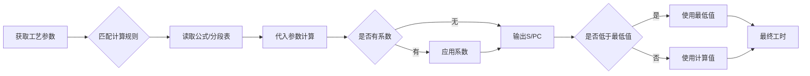
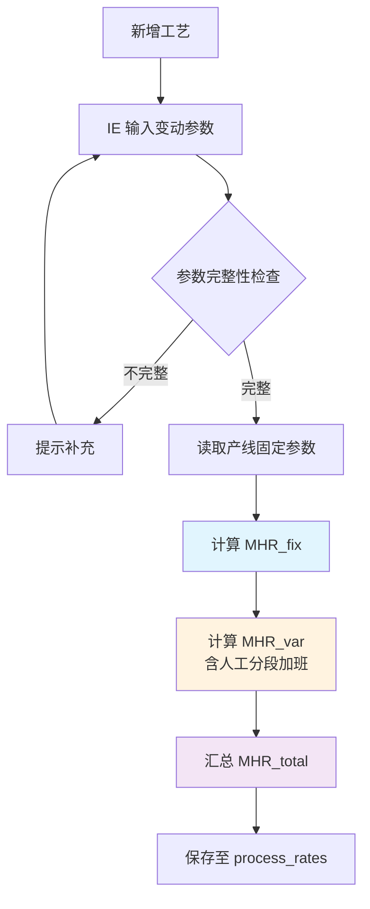
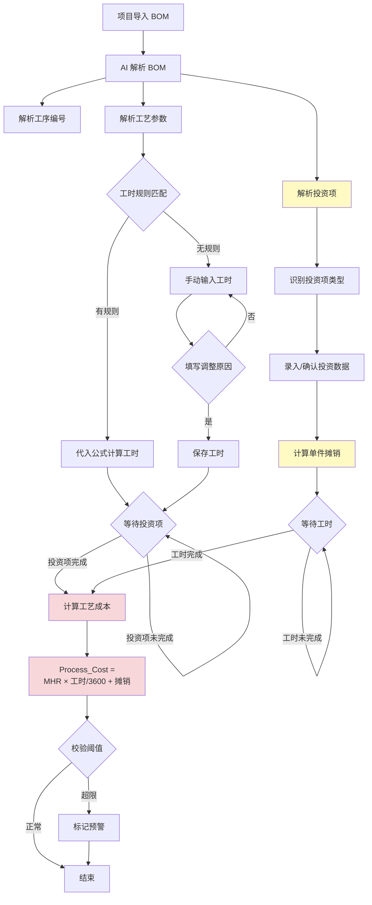
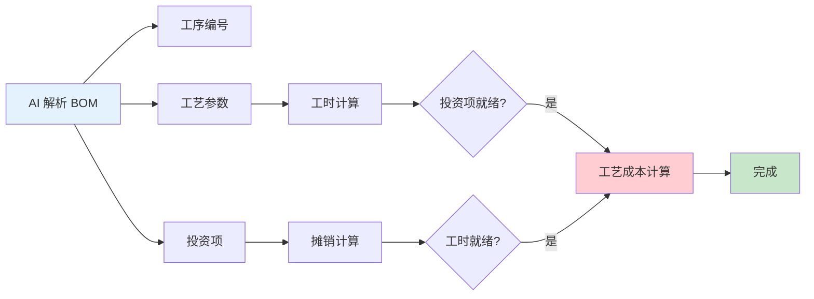

# 工艺成本计算逻辑

| 版本号 | 创建时间 | 更新时间 | 文档主题 | 创建人 |
|--------|----------|----------|----------|--------|
| v2.8   | 2026-02-03 | 2026-03-10 | 工艺成本计算逻辑 | Randy Luo |

---

**版本变更记录：**
| 版本 | 日期 | 变更内容 |
|------|------|----------|
| v2.8 | 2026-03-10 | 🔴 **能源成本公式修正**：修正能源成本计算公式为 `(每小时能耗÷机器数量)×总工时×能源单价`；0.78为能源单价（由控制部门维护，每年变动） |
| v1.2 | 2026-02-04 | 初始版本 |
| v1.3 | 2026-02-05 | 同步 v2.0 流程变更：移除 Controlling 审核；新增 sales_input 状态；MHR 费率拆分为 var/fix |
| v1.4 | 2026-02-05 | 移除双轨计价逻辑，仅保留 Standard Cost 计算；简化 MHR 费率模型 |
| v2.0 | 2026-02-13 | 🔴 **重大重构**：新增工序编码规则；重构参数分类为固定/变动成本；更新 MHR 计算公式；新增负载系数 |
| v2.1 | 2026-02-13 | 🆕 新增工时版本管理、新工作中心建立流程、工时计算规则维护 |
| v2.2 | 2026-02-14 | 🔴 **架构重构**：移除 §7 数据库设计规范，改为引用 [数据库设计.md](数据库设计.md)；保持文档职责单一 |
| v2.3 | 2026-03-04 | 🔴 **公式对齐**：MHR 计算公式对齐 VOSS 标准规则；新增机器数参数；修正能源计算公式；添加其他变动成本项 |
| v2.4 | 2026-03-05 | 🔴 **人工成本内嵌**：移除人工成本单独计算章节；公式简化为 `Cost = MHR × (节拍 / 3600)`；移除 `personnel_std` 和 `labor_rate` 字段 |
| v2.5 | 2026-03-05 | 🔴 **人工成本计入MHR**：MHR_var 新增人工成本（分段计算加班工资：1倍/1.5倍/2倍）；process_rates 表新增 `operators` 字段 |
| v2.6 | 2026-03-07 | 🔴 **BOM解析流程补充**：新增 AI 解析投资项流程、工艺参数→公式→工时转换、投资项→变动参数影响；明确工艺成本计算的顺序依赖 |
| v2.7 | 2026-03-07 | 🔴 **工时规则细化**：补充 S/PC 标准、Cycle time 转换公式、实际工时计算公式、系数机制、长度分段规则（基于 ASUS 标准工时表） |

---

## 1. 工艺评估核心录入参数

根据业务场景，参数录入分为**固定成本参数**（由 Controlling 维护）和**变动成本参数**（由 IE/工艺输入）。

### 1.1 固定成本参数（Controlling 维护）

这些参数通常每年更新一次，作为全公司报价的底座。

| 参数 | 说明 | 单位 | 变化频率 |
|------|------|------|---------|
| **租金单价** | 厂房租金成本 | 元/㎡/年 | 年度更新 |
| **能源单价** | 电力单价 | 元/kWh | 年度更新 |
| **折旧年限** | 设备折旧年限 | 年 | 因产线不同有差异 |
| **利率** | 年利率 | % | 年度更新 |
| **小时工资** | 操作员时薪 | 元/小时 | 每个产线每年变化 |

### 1.2 变动成本参数（IE/工艺输入）

由 IE 或 VM 针对具体设备/工艺进行录入，**在新增工艺时触发 MHR 计算**。

| 参数 | 说明 | 单位 |
|------|------|------|
| **设备购置原值** | 设备采购价格 | 元 |
| **机器数** | 同类型设备数量 | 台 |
| **占用面积** | 设备占地面积 | ㎡ |
| **额定功率** | 设备额定功率 | kW |
| **计划小时数** | 年度计划运行时间 | 小时 |
| **负载系数** | 实际功率与额定功率比率 | 0-1（默认 0.7） |

**🆕 v2.3 新增参数：**
- **机器数**：折旧计算需乘以机器数量
- **Set-up Hours**：调试/换型时间，用于 MHR 分母计算

**计划小时数计算：**
```
计划小时数 = 天数 × 班次小时 × 稼动率
```

**负载系数使用规则：**
| 场景 | 负载系数 | 说明 |
|------|---------|------|
| 默认值 | 0.7 | 针对成熟工序如注塑机 |
| 低负载 | 0.5-0.6 | 保压、冷却占比较长的工序 |
| 高负载 | 0.8-1.0 | 全速冲压、持续加热的高能耗工序 |

> **注意：** 在"新增工艺"或"高精度报价"时，IE 可以调整负载系数。

### 1.3 工序编码规则（暂定-未确认） 🆕

#### 工序编号格式

- **格式**：`字母 + 两位数字`
- **字母**：代表工作中心
- **数字**：该工作中心下的工序序号（01-99）

**示例**：`I01` = 注塑工作中心的第1个工序

#### 工作中心字母映射表

| 字母 | 英文全称 | 中文 | 说明 |
|------|---------|------|------|
| **I** | Injection | 注塑 | VOSS 核心工序，通常关联注塑机 |
| **A** | Assembly | 装配 | 包含手动、半自动、全自动装配线 |
| **M** | Machining | 机加 | 涉及切管、倒角、打孔等 |
| **T** | Testing | 检测 | 气密性检查、水检、视觉检测 |
| **P** | Packing | 包装 | 称重、贴标、入库前处理 |
| **S** | Surface | 表处 | 涂层、清洗、丝印 |

#### 工艺路线编码规则

- **格式**：`产线名称 + 工序1编号 + 工序2编号 + ...`
- **示例**：`LINE-I01A02M03` = 产线 LINE，经过注塑 I01 → 装配 A02 → 机加 M03

---

## 2. 工艺评估计算逻辑 (Calculation Logic)

### 2.1 工艺成本快速计算流程 🆕 v2.6 完整版

#### 2.1.1 完整业务流程图

```
┌─────────────────────────────────────────────────────────────────────┐
│  步骤 1: 后台工艺库（预先完成，独立于项目）                           │
│  ────────────────────────────────────────────────────────────────  │
│  Controlling 维护固定参数（租金、能源单价、利率、折旧年限）            │
│              ↓                                                       │
│  IE 录入变动参数（设备原值、机器数、占用面积、功率、计划工时等）        │
│              ↓                                                       │
│  系统自动计算 MHR_fix + MHR_var → 保存至 process_rates 表           │
└─────────────────────────────────────────────────────────────────────┘
                              ↓
┌─────────────────────────────────────────────────────────────────────┐
│  步骤 2: AI 解析 BOM 表（项目导入时触发）                             │
│  ────────────────────────────────────────────────────────────────  │
│  2.1 解析工序编号 → 识别工序（如 I01 注塑、M01 切管、A01 装配）        │
│  2.2 解析工艺参数 → 提取变量值（如 "长度:200mm"、"管径:15mm"）        │
│  2.3 解析投资项 → 提取工装/检具/模具信息（见 §2.1.3）                │
└─────────────────────────────────────────────────────────────────────┘
                              ↓
┌─────────────────────────────────────────────────────────────────────┐
│  步骤 3: 工艺参数代入公式（工时计算）                                 │
│  ────────────────────────────────────────────────────────────────  │
│  示例 1: "长度切管" → 长度法规则 → 切管工时 = f(长度, 管径)           │
│  示例 2: "压桩点数" → 点数法规则 → 压桩工时 = 点数 × 12秒             │
│  示例 3: "成型" → 时间法规则 → 直接读取工时                           │
│              ↓                                                       │
│  得出: cycle_time_std（标准工时，秒/件）                              │
└─────────────────────────────────────────────────────────────────────┘
                              ↓
┌─────────────────────────────────────────────────────────────────────┐
│  步骤 4: 投资项计算额外变动参数 🆕                                    │
│  ────────────────────────────────────────────────────────────────  │
│  投资项 → 摊销至 MHR_var 的组成部分：                                  │
│  • 刀具（Tools）: 每 1000 件更换一次 → 单位刀具成本                    │
│  • 工装（Fixture）: 寿命 50 万件 → 单位工装摊销                       │
│  • 模具（Mold）: 寿命 100 万模次 → 单位模具摊销                       │
│  • 检具（Gauge）: 一次性投入，按年摊销                               │
│              ↓                                                       │
│  得出: investment_amortization_per_unit（单件摊销额）                 │
└─────────────────────────────────────────────────────────────────────┘
                              ↓
┌─────────────────────────────────────────────────────────────────────┐
│  步骤 5: 工艺成本计算（最后执行，依赖步骤 3 和 4）                    │
│  ────────────────────────────────────────────────────────────────  │
│  Process_Cost = MHR_total × (cycle_time_std / 3600)                  │
│                 + investment_amortization_per_unit                   │
│              ↓                                                       │
│  得出: 单工序工艺成本（元/件）                                         │
└─────────────────────────────────────────────────────────────────────┘
```

#### 2.1.2 关键顺序依赖关系 🆕

| 步骤 | 依赖条件 | 说明 |
|------|---------|------|
| **步骤 3（工时计算）** | 步骤 2 完成 | 必须先解析出工艺参数（如长度）才能计算工时 |
| **步骤 4（投资项摊销）** | 步骤 2 完成 | 必须先解析出投资项（工装/模具）才能计算摊销 |
| **步骤 5（工艺成本）** | 步骤 3 + 4 完成 | **工艺成本是最后计算的**，需要工时和投资项都就绪 |

> **🔴 重要**：工艺成本**不能**在 BOM 解析后立即计算，必须等待：
> 1. 工艺参数已代入公式得出工时
> 2. 投资项已输入并计算单件摊销

#### 2.1.3 AI 解析投资项示例 🆕

**BOM 表 Comments 列示例内容：**
```
"切管工序，需专用切管刀模（寿命 50 万件），管材长度 200mm"
"压桩工序，需 15mm 压桩模具，共 32 个压桩点"
```

**AI 解析输出：**
```json
{
  "process_code": "M01",
  "process_name": "切管",
  "parameters": {
    "length": 200,
    "unit": "mm"
  },
  "investment_items": [
    {
      "item_type": "模具",
      "item_name": "切管刀模",
      "quantity": 1,
      "unit_cost": 50000,
      "lifecycle_qty": 500000,
      "amortization_per_unit": 0.10
    }
  ]
}
```

#### 2.1.4 简化流程（原版保留参考）

```
AI 解析 BOM/工艺路径
       ↓
识别工序编号（如"I01"、"M02"）
       ↓
自动关联该设备的 MHR
       ↓
乘以工艺定额（节拍）
       ↓
得出设备部分工艺成本
```

> **⚠️ 注意**：此简化流程未体现投资项解析和工时参数计算，仅供参考。完整流程见 §2.1.1。

### 2.2 MHR (机时费率) 计算公式 🆕 v2.5

**触发时机**：新增工艺/设备时

#### 固定成本/小时 (MHR_fix)

```
折旧 = 设备购置原值 / 折旧年限 × 机器数
利息 = 设备原值 / 2 × 利率
保险/租金等 = Distribution of insurance + rent + bank charge

MHR_fix = Total Fixed Costs / (Net Hours + Set-up Hours)
```

#### 变动成本/小时 (MHR_var) 🆕 v2.5

```
# 人工成本（分段计算加班工资）
total_hours = Net Hours + Set-up Hours
hours_per_operator = total_hours / operators

IF hours_per_operator < 1693:
    wages = total_hours × wage_rate × 1.0
ELSE IF hours_per_operator < 2520:
    normal = 1693 × operators × wage_rate
    overtime_1_5 = (total_hours - 1693 × operators) × wage_rate × 1.5
    wages = normal + overtime_1_5
ELSE:
    normal = 1693 × operators × wage_rate
    overtime_1_5 = 827 × operators × wage_rate × 1.5
    overtime_2 = (total_hours - 2520 × operators) × wage_rate × 2.0
    wages = normal + overtime_1_5 + overtime_2

# 能源成本（Excel公式：C26 = C13/C6*C19*0.78）
# 即：能源成本 = (每小时能耗 ÷ 机器数量) × 总工时 × 能源单价
# 其中：0.78 为能源单价（由控制部门维护，每年变动）
Energy = (Hourly_Energy_Consumption / Machine_Count) × Total_Hours × Energy_Unit_Price(0.78)

# 其他变动成本
Other_Variable = Tools + Supplies + Maintenance + Other_Variable_Cost

MHR_var = (Wages + Energy + Other_Variable) / (Net Hours + Set-up Hours)
```

#### MHR 费率汇总

```
MHR_total = MHR_fix + MHR_var
```

> **🆕 v2.5 变更说明（人工成本）：**
> - 新增 **operators** 字段（操作员人数）
> - 人工成本计入 **MHR_var**（变动成本）
> - 分段计算加班工资：
>   - 正常工时（<1693小时/人/年）：1.0倍
>   - 加班1.5倍（1693~2520小时/人/年）
>   - 加班2倍（>2520小时/人/年）

> **🆕 v2.3 变更说明：**
> - 折旧计算新增**机器数**参数
> - 能源公式改为：`能源单价 / 面积 × 功率 × 0.78`
> - 新增**其他变动成本**项（刀具、耗材、维护等）
> - 分母统一使用：`(Net Hours + Set-up Hours)`

### 2.3 单工序工艺成本汇总

对于报价单中的每一行工艺，成本计算如下：

$$Cost_{std} = MHR_{total} \times \frac{Cycle\ Time}{3600}$$

> **注意：** Cycle Time 以秒为单位，需除以 3600 转换为小时

---

## 3. 系统校验与风险预警

为防止录入错误导致报价亏损，系统需设置以下"软硬闸口"：

### 3.1 除零保护 (Zero Division Protection)

| 条件 | 触发动作 |
|------|---------|
| 计划小时数 = 0 | 禁止计算，提示"计划小时数不能为0" |
| 折旧年限 = 0 | 禁止计算，提示"折旧年限不能为0" |

### 3.2 阈值拦截 (Threshold Validation)

| 条件 | 触发动作 |
|------|---------|
| $MHR_{total}$ 偏离同类产线均值 $\pm 15\%$ | 自动标记为"需重点审核" |
| 负载系数 < 0.5 或 > 1.0 | 弹出警告确认 |

### 3.3 同步性检查 (Data Consistency)

| 条件 | 触发动作 |
|------|---------|
| 设备购置原值 > 0 但未填写占用面积 | 弹出警告 |
| 新增工艺但未触发 MHR 计算 | 不允许进入 Sales 审核环节 |

---

## 4. 工时版本管理 🆕

### 4.1 工时来源分类

| 工时来源 | 标记 | 原因说明 | 适用场景 |
|---------|------|---------|---------|
| 系统自动计算 | `auto` | 无需填写原因，仅做验证 | 成熟工艺，工时规则库已配置 |
| 手动调整 | `manual` | **必须填写调整原因** | 新工艺、特殊情况、经验修正 |

### 4.2 手动调整规则

**触发条件：**
- 工时规则库未覆盖的新工艺
- 实际工时与系统计算差异较大
- 特殊产品需要经验修正

**操作流程：**
```
手动修改工时 → 弹出原因输入框 → 填写调整原因 → 保存
```

**校验规则：**
- `cycle_time_source = 'manual'` 时，`cycle_time_adjustment_reason` 必填
- 系统自动记录调整人和调整时间

### 4.3 总费率手动调整 🆕

**业务场景：**
总费率（Total Rate）= MHR（机时费率，已含人工成本）。在某些特殊情况下，IE 可能需要手动调整总费率，而非使用系统计算值。

**触发条件：**
- 设备为非标准配置，系统计算的 MHR 与实际偏差较大
- 多设备组合使用，需要综合计算费率
- 特殊工艺需要经验修正

**操作流程：**
```
手动修改总费率 → 弹出原因输入框 → 填写调整原因 → 保存
```

**校验规则：**
| 字段 | 条件 | 说明 |
|------|------|------|
| `total_rate_source` | = `manual` 时 | 标记为手动调整 |
| `total_rate_adjustment_reason` | 必填 | 填写调整原因 |
| `mhr_snapshot` | 保持原值 | 快照不覆盖，便于追溯 |

**数据库字段扩展：**
```python
class ProductProcess(BaseModel):
    # ... 现有字段 ...
    total_rate_source: str = Field(default="auto")  # auto / manual
    total_rate_adjustment_reason: str | None = None  # 手动调整时必填

    @validator('total_rate_adjustment_reason')
    def validate_total_rate_reason(cls, v, values):
        """手动调整总费率时必须填写原因"""
        if values.get('total_rate_source') == 'manual' and not v:
            raise ValueError('手动调整总费率时必须填写调整原因')
        return v
```

---

## 5. 新工作中心建立流程 🆕

### 5.1 流程图

```
临时编号(IE录入参数) → MHR自动计算 → 实际投产后 → IE将状态改为"正式"
```

### 5.2 状态说明

| 状态 | 英文 | 说明 | 操作人 |
|------|------|------|--------|
| **临时** | `TEMPORARY` | MHR 已计算但设备未实际投产 | IE 创建 |
| **正式** | `ACTIVE` | 设备已实际投产，可用于正式报价 | IE 确认 |
| **停用** | `INACTIVE` | 设备已退役或不再使用 | Controlling |

### 5.3 临时工作中心管理

**创建时机：**
- 识别到新工艺且库中无对应工作中心
- 需要先计算 MHR 进行报价评估

**转正条件：**
- 设备已实际采购并安装
- 完成试生产验证
- IE 在工作中心维护界面手动确认

---

## 6. 工时计算规则维护 🆕

### 6.1 AI 参数识别与规则匹配 🆕 v2.6

#### 6.1.1 AI 如何从 BOM 中识别工艺参数

**BOM 表 Comments 列示例：**
| 行号 | Part Name | Comments |
|------|-----------|----------|
| 10 | 管接头 | 切管长度 200mm，管径 15mm |
| 20 | 管接头 | 压桩 32 个点，管径 20mm |
| 30 | 连接管 | 弯管成型，弯曲半径 R50 |

**AI 解析逻辑：**
```python
# 伪代码示例
def extract_process_params(comments: str, process_code: str) -> dict:
    """AI 从 Comments 中提取工艺参数"""
    params = {}

    # 工序 M01 (切管) → 识别长度、管径
    if process_code == "M01":
        params["length"] = extract_number(comments, pattern="长度\s*(\d+)mm")
        params["diameter"] = extract_number(comments, pattern="管径\s*(\d+)mm")

    # 工序 A01 (压桩) → 识别点数、管径
    elif process_code == "A01":
        params["point_count"] = extract_number(comments, pattern="(\d+)\s*个点")
        params["diameter"] = extract_number(comments, pattern="管径\s*(\d+)mm")

    return params
```

#### 6.1.2 参数代入规则公式

**长度法示例（切管工序）：**
```
规则定义: work_center_time_rules
├── calc_method = "LENGTH"
├── input_variable = "length"
├── range_min = 0
├── range_max = NULL
├── std_time_seconds = 8  # 秒/根
└── unit = "秒/根"

AI 识别参数: length = 200mm
代入公式: cycle_time = 8 秒/根 × (200mm / 1000mm) = 1.6 秒
```

**点数法示例（压桩工序）：**
```
规则定义: work_center_time_rules
├── calc_method = "COUNT"
├── input_variable = "point_count"
├── range_min = 0
├── std_time_seconds = 12  # 秒/点
└── unit = "秒/点"

AI 识别参数: point_count = 32
代入公式: cycle_time = 12 秒/点 × 32 点 = 384 秒
```

**时间法示例（成型工序）：**
```
规则定义: work_center_time_rules
├── calc_method = "TIME"
├── input_variable = "length"
├── range_min = 0
├── range_max = 1000  # mm
├── std_time_seconds = 2.7
└── unit = "秒"

AI 识别参数: length = 800mm (在范围内)
直接取值: cycle_time = 2.7 秒
```

#### 6.1.3 规则配置汇总

每个工作中心可定义独立的工时计算方法：

| 计算方法 | 英文 | 输入变量 | 输出 | 典型应用 |
|---------|------|---------|------|---------|
| **长度法** | `LENGTH` | 长度/宽度等尺寸参数 | 工时/单位长度 | 切管、挤出、切断 |
| **点数法** | `COUNT` | 点数/孔数/数量 | 工时/点 | 压桩、铆接、焊接 |
| **时间法** | `TIME` | 范围条件匹配 | 直接工时 | 成型、热处理、检测 |

### 6.2 规则示例

**切管工时规则（长度法）：**
| 工作中心 | 输入变量 | 范围 | 标准工时 | 单位 |
|---------|---------|------|---------|------|
| M01 (切管) | 管子类型 | 光管 | 8 | 秒/根 |
| M01 (切管) | 管子类型 | 波纹管 | 8 | 秒/根 |

**压桩工时规则（点数法）：**
| 工作中心 | 输入变量 | 范围 | 标准工时 | 单位 |
|---------|---------|------|---------|------|
| A01 (压桩) | 管径 | < 25mm | 12 | 秒/点 |
| A01 (压桩) | 管径 | ≥ 25mm | 15 | 秒/点 |

**成型工时规则（时间法）：**
| 工作中心 | 输入变量 | 范围 | 标准工时 | 单位 |
|---------|---------|------|---------|------|
| M02 (成型) | 管子长度 | ≤ 1m | 2.7 | 秒 |
| M02 (成型) | 管子长度 | ≤ 2m | 5.0 | 秒 |

### 6.3 数据库存储

工时规则存储在 `work_center_time_rules` 表中，详见 §7.4。

### 6.4 工时计算详细规则 🆕 v2.7

#### 6.4.1 核心定义

**S/PC (Seconds Per Cycle)**：标准工时，单位为**秒/件**

这是工时计算的**核心输出值**，所有工时规则最终都要转换为 S/PC 格式。

**Cycle Time min/100pc**：100件产品的总分钟数

这是统计测量时的原始数据单位，需要转换为 S/PC：

```
S/PC = (Cycle Time min/100pc × 60) ÷ 100
     = Cycle Time min/100pc × 0.6
```

**示例：**
- Cycle Time = 13 min/100pc
- S/PC = 13 × 0.6 = 7.8 秒/件

#### 6.4.2 Set Up Time（换型时间）

换型时间有两种单位格式：

| 单位 | 说明 | 典型应用 |
|------|------|---------|
| **Set up time/h** | 小时 | 需要长时间换型的大型设备 |
| **Set up time/min** | 分钟 | 快速换型的小型设备 |

**换型时间分摊公式：**
```
每件摊销的换型时间 = Set up time ÷ 年产量
```

> **注意**：在报价时，年产量使用项目的年度规划量。

#### 6.4.3 实际工时计算公式表 🆕

基于 ASUS 标准工时表，以下是实际使用的计算公式：

| 工序编码 | 工序名称 | 判定条件 | 计算公式 | 备注 |
|---------|---------|---------|---------|------|
| **M01** | 切PA管（济南） | PA管长度 | `(L+70mm)/1000 × 0.1 × 60` | 最低5秒 |
| **M01** | 切PA管（常州） | PA管长度 | `(L+70mm)/1000 × 0.3 × 60` | 不同设备系数不同 |
| **M02** | 切波纹管 | 波纹管长度 | `L/1000 × 0.2 × 60` | |
| **A01** | 组装护套 | 护套长度 | `L/200 × 5` | L<200时最低5秒 |
| **A02** | 成型组装 | PA管长度 | `(L+70mm)/1000 × 29` | |
| **A03** | 管路成型(蒸汽) | L>1.5m | 固定值 22秒 | 条件触发 |
| **A04** | 管路成型(回转炉) | 0<L<=0.8m | 固定值 2.7秒 | 分段规则 |
| **A04** | 管路成型(回转炉) | 0.8<L<=1.5m | 固定值 4.8秒 | 分段规则 |
| **M03** | 三合一工序(高温) | 高温回转炉 | 固定值 16秒 | |
| **M03** | 三合一工序(蒸汽) | 蒸汽成型 | 固定值 21秒 | |
| **T01** | 检具检查-划线 | 划线检测 | 固定值 1秒 | 系数为BOM中划线数量 |
| **M04** | 激光打码 | 客户要求 | 固定值 10秒 | |
| **T01** | 气密检测 | L+70>0 | 固定值 30秒 | 分段规则见下方 |
| **A05** | 打包 | L+70>0 | 固定值 10秒 | |

#### 6.4.4 长度分段规则表 🆕

**切管-光管（工作中心 40001）：**

| 长度范围 | Set up time (h) | Cycle time (min/100pc) | S/PC (秒/件) |
|---------|----------------|----------------------|--------------|
| 0 < L <= 1m | 0.17 | 13 | 7.8 |
| 1m < L <= 2m | - | 17 | 10.2 |
| 2m < L <= 3m | - | 22 | 13.2 |
| 3m < L <= 4m | - | 27 | 16.2 |
| 4m < L <= 5m | - | 32 | 19.2 |

**气密检测（工作中心 40006-气检）：**

| 长度范围 | 产品类型 | Set up time (h) | Cycle time (min/100pc) | S/PC (秒/件) |
|---------|---------|----------------|----------------------|--------------|
| 0 < L <= 1m | 单管 | 0.25 | 50 | 30 |
| 1m < L <= 2m | 单管 | - | 58.33 | 35 |
| 1m < L <= 2m | 组合管 | - | 66.67 | 40 |
| - | 大管径(S18,NW25) | - | 100 | 60 |

**气密检测（分段规则，工序编码 T01）：**

| 长度范围 | S/PC (秒/件) |
|---------|--------------|
| L+70 > 0 | 30 |
| L+70 >= 1m | 32 |
| L+70 >= 2m | 40 |
| L+70 >= 3m | 48 |
| L+70 >= 4m | 55 |
| L+70 >= 5m | 58 |

**打包工序（分段规则，工序编码 A05）：**

| 长度范围 | S/PC (秒/件) |
|---------|--------------|
| L+70 > 0 | 10 |
| L+70 >= 1m | 14 |
| L+70 >= 2m | 19 |
| L+70 >= 3m | 24 |
| L+70 >= 4m | 29 |
| L+70 >= 5m | 34 |

#### 6.4.5 系数机制 🆕

在工时计算中，某些工序需要使用**系数**来调整最终工时：

| 系数类型 | 说明 | 应用工序 |
|---------|------|---------|
| **划线数量** | 最终工时 × BOM中的划线数量 | 划线检测 |
| **BOM数量** | 每种零件单独计算，然后求和 | 组装零部件（扎带、管夹、标签等） |

**示例计算（BOM数量型）：**
```
工序: 组装扎带
单件工时: 12秒/件
BOM数量: 3个扎带
总工时: 12 × 3 = 36秒
```

#### 6.4.6 工时计算流程图 🆕



### 6.5 维护职责

| 角色 | 职责 |
|------|------|
| **IE** | 维护工时计算规则（方法、范围、标准工时） |
| **Controlling** | 审核 MHR 计算结果合理性 |

---

## 7. 数据库设计参考

> **文档职责说明**：数据库表结构的详细定义请参考 [数据库设计.md](数据库设计.md)，本文档仅提供引用链接。

本模块涉及的数据表结构详见 数据库设计.md：

| 表名 | 用途 | 详细定义位置 |
|------|------|-------------|
| `production_lines` | 产线主数据（含租金单价、能源单价、利率等固定参数） | [数据库设计.md §3.3](数据库设计.md#master-data-extension) |
| `process_rates` | 工序费率主数据（含 MHR 计算相关字段） | [数据库设计.md §3.1](数据库设计.md#master-data) |
| `product_processes` | 产品工艺路线（含工时快照、人工费率快照） | [数据库设计.md §3.2](数据库设计.md#transaction-data) |
| `work_center_time_rules` | 工作中心工时规则（长度法/点数法/时间法） | [数据库设计.md §3.3](数据库设计.md#master-data-extension) |

**关键字段说明（与本逻辑文档相关）：**

- `production_lines.status`：TEMPORARY / ACTIVE / INACTIVE（见 §5.2 状态说明）
- `product_processes.cycle_time_source`：auto / manual（见 §4.1 工时来源分类）
- `product_processes.cycle_time_adjustment_reason`：手动调整原因（manual 时必填）
- `work_center_time_rules.calc_method`：LENGTH / COUNT / TIME（见 §6.1 规则配置）

---

## 8. 数据模型定义

### 8.1 Pydantic 模型

```python
from decimal import Decimal
from pydantic import BaseModel, Field, validator
from enum import Enum
from typing import Literal


class WorkCenter(str, Enum):
    """工作中心枚举"""
    INJECTION = "I"   # 注塑
    ASSEMBLY = "A"    # 装配
    MACHINING = "M"   # 机加
    TESTING = "T"     # 检测
    PACKING = "P"     # 包装
    SURFACE = "S"     # 表处


class ProductionLineStatus(str, Enum):
    """产线状态 🆕"""
    TEMPORARY = "TEMPORARY"  # 临时
    ACTIVE = "ACTIVE"        # 正式
    INACTIVE = "INACTIVE"    # 停用


class CycleTimeSource(str, Enum):
    """工时来源 🆕"""
    AUTO = "auto"      # 系统自动计算
    MANUAL = "manual"  # 手动调整


class CalcMethod(str, Enum):
    """工时计算方法 🆕"""
    LENGTH = "LENGTH"  # 长度法
    COUNT = "COUNT"    # 点数法
    TIME = "TIME"      # 时间法


class ProductionLine(BaseModel):
    """产线"""
    id: str
    name: str
    net_production_hours: Decimal = Field(gt=0)
    efficiency_rate: Decimal = Field(gt=0, le=1)
    plan_fx_rate: Decimal = Field(gt=0)
    avg_wages_per_hour: Decimal = Field(gt=0, description="小时工资")
    useful_life_years: int = Field(default=8, ge=1, description="折旧年限")
    rent_unit_price: Decimal = Field(gt=0, description="租金单价（元/㎡/年）")
    energy_unit_price: Decimal = Field(gt=0, description="能源单价（元/kWh）")
    interest_rate: Decimal = Field(ge=0, le=1, description="年利率")
    status: ProductionLineStatus = Field(default=ProductionLineStatus.TEMPORARY)  # 🆕

    @property
    def effective_hours(self) -> Decimal:
        """年度有效产能"""
        return self.net_production_hours * self.efficiency_rate


class ProcessRate(BaseModel):
    """工序费率"""
    process_code: str = Field(..., pattern=r"^[IAMTPS]\d{2}$", description="工序编号")
    production_line_id: str
    process_name: str
    work_center: WorkCenter
    equipment_origin_value: Decimal = Field(gt=0, description="设备购置原值")
    machine_count: int = Field(default=1, ge=1, description="🆕 v2.3 机器数")
    floor_area: Decimal = Field(gt=0, description="占用面积（㎡）")
    rated_power: Decimal = Field(gt=0, description="额定功率（kW）")
    planned_hours: Decimal = Field(gt=0, description="计划小时数")
    setup_hours: Decimal = Field(default=Decimal("0"), ge=0, description="🆕 v2.3 调试/换型时间")
    load_factor: Decimal = Field(default=Decimal("0.78"), ge=0.5, le=1.0, description="🆕 v2.3 负载系数（固定0.78）")

    # 🆕 v2.3 其他变动成本项
    tools_cost: Decimal = Field(default=Decimal("0"), ge=0, description="刀具成本")
    supplies_cost: Decimal = Field(default=Decimal("0"), ge=0, description="耗材成本")
    maintenance_cost: Decimal = Field(default=Decimal("0"), ge=0, description="维护成本")
    other_variable_cost: Decimal = Field(default=Decimal("0"), ge=0, description="其他变动成本")

    # 计算字段
    std_mhr_var: Decimal | None = None
    std_mhr_fix: Decimal | None = None
    std_mhr_total: Decimal | None = None

    def calculate_mhr(self, production_line: ProductionLine) -> None:
        """计算 MHR 费率 🆕 v2.3"""
        # 分母：净小时数 + 调试时间
        total_hours = self.planned_hours + self.setup_hours

        # 固定成本/小时
        depreciation = self.equipment_origin_value / production_line.useful_life_years * self.machine_count
        interest = (self.equipment_origin_value / 2) * production_line.interest_rate
        rent_and_insurance = production_line.rent_unit_price * self.floor_area  # 简化表示

        mhr_fix = (depreciation + interest + rent_and_insurance) / total_hours

        # 变动成本/小时
        energy_cost = (production_line.energy_unit_price / self.floor_area) * self.rated_power * Decimal("0.78")
        other_var = self.tools_cost + self.supplies_cost + self.maintenance_cost + self.other_variable_cost

        mhr_var = (energy_cost + other_var) / total_hours

        # 汇总
        self.std_mhr_fix = mhr_fix.quantize(Decimal("0.01"))
        self.std_mhr_var = mhr_var.quantize(Decimal("0.01"))
        self.std_mhr_total = (self.std_mhr_fix + self.std_mhr_var).quantize(Decimal("0.01"))

    @property
    def mhr_total(self) -> Decimal:
        """获取总费率"""
        return self.std_mhr_total or Decimal("0")


class ProductProcess(BaseModel):
    """产品工艺 🆕 v2.7 扩展"""
    id: str | None = None
    project_product_id: str
    process_code: str
    sequence_order: int

    # 工时相关
    cycle_time_std: Decimal = Field(gt=0, description="标准工时 S/PC（秒/件）")
    cycle_time_source: CycleTimeSource = Field(default=CycleTimeSource.AUTO)
    cycle_time_adjustment_reason: str | None = None

    # 🆕 v2.7 新增：工时计算快照
    cycle_time_calc_params: dict | None = Field(
        default=None,
        description="工时计算参数快照，如 {'length': 200, 'diameter': 15}"
    )
    cycle_time_formula_used: str | None = Field(
        default=None,
        description="实际使用的计算公式"
    )
    cycle_time_coefficient: Decimal = Field(
        default=Decimal("1"),
        description="实际应用的系数值"
    )

    # MHR 快照
    mhr_snapshot: Decimal = Field(gt=0, description="MHR 快照（已含人工成本）")

    # 🆕 v2.7 新增：投资项摊销
    investment_amortization: Decimal = Field(
        default=Decimal("0"),
        description="投资项单件摊销额（元/件）"
    )
    investment_items: list[dict] | None = Field(
        default=None,
        description="投资项明细，如 [{'item_type': '模具', 'unit_cost': 50000, 'lifecycle_qty': 500000}]"
    )

    @validator('cycle_time_adjustment_reason')
    def validate_adjustment_reason(cls, v, values):
        """手动调整时必须填写原因"""
        if values.get('cycle_time_source') == CycleTimeSource.MANUAL and not v:
            raise ValueError('手动调整工时时必须填写调整原因')
        return v

    def calculate_cost(self) -> Decimal:
        """计算工艺成本 🆕 v2.7 更新

        公式: Cost = MHR × (cycle_time_std / 3600) + investment_amortization
        注意: MHR 已包含人工成本
        """
        # 设备运行成本
        hours = self.cycle_time_std / Decimal("3600")
        equipment_cost = self.mhr_snapshot * hours

        # 投资项摊销
        total_cost = equipment_cost + self.investment_amortization

        return total_cost.quantize(Decimal("0.0001"))


class WorkCenterTimeRule(BaseModel):
    """工作中心工时规则 🆕 v2.7 扩展"""
    id: int | None = None
    production_line_id: str
    calc_method: CalcMethod
    input_variable: str = Field(..., description="输入变量名")

    # 🆕 v2.7 新增：计算公式支持
    formula: str | None = Field(
        default=None,
        description="计算公式，如 '(L+70)/1000*0.1*60' 或 'L/1000*0.2*60'"
    )
    cycle_time_per_100pc: Decimal | None = Field(
        default=None,
        description="Cycle time min/100pc（100件的总分钟数）"
    )

    # 范围匹配（用于分段规则）
    range_min: Decimal = Field(default=Decimal("0"), description="范围下限")
    range_max: Decimal | None = Field(default=None, description="范围上限（NULL 表示无上限）")
    range_condition: str | None = Field(
        default=None,
        description="范围条件表达式，如 'L+70>0' 或 'L+70>=1m'"
    )

    # 工时输出
    std_time_seconds: Decimal | None = Field(default=None, description="标准工时 S/PC（秒/件）")
    min_value: Decimal | None = Field(
        default=None,
        description="最低值限制，如 5 表示最低5秒"
    )
    unit: str = Field(default="秒", description="单位")

    # 🆕 v2.7 新增：系数机制
    coefficient_type: str | None = Field(
        default=None,
        description="系数类型：scribe_count（划线数量）/ bom_quantity（BOM数量）/ conditional（条件触发）"
    )
    coefficient_description: str | None = Field(
        default=None,
        description="系数说明，如'系数为BOM数量'、'条件触发'"
    )

    # 换型时间
    setup_time_hours: Decimal | None = Field(default=None, description="换型时间（小时）")
    setup_time_minutes: Decimal | None = Field(default=None, description="换型时间（分钟）")

    status: str = "ACTIVE"

    def matches(self, value: Decimal) -> bool:
        """检查输入值是否匹配规则范围"""
        if value < self.range_min:
            return False
        if self.range_max is not None and value > self.range_max:
            return False
        return True

    def calculate_cycle_time(
        self,
        params: dict[str, Decimal],
        coefficient: Decimal = Decimal("1")
    ) -> Decimal:
        """计算工时 🆕 v2.7

        Args:
            params: 工艺参数字典，如 {"length": 200, "diameter": 15}
            coefficient: 系数值，如BOM数量、划线数量

        Returns:
            计算后的工时（秒/件）
        """
        # 1. 如果有公式，使用公式计算
        if self.formula:
            result = self._eval_formula(self.formula, params)
        # 2. 如果有 cycle_time_per_100pc，转换为 S/PC
        elif self.cycle_time_per_100pc:
            result = self.cycle_time_per_100pc * Decimal("0.6")
        # 3. 否则使用固定工时
        elif self.std_time_seconds:
            result = self.std_time_seconds
        else:
            raise ValueError("工时规则缺少计算依据")

        # 4. 应用系数
        result = result * coefficient

        # 5. 应用最低值限制
        if self.min_value is not None and result < self.min_value:
            result = self.min_value

        return result.quantize(Decimal("0.01"))

    def _eval_formula(self, formula: str, params: dict[str, Decimal]) -> Decimal:
        """计算公式（简化版，实际应使用安全的表达式求值）

        示例公式：
        - "(L+70)/1000*0.1*60"
        - "L/1000*0.2*60"
        - "L/200*5"
        """
        # 替换变量名
        expr = formula
        for key, value in params.items():
            expr = expr.replace(key, str(value))

        # 实际项目中应使用 ast.literal_eval 或专用表达式库
        # 这里仅作示意
        try:
            return eval(expr, {"__builtins__": {}}, {})
        except:
            return Decimal("0")


class ProcessCostValidation(BaseModel):
    """工艺成本校验结果"""
    is_valid: bool
    warnings: list[str] = []
    errors: list[str] = []

    @classmethod
    def validate_mhr_deviation(
        cls,
        calculated: Decimal,
        benchmark: Decimal,
        threshold: Decimal = Decimal("0.15")
    ) -> "ProcessCostValidation":
        """校验 MHR 偏离度"""
        deviation = abs((calculated - benchmark) / benchmark)
        warnings = []
        if deviation > threshold:
            warnings.append(f"MHR 偏离基准 {deviation*100:.1f}%，需重点审核")

        return cls(is_valid=len(warnings) == 0, warnings=warnings)
```

---

## 9. 计算流程图 🆕 v2.6 完整版

### 9.1 工艺库 MHR 计算流程（后台，独立于项目）



### 9.2 项目 BOM 解析与工艺成本计算流程 🆕



### 9.3 顺序依赖关系图 🆕



> **🔴 关键点**：工艺成本计算（I）是**最后一步**，必须同时等待：
> - 工时计算完成（E → G）
> - 投资项摊销计算完成（D → F → H）

---

## 10. 与其他文档的关联

| 文档 | 关联点 |
|------|--------|
| [数据库设计.md](数据库设计.md) | 依赖 `production_lines`, `process_rates`, `product_processes`, `work_center_time_rules` 表 |
| [NRE投资成本计算逻辑.md](NRE投资成本计算逻辑.md) | 设备投资影响 MHR 固定费率计算 |
| [投资回收期计算逻辑.md](投资回收期计算逻辑.md) | 折旧成本用于现金流计算 |
| [商业案例计算逻辑.md](商业案例计算逻辑.md) | 工艺成本汇总为 HK III |
| [报价汇总计算逻辑.md](报价汇总计算逻辑.md) | 工艺成本影响 SK1/SK2 |

### 10.1 数据流向 🆕 v2.6 完整版

```
┌─────────────────────────────────────────────────────────────┐
│                 第一阶段：后台工艺库（独立于项目）              │
├─────────────────────────────────────────────────────────────┤
│  Controlling (财务):                                         │
│  维护: 租金单价, 能源单价, 折旧年限, 利率, 小时工资           │
│                              ↓                               │
│  IE/工艺工程师:                                               │
│  录入: 设备原值, 占用面积, 额定功率, 计划小时数, 负载系数     │
│  维护: 工时计算规则（长度法/点数法/时间法）                    │
│  触发: 新增工艺时自动计算 MHR_fix + MHR_var → 保存           │
└─────────────────────────────────────────────────────────────┘
                              ↓
┌─────────────────────────────────────────────────────────────┐
│                 第二阶段：项目 BOM 导入与 AI 解析              │
├─────────────────────────────────────────────────────────────┤
│  AI 解析 BOM 表:                                             │
│  1. 解析工序编号 → I01, M02, A03...                          │
│  2. 解析工艺参数 → 长度, 管径, 点数...                         │
│  3. 解析投资项 → 工装, 检具, 模具...                          │
└─────────────────────────────────────────────────────────────┘
                              ↓
┌─────────────────────────────────────────────────────────────┐
│                 第三阶段：工艺参数代入公式（工时计算）          │
├─────────────────────────────────────────────────────────────┤
│  工艺参数 → 工时规则匹配 → 公式计算 → cycle_time_std          │
│  示例: "长度 200mm" → LENGTH 规则 → 切管工时 = 1.6 秒         │
└─────────────────────────────────────────────────────────────┘
                              ↓
┌─────────────────────────────────────────────────────────────┐
│                 第四阶段：投资项计算摊销                       │
├─────────────────────────────────────────────────────────────┤
│  投资项 → 寿命/产量 → 单件摊销 → investment_amortization      │
│  示例: 切管刀模 5万 ÷ 50万件 = 0.10 元/件                    │
└─────────────────────────────────────────────────────────────┘
                              ↓
┌─────────────────────────────────────────────────────────────┐
│                 第五阶段：工艺成本计算（最后执行）              │
├─────────────────────────────────────────────────────────────┤
│  Process_Cost = MHR_total × (cycle_time_std / 3600)          │
│                 + investment_amortization_per_unit            │
│                                                              │
│  依赖条件: ✅ 工时已计算 + ✅ 投资项已输入                     │
└─────────────────────────────────────────────────────────────┘
                              ↓
┌─────────────────────────────────────────────────────────────┐
│                 Business Case 汇总                           │
│  HK III = Σ Process Cost (所有工序成本汇总)                  │
└─────────────────────────────────────────────────────────────┘
```

> **🔴 关键流程顺序**：阶段三（工时）和阶段四（投资项）**并行执行**，但阶段五（工艺成本）必须**等待两者都完成**才能计算。

---

## 11. 开发实施 Checklist 🆕 v2.6 更新

### 11.1 后台工艺库（MHR 计算）

| 任务 | 责任方 | 状态 |
|------|--------|------|
| 后端：更新 `ProductionLine` 模型新增字段 | 后端开发 | ⬜ |
| 后端：更新 `ProcessRate` 模型新增字段 | 后端开发 | ⬜ |
| 后端：实现 MHR 自动计算逻辑（含人工分段加班） | 后端开发 | ⬜ |
| 后端：实现工序编号格式校验 | 后端开发 | ⬜ |
| 后端：实现阈值校验与预警机制 | 后端开发 | ⬜ |
| 后端：新增 `work_center_time_rules` 表及 API | 后端开发 | ⬜ |

### 11.2 BOM 解析与工艺参数计算 🆕

| 任务 | 责任方 | 状态 |
|------|--------|------|
| AI：实现工序编号识别与 MHR 关联 | AI 开发 | ⬜ |
| AI：实现工艺参数提取（长度、管径、点数等） | AI 开发 | ⬜ |
| AI：实现投资项解析（工装、检具、模具） | AI 开发 | ⬜ |
| 后端：实现工时自动计算规则匹配引擎 | 后端开发 | ⬜ |
| 后端：实现投资项单件摊销计算 | 后端开发 | ⬜ |
| 后端：实现工艺成本计算依赖检查（工时+投资项） | 后端开发 | ⬜ |

### 11.3 前端界面

| 任务 | 责任方 | 状态 |
|------|--------|------|
| 前端：开发新增工艺 MHR 计算界面 | 前端开发 | ⬜ |
| 前端：实现工序编号自动生成 | 前端开发 | ⬜ |
| 前端：实现工时规则维护界面 | 前端开发 | ⬜ |
| 前端：实现手动调整工时原因输入 | 前端开发 | ⬜ |
| 前端：开发投资项录入与确认界面 | 前端开发 | ⬜ |
| 前端：实现工艺成本计算状态显示（等待依赖） | 前端开发 | ⬜ |

---

## 12. API 端点定义

### 12.1 产线管理

| 方法 | 端点 | 功能 |
|------|------|------|
| GET | `/api/v1/production-lines` | 获取产线列表 |
| POST | `/api/v1/production-lines` | 创建产线 |
| PUT | `/api/v1/production-lines/{id}` | 更新产线 |
| **PUT** | **`/api/v1/production-lines/{id}/activate`** | **🆕 将临时工作中心改为正式** |

### 12.2 工艺费率管理

| 方法 | 端点 | 功能 |
|------|------|------|
| GET | `/api/v1/process-rates` | 获取工序费率列表 |
| POST | `/api/v1/process-rates` | **创建工序费率（触发 MHR 计算）** |
| PUT | `/api/v1/process-rates/{id}` | 更新工序费率 |
| POST | `/api/v1/process-rates/{id}/recalculate` | **重新计算 MHR** |

### 12.3 工时规则管理 🆕

| 方法 | 端点 | 功能 |
|------|------|------|
| GET | `/api/v1/time-rules/{production_line_id}` | 获取工作中心的工时规则 |
| POST | `/api/v1/time-rules` | 创建工时规则 |
| PUT | `/api/v1/time-rules/{id}` | 更新工时规则 |
| DELETE | `/api/v1/time-rules/{id}` | 删除工时规则 |
| POST | `/api/v1/time-rules/calculate` | **根据输入变量计算工时** |

### 12.4 工艺成本计算

| 方法 | 端点 | 功能 |
|------|------|------|
| POST | `/api/v1/process-cost/calculate` | 计算工艺成本 |
| GET | `/api/v1/process-cost/{project_product_id}` | 获取产品工艺成本 |

### 12.5 响应示例

**工时计算请求/响应 🆕：**
```json
// POST /api/v1/time-rules/calculate
{
  "production_line_id": "A01",
  "input_variable": "管径",
  "value": 20
}

// Response
{
  "matched": true,
  "std_time_seconds": 12,
  "rule_id": 5,
  "calc_method": "COUNT"
}
```

**产品工艺成本响应：**
```json
{
  "project_product_id": "PROD-001",
  "processes": [
    {
      "process_code": "I01",
      "process_name": "注塑成型",
      "work_center": "I",
      "sequence_order": 10,
      "cycle_time_std": 45,
      "cycle_time_source": "auto",
      "cycle_time_adjustment_reason": null,
      "mhr_snapshot": 156.40,
      "std_cost": 1.9588
    }
  ],
  "total_std_cost": 3.0125,
  "validation": {
    "is_valid": true,
    "warnings": [],
    "errors": []
  }
}
```

---

**文档结束**
