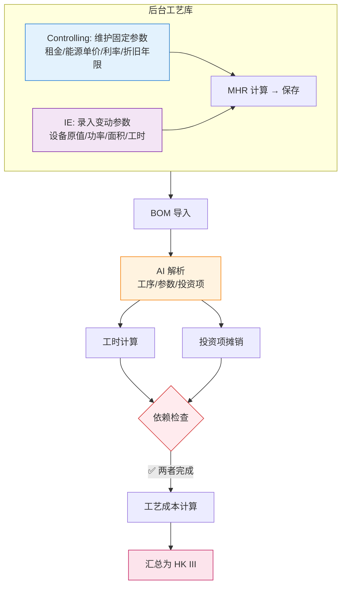

# 工艺成本计算逻辑

| 版本号 | 创建时间 | 更新时间 | 文档主题 | 创建人 |
|--------|----------|----------|----------|--------|
| v4.7   | 2026-02-03 | 2026-03-11 | 工艺成本计算逻辑（精简版+补充业务规则） | Randy Luo |

---

**版本变更记录：**
| 版本 | 日期 | 变更内容 |
|------|------|----------|
| v4.0 | 2026-03-11 | 精简文档，移除冗余内容 |
| v4.1 | 2026-03-11 | 补充系统校验规则、工时版本管理、详细工时计算规则 |
| v4.2 | 2026-03-11 | 修正工时计算方法：补充公式/分段/固定/条件四种执行方式 |
| v4.3 | 2026-03-11 | 对齐数据库表 quotation_work_center_time_rules 的实际字段定义 |
| v4.4 | 2026-03-11 | 更新 §3 工时计算规则，统一使用四种规则类型 |
| v4.5 | 2026-03-11 | 补充遗漏内容：参数分类、依赖关系、AI解析示例、换型时间、负载系数规则 |
| v4.6 | 2026-03-11 | 删除重复的第8章，将独特内容合并到第3章 |
| v4.7 | 2026-03-11 | 🔴 **移除投资项单件摊销**：工艺成本公式简化为 `Cost_process = MHR × (Cycle Time / 3600)`；投资项由独立的 NRE 模块处理 |

---

## 1. 核心计算公式

### 1.1 单工序工艺成本

$$Cost_{process} = MHR_{total} \times \frac{Cycle\ Time}{3600}$$

| 符号 | 说明 |
|------|------|
| $MHR_{total}$ | 机时费率（元/小时）= MHR_fix + MHR_var |
| $Cycle\ Time$ | 标准工时（秒/件） |

> **🔴 v4.7 说明**：投资项（模具、工装、检具等）由独立的 NRE 投资模块处理，不计入工序级工艺成本。

### 1.2 MHR 计算公式

```
MHR_fix = (折旧 + 利息 + 租金保险) / (净小时数 + 调试时间)
MHR_var = (能源 + 人工 + 其他变动) / (净小时数 + 调试时间)
MHR_total = MHR_fix + MHR_var
```

**组成部分：**

| 费用类型 | 计算公式 |
|----------|----------|
| 折旧 | `设备原值 / 折旧年限 × 机器数` |
| 利息 | `设备原值 / 2 × 利率` |
| 能源 | `(额定功率 × 负载系数 × 总工时 × 工厂能源单价) / 机器数` |
| 人工 | 分段计算：正常1倍、加班1.5倍、加班2倍 |
| 其他变动 | 刀具 + 耗材 + 维护 + 其他 |

### 1.3 参数录入分类

根据业务场景，参数录入分为**固定成本参数**和**变动成本参数**：

#### 固定成本参数（Controlling 维护）

| 参数 | 说明 | 单位 | 变化频率 |
|------|------|------|---------|
| **租金单价** | 厂房租金成本 | 元/㎡/年 | 年度更新 |
| **能源单价** | 电力单价（按工厂维护） | 元/kWh | 工厂级参数，年度更新 |
| **折旧年限** | 设备折旧年限 | 年 | 因产线不同有差异 |
| **利率** | 年利率 | % | 年度更新 |
| **小时工资** | 操作员时薪 | 元/小时 | 每个产线每年变化 |

#### 变动成本参数（IE/工艺输入）

| 参数 | 说明 | 单位 |
|------|------|------|
| **设备购置原值** | 设备采购价格 | 元 |
| **机器数** | 同类型设备数量 | 台 |
| **占用面积** | 设备占地面积 | ㎡ |
| **额定功率** | 设备额定功率 | kW |
| **计划小时数** | 年度计划运行时间 | 小时 |
| **负载系数** | 实际功率与额定功率比率 | 0-1 |

**计划小时数计算：**
```
计划小时数 = 天数 × 班次小时 × 稼动率
```

**负载系数使用规则：**

| 场景 | 负载系数 | 说明 |
|------|---------|------|
| 默认值 | 0.7 | 针对成熟工序如注塑机 |
| 低负载 | 0.5-0.6 | 保压、冷却占比较长的工序 |
| 高负载 | 0.8-1.0 | 全速冲压、持续加热的高能耗工序 |

---

## 2. 工序编码规则

### 2.1 工序编号格式

**格式**：`字母 + 两位数字`（如 C01, A02, T01）

| 字母 | 类别 | 示例 |
|------|------|------|
| **C** | 切管类 | C01=切PA管, C02=切波纹管 |
| **F** | 成型类 | F01=管路成型(蒸汽), F02=管路成型(回转炉) |
| **A** | 组装类 | A01=成型组装, A02=组装护套 |
| **T** | 检测类 | T01=检具检查, T02=气密检测 |
| **M** | 加工类 | M01=三合一, M02=激光打码 |
| **P** | 包装类 | P01=打包/包装 |

### 2.2 工作中心编号格式

**格式**：`5位数字`（如 40001）

| 前2位 | 说明 |
|-------|------|
| **40** | 济南工厂 |
| **80** | 常州工厂 |

### 2.3 工序分类清单

根据 ASUS 标准工时表，工序按功能分类如下：

| 分类 | 工序编号 | 工序名称 | 典型工作中心 |
|------|---------|---------|-------------|
| **切管类(C)** | C01 | 切PA管 | 40042, 80012 |
| | C02 | 切波纹管 | 40018, 80021 |
| | C03 | 切管-光管 | 40001 |
| **成型类(F)** | F02 | 管路成型（回转炉） | 40027, 80024 |
| | F01 | 管路成型（蒸汽） | 40012, 80012 |
| | A01 | 成型组装（安装拆卸） | 40021, 80021 |
| **组装类(A)** | A02 | 组装护套4种 | 40021, 80021 |
| | A03 | 组装接头 | 40028 |
| | A04 | BESS-储能组装 | 40032, 40031 |
| | A05 | 组装零部件 | 40021, 80021 |
| | A06 | 组装保温棉+胶带 | 40021, 80021 |
| **检测类(T)** | T01 | 检具检查 | 40021, 80021 |
| | T02 | 气密检测 | 40036, 80036 |
| **加工类(M)** | M01 | 三合一（回切倒角吹气端部检） | 40050, 80035 |
| | M02 | 激光打码 | 40023 |
| | M03 | 组装标签&激光打码 | 40023 |
| **包装类(P)** | P01 | 打包/包装 | 40021, 80021 |

> **说明**：同一工作中心可支持多种工序（如 40021 支持组装护套、组装零部件、检具检查、打包等）

---

## 3. 工时计算规则

工时规则存储在 `quotation_work_center_time_rules` 表中，支持**四种规则类型**：

### 3.1 规则类型（rule_type）

| 规则类型 | 说明 | 使用字段 |
|---------|------|---------|
| **FIXED** | 固定值 | `base_time` |
| **FORMULA** | 公式计算 | `base_formula` + `parameter_name` |
| **SEGMENT** | 分段规则 | `segment_config` (JSON) |
| **CONDITIONAL** | 条件判断 | `conditional_config` (JSON) |

### 3.2 S/PC 定义

**S/PC (Seconds Per Cycle)**：标准工时，单位为 **秒/件**

所有工时规则最终都要转换为 S/PC 格式。

**Cycle Time min/100pc**：100件产品的总分钟数

转换公式：
```
S/PC = Cycle Time min/100pc × 0.6
```

### 3.3 规则示例

| 工序 | 规则类型 | 配置 | 结果（秒/件） |
|------|---------|------|--------------|
| 激光打码 | FIXED | `base_time = 10` | 固定 10 秒 |
| 切PA管 | FORMULA | `base_formula = "(L+70)/1000*0.1*60"` | 根据长度 L 计算 |
| 气密检测 | SEGMENT | `segment_config` 按 L+70 分段 | 30/32/40/48... |
| 检具检查 | CONDITIONAL | `conditional_config` 按划线数量系数 | `1秒 × 划线数量` |

### 3.4 字段说明

- `parameter_name`：公式中的参数变量名（如 `L` 代表长度）
- `parameter_label`：参数显示名称（如"管子长度"）
- `parameter_unit`：参数单位（如 mm、个、kg）
- `min_time`：最低工时限制（秒），计算结果低于此值时使用该值

### 3.5 分段配置示例（segment_config）

```json
[
  {"min": 0, "max": 500, "time": 7},
  {"min": 500, "max": 1000, "time": 9},
  {"min": 1000, "max": null, "time": 12}
]
```

### 3.6 条件配置示例（conditional_config）

```json
[
  {"condition": "L<=0.5", "result": "7", "result_type": "VALUE"},
  {"condition": "L>2", "result": "L/10*20", "result_type": "FORMULA"}
]
```

### 3.7 系数机制

| 系数类型 | 说明 | 应用工序 |
|---------|------|---------|
| **划线数量** | 最终工时 × BOM中的划线数量 | 划线检测 |
| **BOM数量** | 每种零件单独计算，然后求和 | 组装零部件（扎带、管夹、标签等） |

### 3.8 典型工序工时公式表

| 工序编码 | 工序名称 | 判定条件 | 计算公式 | 备注 |
|---------|---------|---------|---------|------|
| **C01** | 切PA管（济南） | PA管长度 | `(L+70)/1000 × 0.1 × 60` | 最低5秒 |
| **C01** | 切PA管（常州） | PA管长度 | `(L+70)/1000 × 0.3 × 60` | 不同设备系数不同 |
| **C02** | 切波纹管 | 波纹管长度 | `L/1000 × 0.2 × 60` | |
| **A02** | 组装护套 | 护套长度 | `L/200 × 5` | L<200时最低5秒 |
| **A01** | 成型组装 | PA管长度 | `(L+70)/1000 × 29` | |
| **F02** | 管路成型(回转炉) | 0<L≤0.8m | 固定值 2.7秒 | 分段规则 |
| **F02** | 管路成型(回转炉) | 0.8<L≤1.5m | 固定值 4.8秒 | 分段规则 |
| **T01** | 检具检查 | 划线检测 | 固定值 1秒 | 系数为划线数量 |
| **T02** | 气密检测 | L+70>0 | 固定值 30秒 | 分段规则 |
| **P01** | 打包/包装 | L+70>0 | 固定值 10秒 | 分段规则 |

### 3.9 长度分段规则示例

**气密检测（工序 T02）：**

| 长度范围 | S/PC (秒/件) |
|---------|--------------|
| L+70 > 0 | 30 |
| L+70 ≥ 1m | 32 |
| L+70 ≥ 2m | 40 |
| L+70 ≥ 3m | 48 |
| L+70 ≥ 4m | 55 |
| L+70 ≥ 5m | 58 |

**打包工序（工序 P01）：**

| 长度范围 | S/PC (秒/件) |
|---------|--------------|
| L+70 > 0 | 10 |
| L+70 ≥ 1m | 14 |
| L+70 ≥ 2m | 19 |
| L+70 ≥ 3m | 24 |
| L+70 ≥ 4m | 29 |
| L+70 ≥ 5m | 34 |

---

## 4. 完整业务流程



### 4.1 关键顺序依赖关系

| 步骤 | 依赖条件 | 说明 |
|------|---------|------|
| **工时计算** | BOM解析完成 | 必须先解析出工艺参数（如长度）才能计算工时 |
| **投资项摊销** | BOM解析完成 | 必须先解析出投资项（工装/模具）才能计算摊销 |
| **工艺成本** | 工时+投资项都完成 | **工艺成本是最后计算的**，需要两者都就绪 |

> **🔴 重要**：工艺成本**不能**在 BOM 解析后立即计算，必须等待：
> 1. 工艺参数已代入公式得出工时
> 2. 投资项已输入并计算单件摊销

### 4.2 AI 解析投资项示例

**BOM 表 Comments 列示例内容：**
```
"切管工序，需专用切管刀模（寿命 50 万件），管材长度 200mm"
"压桩工序，需 15mm 压桩模具，共 32 个压桩点"
```

**AI 解析输出：**
```json
{
  "process_code": "M01",
  "process_name": "切管",
  "parameters": {
    "length": 200,
    "unit": "mm"
  },
  "investment_items": [
    {
      "item_type": "模具",
      "item_name": "切管刀模",
      "quantity": 1,
      "unit_cost": 50000,
      "lifecycle_qty": 500000,
      "amortization_per_unit": 0.10
    }
  ]
}
```

---

## 5. 维护职责

| 角色 | 职责 |
|------|------|
| **Controlling** | 维护工厂能源单价、租金单价、利率、折旧年限 |
| **IE/工艺** | 录入设备参数、维护工时计算规则、新增工艺时计算 MHR |

---

## 6. 系统校验与风险预警

为防止录入错误导致报价亏损，系统需设置以下校验规则：

### 6.1 除零保护

| 条件 | 触发动作 |
|------|---------|
| 计划小时数 = 0 | 禁止计算，提示"计划小时数不能为0" |
| 折旧年限 = 0 | 禁止计算，提示"折旧年限不能为0" |
| 机器数 = 0 | 禁止计算，提示"机器数不能为0" |

### 6.2 阈值拦截

| 条件 | 触发动作 |
|------|---------|
| MHR 偏离同类产线均值 ±15% | 自动标记为"需重点审核" |
| 负载系数 < 0.5 或 > 1.0 | 弹出警告确认 |
| 工时低于/高于历史值 ±30% | 弹出警告确认 |

### 6.3 数据一致性检查

| 条件 | 触发动作 |
|------|---------|
| 设备购置原值 > 0 但未填写占用面积 | 弹出警告 |
| 新增工艺但未触发 MHR 计算 | 不允许进入 Sales 审核环节 |

---

## 7. 工时版本管理

### 7.1 工时来源分类

| 工时来源 | 标记 | 原因说明 | 适用场景 |
|---------|------|---------|---------|
| 系统自动计算 | `auto` | 无需填写原因，仅做验证 | 成熟工艺，工时规则库已配置 |
| 手动调整 | `manual` | **必须填写调整原因** | 新工艺、特殊情况、经验修正 |

### 7.2 手动调整规则

**触发条件：**
- 工时规则库未覆盖的新工艺
- 实际工时与系统计算差异较大
- 特殊产品需要经验修正

**校验规则：**
- `cycle_time_source = 'manual'` 时，`cycle_time_adjustment_reason` 必填
- 系统自动记录调整人和调整时间

### 7.3 换型时间（Set Up Time）

换型时间有两种单位格式：

| 单位 | 说明 | 典型应用 |
|------|------|---------|
| **Set up time/h** | 小时 | 需要长时间换型的大型设备 |
| **Set up time/min** | 分钟 | 快速换型的小型设备 |

**换型时间分摊公式：**
```
每件摊销的换型时间 = Set up time ÷ 年产量
```

> **注意**：在报价时，年产量使用项目的年度规划量。

---

## 8. 相关文档

| 文档 | 关联内容 |
|------|----------|
| [数据库设计.md](数据库设计.md) | `factories`, `production_lines`, `process_rates`, `quotation_work_center_time_rules` 表定义 |
| [计算公式手册.md](计算公式手册.md) | 完整报价计算公式 |
| [NRE投资成本计算逻辑.md](NRE投资成本计算逻辑.md) | 投资项摊销计算 |
