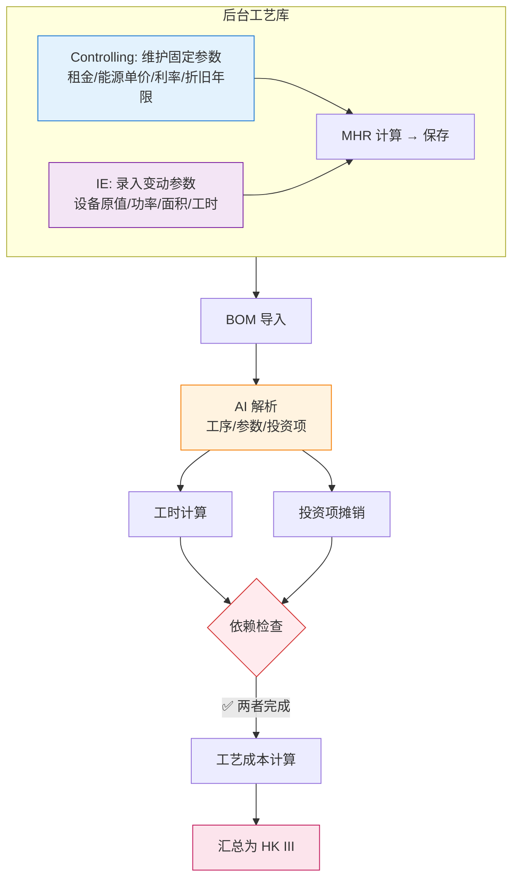

# 工艺成本计算逻辑

| 版本号 | 创建时间 | 更新时间 | 文档主题 | 创建人 |
|--------|----------|----------|----------|--------|
| v4.1   | 2026-02-03 | 2026-03-11 | 工艺成本计算逻辑（精简版+补充业务规则） | Randy Luo |

---

**版本变更记录：**
| 版本 | 日期 | 变更内容 |
|------|------|----------|
| v4.0 | 2026-03-11 | 精简文档，移除冗余内容 |
| v4.1 | 2026-03-11 | 补充系统校验规则、工时版本管理、详细工时计算规则 |

---

## 1. 核心计算公式

### 1.1 单工序工艺成本

$$Cost_{process} = MHR_{total} \times \frac{Cycle\ Time}{3600} + Amortization_{per\_unit}$$

| 符号 | 说明 |
|------|------|
| $MHR_{total}$ | 机时费率（元/小时）= MHR_fix + MHR_var |
| $Cycle\ Time$ | 标准工时（秒/件） |
| $Amortization_{per\_unit}$ | 投资项单件摊销（元/件） |

### 1.2 MHR 计算公式

```
MHR_fix = (折旧 + 利息 + 租金保险) / (净小时数 + 调试时间)
MHR_var = (能源 + 人工 + 其他变动) / (净小时数 + 调试时间)
MHR_total = MHR_fix + MHR_var
```

**组成部分：**

| 费用类型 | 计算公式 |
|----------|----------|
| 折旧 | `设备原值 / 折旧年限 × 机器数` |
| 利息 | `设备原值 / 2 × 利率` |
| 能源 | `(额定功率 × 负载系数 × 总工时 × 工厂能源单价) / 机器数` |
| 人工 | 分段计算：正常1倍、加班1.5倍、加班2倍 |
| 其他变动 | 刀具 + 耗材 + 维护 + 其他 |

---

## 2. 工序编码规则

### 2.1 工序编号格式

**格式**：`字母 + 两位数字`（如 C01, A02, T01）

| 字母 | 类别 | 示例 |
|------|------|------|
| **C** | 切管类 | C01=切PA管, C02=切波纹管 |
| **F** | 成型类 | F01=管路成型(蒸汽), F02=管路成型(回转炉) |
| **A** | 组装类 | A01=成型组装, A02=组装护套 |
| **T** | 检测类 | T01=检具检查, T02=气密检测 |
| **M** | 加工类 | M01=三合一, M02=激光打码 |
| **P** | 包装类 | P01=打包/包装 |

### 2.2 工作中心编号格式

**格式**：`5位数字`（如 40001）

| 前2位 | 说明 |
|-------|------|
| **40** | 济南工厂 |
| **80** | 常州工厂 |

---

## 3. 工时计算规则

### 3.1 计算方法

| 方法 | 适用场景 | 输入变量 | 示例 |
|------|----------|----------|------|
| LENGTH | 长度法 | 管子长度 | 切管：`(L+70)/1000 × 0.1 × 60` |
| COUNT | 点数法 | 压桩点数、划线数量 | 压桩：`12 × 点数` |
| TIME | 时间法 | 固定时间 | 检具检查：`1 × 划线数量` |

### 3.2 S/PC 定义

**S/PC (Seconds Per Cycle)**：标准工时，单位为 **秒/件**

所有工时规则最终都要转换为 S/PC 格式。

### 3.3 长度分段规则示例

**管路成型（回转炉）工序 F02：**

| 长度范围 | S/PC (秒/件) |
|----------|---------------|
| 0 < L ≤ 0.8m | 2.7 |
| 0.8 < L ≤ 1.5m | 4.8 |

---

## 4. 完整业务流程



---

## 5. 维护职责

| 角色 | 职责 |
|------|------|
| **Controlling** | 维护工厂能源单价、租金单价、利率、折旧年限 |
| **IE/工艺** | 录入设备参数、维护工时计算规则、新增工艺时计算 MHR |

---

## 6. 相关文档

| 文档 | 关联内容 |
|------|----------|
| [数据库设计.md](数据库设计.md) | `factories`, `production_lines`, `process_rates`, `work_center_time_rules` 表定义 |
| [计算公式手册.md](计算公式手册.md) | 完整报价计算公式 |
| [NRE投资成本计算逻辑.md](NRE投资成本计算逻辑.md) | 投资项摊销计算 |
