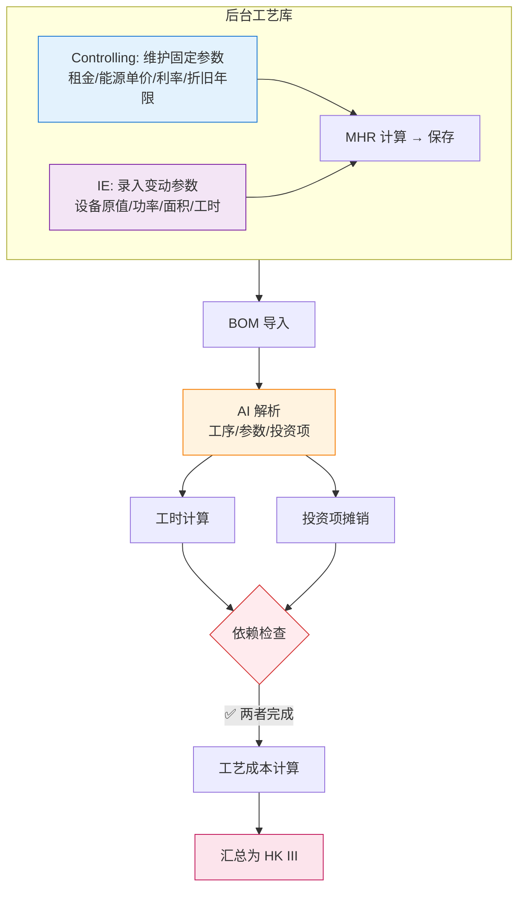

# 工艺成本计算逻辑

| 版本号 | 创建时间 | 更新时间 | 文档主题 | 创建人 |
|--------|----------|----------|----------|--------|
| v4.2   | 2026-02-03 | 2026-03-11 | 工艺成本计算逻辑（精简版+补充业务规则） | Randy Luo |

---

**版本变更记录：**
| 版本 | 日期 | 变更内容 |
|------|------|----------|
| v4.0 | 2026-03-11 | 精简文档，移除冗余内容 |
| v4.1 | 2026-03-11 | 补充系统校验规则、工时版本管理、详细工时计算规则 |
| v4.2 | 2026-03-11 | 修正工时计算方法：补充公式/分段/固定/条件四种执行方式 |

---

## 1. 核心计算公式

### 1.1 单工序工艺成本

$$Cost_{process} = MHR_{total} \times \frac{Cycle\ Time}{3600} + Amortization_{per\_unit}$$

| 符号 | 说明 |
|------|------|
| $MHR_{total}$ | 机时费率（元/小时）= MHR_fix + MHR_var |
| $Cycle\ Time$ | 标准工时（秒/件） |
| $Amortization_{per\_unit}$ | 投资项单件摊销（元/件） |

### 1.2 MHR 计算公式

```
MHR_fix = (折旧 + 利息 + 租金保险) / (净小时数 + 调试时间)
MHR_var = (能源 + 人工 + 其他变动) / (净小时数 + 调试时间)
MHR_total = MHR_fix + MHR_var
```

**组成部分：**

| 费用类型 | 计算公式 |
|----------|----------|
| 折旧 | `设备原值 / 折旧年限 × 机器数` |
| 利息 | `设备原值 / 2 × 利率` |
| 能源 | `(额定功率 × 负载系数 × 总工时 × 工厂能源单价) / 机器数` |
| 人工 | 分段计算：正常1倍、加班1.5倍、加班2倍 |
| 其他变动 | 刀具 + 耗材 + 维护 + 其他 |

---

## 2. 工序编码规则

### 2.1 工序编号格式

**格式**：`字母 + 两位数字`（如 C01, A02, T01）

| 字母 | 类别 | 示例 |
|------|------|------|
| **C** | 切管类 | C01=切PA管, C02=切波纹管 |
| **F** | 成型类 | F01=管路成型(蒸汽), F02=管路成型(回转炉) |
| **A** | 组装类 | A01=成型组装, A02=组装护套 |
| **T** | 检测类 | T01=检具检查, T02=气密检测 |
| **M** | 加工类 | M01=三合一, M02=激光打码 |
| **P** | 包装类 | P01=打包/包装 |

### 2.2 工作中心编号格式

**格式**：`5位数字`（如 40001）

| 前2位 | 说明 |
|-------|------|
| **40** | 济南工厂 |
| **80** | 常州工厂 |

---

## 3. 工时计算规则

### 3.1 计算方法

| 方法 | 适用场景 | 输入变量 | 示例 |
|------|----------|----------|------|
| LENGTH | 长度法 | 管子长度 | 切管：`(L+70)/1000 × 0.1 × 60` |
| COUNT | 点数法 | 压桩点数、划线数量 | 压桩：`12 × 点数` |
| TIME | 时间法 | 固定时间 | 检具检查：`1 × 划线数量` |

### 3.2 S/PC 定义

**S/PC (Seconds Per Cycle)**：标准工时，单位为 **秒/件**

所有工时规则最终都要转换为 S/PC 格式。

### 3.3 长度分段规则示例

**管路成型（回转炉）工序 F02：**

| 长度范围 | S/PC (秒/件) |
|----------|---------------|
| 0 < L ≤ 0.8m | 2.7 |
| 0.8 < L ≤ 1.5m | 4.8 |

---

## 4. 完整业务流程



---

## 5. 维护职责

| 角色 | 职责 |
|------|------|
| **Controlling** | 维护工厂能源单价、租金单价、利率、折旧年限 |
| **IE/工艺** | 录入设备参数、维护工时计算规则、新增工艺时计算 MHR |

---

## 6. 系统校验与风险预警

为防止录入错误导致报价亏损，系统需设置以下校验规则：

### 6.1 除零保护

| 条件 | 触发动作 |
|------|---------|
| 计划小时数 = 0 | 禁止计算，提示"计划小时数不能为0" |
| 折旧年限 = 0 | 禁止计算，提示"折旧年限不能为0" |
| 机器数 = 0 | 禁止计算，提示"机器数不能为0" |

### 6.2 阈值拦截

| 条件 | 触发动作 |
|------|---------|
| MHR 偏离同类产线均值 ±15% | 自动标记为"需重点审核" |
| 负载系数 < 0.5 或 > 1.0 | 弹出警告确认 |
| 工时低于/高于历史值 ±30% | 弹出警告确认 |

### 6.3 数据一致性检查

| 条件 | 触发动作 |
|------|---------|
| 设备购置原值 > 0 但未填写占用面积 | 弹出警告 |
| 新增工艺但未触发 MHR 计算 | 不允许进入 Sales 审核环节 |

---

## 7. 工时版本管理

### 7.1 工时来源分类

| 工时来源 | 标记 | 原因说明 | 适用场景 |
|---------|------|---------|---------|
| 系统自动计算 | `auto` | 无需填写原因，仅做验证 | 成熟工艺，工时规则库已配置 |
| 手动调整 | `manual` | **必须填写调整原因** | 新工艺、特殊情况、经验修正 |

### 7.2 手动调整规则

**触发条件：**
- 工时规则库未覆盖的新工艺
- 实际工时与系统计算差异较大
- 特殊产品需要经验修正

**校验规则：**
- `cycle_time_source = 'manual'` 时，`cycle_time_adjustment_reason` 必填
- 系统自动记录调整人和调整时间

---

## 8. 详细工时计算规则

### 8.1 核心定义

**S/PC (Seconds Per Cycle)**：标准工时，单位为 **秒/件**

所有工时规则最终都要转换为 S/PC 格式。

**Cycle Time min/100pc**：100件产品的总分钟数

转换公式：
```
S/PC = (Cycle Time min/100pc × 60) ÷ 100 = Cycle Time min/100pc × 0.6
```

### 8.2 计算方法汇总

工时规则有**四种执行方式**：

| 执行方式 | 说明 | 字段依据 | 示例 |
|---------|------|---------|------|
| **公式法** | 根据公式动态计算 | `formula` 字段 | 切管：`(L+70)/1000 × 0.1 × 60` |
| **分段法** | 根据长度/条件范围匹配不同值 | `range_condition` + 多条记录 | 气密检测：L+70≥1m 用 32秒，≥2m 用 40秒 |
| **固定法** | 直接使用固定工时值 | `std_time_seconds` 字段 | 激光打码：固定 10秒 |
| **条件法** | 根据系数类型动态调整 | `coefficient_type` 字段 | 检具检查：`1秒 × 划线数量` |

**与传统分类（LENGTH/COUNT/TIME）的对应关系：**

| 传统分类 | 对应执行方式 |
|---------|-------------|
| LENGTH（长度法） | 公式法 |
| COUNT（点数法） | 条件法（系数 = 点数） |
| TIME（时间法） | 分段法 或 固定法 |

### 8.3 系数机制

| 系数类型 | 说明 | 应用工序 |
|---------|------|---------|
| **划线数量** | 最终工时 × BOM中的划线数量 | 划线检测 |
| **BOM数量** | 每种零件单独计算，然后求和 | 组装零部件（扎带、管夹、标签等） |

### 8.4 典型工序工时公式表

| 工序编码 | 工序名称 | 判定条件 | 计算公式 | 备注 |
|---------|---------|---------|---------|------|
| **C01** | 切PA管（济南） | PA管长度 | `(L+70)/1000 × 0.1 × 60` | 最低5秒 |
| **C01** | 切PA管（常州） | PA管长度 | `(L+70)/1000 × 0.3 × 60` | 不同设备系数不同 |
| **C02** | 切波纹管 | 波纹管长度 | `L/1000 × 0.2 × 60` | |
| **A02** | 组装护套 | 护套长度 | `L/200 × 5` | L<200时最低5秒 |
| **A01** | 成型组装 | PA管长度 | `(L+70)/1000 × 29` | |
| **F02** | 管路成型(回转炉) | 0<L≤0.8m | 固定值 2.7秒 | 分段规则 |
| **F02** | 管路成型(回转炉) | 0.8<L≤1.5m | 固定值 4.8秒 | 分段规则 |
| **T01** | 检具检查 | 划线检测 | 固定值 1秒 | 系数为划线数量 |
| **T02** | 气密检测 | L+70>0 | 固定值 30秒 | 分段规则 |
| **P01** | 打包/包装 | L+70>0 | 固定值 10秒 | 分段规则 |

### 8.5 长度分段规则示例

**气密检测（工序 T02）：**

| 长度范围 | S/PC (秒/件) |
|---------|--------------|
| L+70 > 0 | 30 |
| L+70 ≥ 1m | 32 |
| L+70 ≥ 2m | 40 |
| L+70 ≥ 3m | 48 |
| L+70 ≥ 4m | 55 |
| L+70 ≥ 5m | 58 |

**打包工序（工序 P01）：**

| 长度范围 | S/PC (秒/件) |
|---------|--------------|
| L+70 > 0 | 10 |
| L+70 ≥ 1m | 14 |
| L+70 ≥ 2m | 19 |
| L+70 ≥ 3m | 24 |
| L+70 ≥ 4m | 29 |
| L+70 ≥ 5m | 34 |

---

## 9. 相关文档

| 文档 | 关联内容 |
|------|----------|
| [数据库设计.md](数据库设计.md) | `factories`, `production_lines`, `process_rates`, `work_center_time_rules` 表定义 |
| [计算公式手册.md](计算公式手册.md) | 完整报价计算公式 |
| [NRE投资成本计算逻辑.md](NRE投资成本计算逻辑.md) | 投资项摊销计算 |
