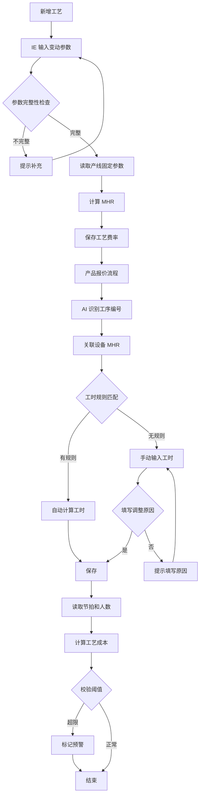

# 工艺成本计算逻辑

| 版本号 | 创建时间 | 更新时间 | 文档主题 | 创建人 |
|--------|----------|----------|----------|--------|
| v2.5   | 2026-02-03 | 2026-03-05 | 工艺成本计算逻辑 | Randy Luo |

---

**版本变更记录：**
| 版本 | 日期 | 变更内容 |
|------|------|----------|
| v2.5 | 2026-03-05 | 🔴 **人工成本计入MHR**：MHR_var 新增人工成本（分段计算加班工资：1倍/1.5倍/2倍）；process_rates 表新增 `operators` 字段 |
| v2.4 | 2026-03-05 | 🔴 **人工成本内嵌**：移除人工成本单独计算章节；公式简化为 `Cost = MHR × (节拍 / 3600)`；移除 `personnel_std` 和 `labor_rate` 字段 |
| v2.3 | 2026-03-04 | 🔴 **公式对齐**：MHR 计算公式对齐 VOSS 标准规则；新增机器数参数；修正能源计算公式；添加其他变动成本项 |
| v2.2 | 2026-02-14 | 🔴 **架构重构**：移除 §7 数据库设计规范，改为引用 [数据库设计.md](数据库设计.md)；保持文档职责单一 |
| v2.1 | 2026-02-13 | 🆕 新增工时版本管理、新工作中心建立流程、工时计算规则维护 |
| v2.0 | 2026-02-13 | 🔴 **重大重构**：新增工序编码规则；重构参数分类为固定/变动成本；更新 MHR 计算公式；新增负载系数 |
| v1.4 | 2026-02-05 | 移除双轨计价逻辑，仅保留 Standard Cost 计算；简化 MHR 费率模型 |
| v1.3 | 2026-02-05 | 同步 v2.0 流程变更：移除 Controlling 审核；新增 sales_input 状态；MHR 费率拆分为 var/fix |
| v1.2 | 2026-02-04 | 初始版本 |

---

## 1. 工艺评估核心录入参数

根据业务场景，参数录入分为**固定成本参数**（由 Controlling 维护）和**变动成本参数**（由 IE/工艺输入）。

### 1.1 固定成本参数（Controlling 维护）

这些参数通常每年更新一次，作为全公司报价的底座。

| 参数 | 说明 | 单位 | 变化频率 |
|------|------|------|---------|
| **租金单价** | 厂房租金成本 | 元/㎡/年 | 年度更新 |
| **能源单价** | 电力单价 | 元/kWh | 年度更新 |
| **折旧年限** | 设备折旧年限 | 年 | 因产线不同有差异 |
| **利率** | 年利率 | % | 年度更新 |
| **小时工资** | 操作员时薪 | 元/小时 | 每个产线每年变化 |

### 1.2 变动成本参数（IE/工艺输入）

由 IE 或 VM 针对具体设备/工艺进行录入，**在新增工艺时触发 MHR 计算**。

| 参数 | 说明 | 单位 |
|------|------|------|
| **设备购置原值** | 设备采购价格 | 元 |
| **机器数** | 同类型设备数量 | 台 |
| **占用面积** | 设备占地面积 | ㎡ |
| **额定功率** | 设备额定功率 | kW |
| **计划小时数** | 年度计划运行时间 | 小时 |
| **负载系数** | 实际功率与额定功率比率 | 0-1（默认 0.7） |

**🆕 v2.3 新增参数：**
- **机器数**：折旧计算需乘以机器数量
- **Set-up Hours**：调试/换型时间，用于 MHR 分母计算

**计划小时数计算：**
```
计划小时数 = 天数 × 班次小时 × 稼动率
```

**负载系数使用规则：**
| 场景 | 负载系数 | 说明 |
|------|---------|------|
| 默认值 | 0.7 | 针对成熟工序如注塑机 |
| 低负载 | 0.5-0.6 | 保压、冷却占比较长的工序 |
| 高负载 | 0.8-1.0 | 全速冲压、持续加热的高能耗工序 |

> **注意：** 在"新增工艺"或"高精度报价"时，IE 可以调整负载系数。

### 1.3 工序编码规则 🆕

#### 工序编号格式

- **格式**：`字母 + 两位数字`
- **字母**：代表工作中心
- **数字**：该工作中心下的工序序号（01-99）

**示例**：`I01` = 注塑工作中心的第1个工序

#### 工作中心字母映射表

| 字母 | 英文全称 | 中文 | 说明 |
|------|---------|------|------|
| **I** | Injection | 注塑 | VOSS 核心工序，通常关联注塑机 |
| **A** | Assembly | 装配 | 包含手动、半自动、全自动装配线 |
| **M** | Machining | 机加 | 涉及切管、倒角、打孔等 |
| **T** | Testing | 检测 | 气密性检查、水检、视觉检测 |
| **P** | Packing | 包装 | 称重、贴标、入库前处理 |
| **S** | Surface | 表处 | 涂层、清洗、丝印 |

#### 工艺路线编码规则

- **格式**：`产线名称 + 工序1编号 + 工序2编号 + ...`
- **示例**：`LINE-I01A02M03` = 产线 LINE，经过注塑 I01 → 装配 A02 → 机加 M03

---

## 2. 工艺评估计算逻辑 (Calculation Logic)

### 2.1 工艺成本快速计算流程

```
AI 解析 BOM/工艺路径
       ↓
识别工序编号（如"I01"、"M02"）
       ↓
自动关联该设备的 MHR
       ↓
乘以工艺定额（节拍）
       ↓
得出设备部分工艺成本
```

### 2.2 MHR (机时费率) 计算公式 🆕 v2.5

**触发时机**：新增工艺/设备时

#### 固定成本/小时 (MHR_fix)

```
折旧 = 设备购置原值 / 折旧年限 × 机器数
利息 = 设备原值 / 2 × 利率
保险/租金等 = Distribution of insurance + rent + bank charge

MHR_fix = Total Fixed Costs / (Net Hours + Set-up Hours)
```

#### 变动成本/小时 (MHR_var) 🆕 v2.5

```
# 人工成本（分段计算加班工资）
total_hours = Net Hours + Set-up Hours
hours_per_operator = total_hours / operators

IF hours_per_operator < 1693:
    wages = total_hours × wage_rate × 1.0
ELSE IF hours_per_operator < 2520:
    normal = 1693 × operators × wage_rate
    overtime_1_5 = (total_hours - 1693 × operators) × wage_rate × 1.5
    wages = normal + overtime_1_5
ELSE:
    normal = 1693 × operators × wage_rate
    overtime_1_5 = 827 × operators × wage_rate × 1.5
    overtime_2 = (total_hours - 2520 × operators) × wage_rate × 2.0
    wages = normal + overtime_1_5 + overtime_2

# 能源成本
Energy = (能源单价 / 面积) × 功率 × 0.78

# 其他变动成本
Other_Variable = Tools + Supplies + Maintenance + Other_Variable_Cost

MHR_var = (Wages + Energy + Other_Variable) / (Net Hours + Set-up Hours)
```

#### MHR 费率汇总

```
MHR_total = MHR_fix + MHR_var
```

> **🆕 v2.5 变更说明（人工成本）：**
> - 新增 **operators** 字段（操作员人数）
> - 人工成本计入 **MHR_var**（变动成本）
> - 分段计算加班工资：
>   - 正常工时（<1693小时/人/年）：1.0倍
>   - 加班1.5倍（1693~2520小时/人/年）
>   - 加班2倍（>2520小时/人/年）

> **🆕 v2.3 变更说明：**
> - 折旧计算新增**机器数**参数
> - 能源公式改为：`能源单价 / 面积 × 功率 × 0.78`
> - 新增**其他变动成本**项（刀具、耗材、维护等）
> - 分母统一使用：`(Net Hours + Set-up Hours)`

### 2.3 单工序工艺成本汇总

对于报价单中的每一行工艺，成本计算如下：

$$Cost_{std} = MHR_{total} \times \frac{Cycle\ Time}{3600}$$

> **注意：** Cycle Time 以秒为单位，需除以 3600 转换为小时

---

## 3. 系统校验与风险预警

为防止录入错误导致报价亏损，系统需设置以下"软硬闸口"：

### 3.1 除零保护 (Zero Division Protection)

| 条件 | 触发动作 |
|------|---------|
| 计划小时数 = 0 | 禁止计算，提示"计划小时数不能为0" |
| 折旧年限 = 0 | 禁止计算，提示"折旧年限不能为0" |

### 3.2 阈值拦截 (Threshold Validation)

| 条件 | 触发动作 |
|------|---------|
| $MHR_{total}$ 偏离同类产线均值 $\pm 15\%$ | 自动标记为"需重点审核" |
| 负载系数 < 0.5 或 > 1.0 | 弹出警告确认 |

### 3.3 同步性检查 (Data Consistency)

| 条件 | 触发动作 |
|------|---------|
| 设备购置原值 > 0 但未填写占用面积 | 弹出警告 |
| 新增工艺但未触发 MHR 计算 | 不允许进入 Sales 审核环节 |

---

## 4. 工时版本管理 🆕

### 4.1 工时来源分类

| 工时来源 | 标记 | 原因说明 | 适用场景 |
|---------|------|---------|---------|
| 系统自动计算 | `auto` | 无需填写原因，仅做验证 | 成熟工艺，工时规则库已配置 |
| 手动调整 | `manual` | **必须填写调整原因** | 新工艺、特殊情况、经验修正 |

### 4.2 手动调整规则

**触发条件：**
- 工时规则库未覆盖的新工艺
- 实际工时与系统计算差异较大
- 特殊产品需要经验修正

**操作流程：**
```
手动修改工时 → 弹出原因输入框 → 填写调整原因 → 保存
```

**校验规则：**
- `cycle_time_source = 'manual'` 时，`cycle_time_adjustment_reason` 必填
- 系统自动记录调整人和调整时间

### 4.3 总费率手动调整 🆕

**业务场景：**
总费率（Total Rate）= MHR（机时费率，已含人工成本）。在某些特殊情况下，IE 可能需要手动调整总费率，而非使用系统计算值。

**触发条件：**
- 设备为非标准配置，系统计算的 MHR 与实际偏差较大
- 多设备组合使用，需要综合计算费率
- 特殊工艺需要经验修正

**操作流程：**
```
手动修改总费率 → 弹出原因输入框 → 填写调整原因 → 保存
```

**校验规则：**
| 字段 | 条件 | 说明 |
|------|------|------|
| `total_rate_source` | = `manual` 时 | 标记为手动调整 |
| `total_rate_adjustment_reason` | 必填 | 填写调整原因 |
| `mhr_snapshot` | 保持原值 | 快照不覆盖，便于追溯 |

**数据库字段扩展：**
```python
class ProductProcess(BaseModel):
    # ... 现有字段 ...
    total_rate_source: str = Field(default="auto")  # auto / manual
    total_rate_adjustment_reason: str | None = None  # 手动调整时必填

    @validator('total_rate_adjustment_reason')
    def validate_total_rate_reason(cls, v, values):
        """手动调整总费率时必须填写原因"""
        if values.get('total_rate_source') == 'manual' and not v:
            raise ValueError('手动调整总费率时必须填写调整原因')
        return v
```

---

## 5. 新工作中心建立流程 🆕

### 5.1 流程图

```
临时编号(IE录入参数) → MHR自动计算 → 实际投产后 → IE将状态改为"正式"
```

### 5.2 状态说明

| 状态 | 英文 | 说明 | 操作人 |
|------|------|------|--------|
| **临时** | `TEMPORARY` | MHR 已计算但设备未实际投产 | IE 创建 |
| **正式** | `ACTIVE` | 设备已实际投产，可用于正式报价 | IE 确认 |
| **停用** | `INACTIVE` | 设备已退役或不再使用 | Controlling |

### 5.3 临时工作中心管理

**创建时机：**
- 识别到新工艺且库中无对应工作中心
- 需要先计算 MHR 进行报价评估

**转正条件：**
- 设备已实际采购并安装
- 完成试生产验证
- IE 在工作中心维护界面手动确认

---

## 6. 工时计算规则维护 🆕

### 6.1 规则配置

每个工作中心可定义独立的工时计算方法：

| 计算方法 | 英文 | 输入变量 | 示例 |
|---------|------|---------|------|
| **长度法** | `LENGTH` | 管子长度 → 标准时间 | 光管切管：8秒/根 |
| **点数法** | `COUNT` | 压桩点数 → 标准时间 | 压桩：12~15秒/点 |
| **时间法** | `TIME` | 直接输入时间 | 成型：2.7~5秒 |

### 6.2 规则示例

**切管工时规则（长度法）：**
| 工作中心 | 输入变量 | 范围 | 标准工时 | 单位 |
|---------|---------|------|---------|------|
| M01 (切管) | 管子类型 | 光管 | 8 | 秒/根 |
| M01 (切管) | 管子类型 | 波纹管 | 8 | 秒/根 |

**压桩工时规则（点数法）：**
| 工作中心 | 输入变量 | 范围 | 标准工时 | 单位 |
|---------|---------|------|---------|------|
| A01 (压桩) | 管径 | < 25mm | 12 | 秒/点 |
| A01 (压桩) | 管径 | ≥ 25mm | 15 | 秒/点 |

**成型工时规则（时间法）：**
| 工作中心 | 输入变量 | 范围 | 标准工时 | 单位 |
|---------|---------|------|---------|------|
| M02 (成型) | 管子长度 | ≤ 1m | 2.7 | 秒 |
| M02 (成型) | 管子长度 | ≤ 2m | 5.0 | 秒 |

### 6.3 数据库存储

工时规则存储在 `work_center_time_rules` 表中，详见 §7.4。

### 6.4 维护职责

| 角色 | 职责 |
|------|------|
| **IE** | 维护工时计算规则（方法、范围、标准工时） |
| **Controlling** | 审核 MHR 计算结果合理性 |

---

## 7. 数据库设计参考

> **文档职责说明**：数据库表结构的详细定义请参考 [数据库设计.md](数据库设计.md)，本文档仅提供引用链接。

本模块涉及的数据表结构详见 数据库设计.md：

| 表名 | 用途 | 详细定义位置 |
|------|------|-------------|
| `production_lines` | 产线主数据（含租金单价、能源单价、利率等固定参数） | [数据库设计.md §3.3](数据库设计.md#master-data-extension) |
| `process_rates` | 工序费率主数据（含 MHR 计算相关字段） | [数据库设计.md §3.1](数据库设计.md#master-data) |
| `product_processes` | 产品工艺路线（含工时快照、人工费率快照） | [数据库设计.md §3.2](数据库设计.md#transaction-data) |
| `work_center_time_rules` | 工作中心工时规则（长度法/点数法/时间法） | [数据库设计.md §3.3](数据库设计.md#master-data-extension) |

**关键字段说明（与本逻辑文档相关）：**

- `production_lines.status`：TEMPORARY / ACTIVE / INACTIVE（见 §5.2 状态说明）
- `product_processes.cycle_time_source`：auto / manual（见 §4.1 工时来源分类）
- `product_processes.cycle_time_adjustment_reason`：手动调整原因（manual 时必填）
- `work_center_time_rules.calc_method`：LENGTH / COUNT / TIME（见 §6.1 规则配置）

---

## 8. 数据模型定义

### 8.1 Pydantic 模型

```python
from decimal import Decimal
from pydantic import BaseModel, Field, validator
from enum import Enum
from typing import Literal


class WorkCenter(str, Enum):
    """工作中心枚举"""
    INJECTION = "I"   # 注塑
    ASSEMBLY = "A"    # 装配
    MACHINING = "M"   # 机加
    TESTING = "T"     # 检测
    PACKING = "P"     # 包装
    SURFACE = "S"     # 表处


class ProductionLineStatus(str, Enum):
    """产线状态 🆕"""
    TEMPORARY = "TEMPORARY"  # 临时
    ACTIVE = "ACTIVE"        # 正式
    INACTIVE = "INACTIVE"    # 停用


class CycleTimeSource(str, Enum):
    """工时来源 🆕"""
    AUTO = "auto"      # 系统自动计算
    MANUAL = "manual"  # 手动调整


class CalcMethod(str, Enum):
    """工时计算方法 🆕"""
    LENGTH = "LENGTH"  # 长度法
    COUNT = "COUNT"    # 点数法
    TIME = "TIME"      # 时间法


class ProductionLine(BaseModel):
    """产线"""
    id: str
    name: str
    net_production_hours: Decimal = Field(gt=0)
    efficiency_rate: Decimal = Field(gt=0, le=1)
    plan_fx_rate: Decimal = Field(gt=0)
    avg_wages_per_hour: Decimal = Field(gt=0, description="小时工资")
    useful_life_years: int = Field(default=8, ge=1, description="折旧年限")
    rent_unit_price: Decimal = Field(gt=0, description="租金单价（元/㎡/年）")
    energy_unit_price: Decimal = Field(gt=0, description="能源单价（元/kWh）")
    interest_rate: Decimal = Field(ge=0, le=1, description="年利率")
    status: ProductionLineStatus = Field(default=ProductionLineStatus.TEMPORARY)  # 🆕

    @property
    def effective_hours(self) -> Decimal:
        """年度有效产能"""
        return self.net_production_hours * self.efficiency_rate


class ProcessRate(BaseModel):
    """工序费率"""
    process_code: str = Field(..., pattern=r"^[IAMTPS]\d{2}$", description="工序编号")
    production_line_id: str
    process_name: str
    work_center: WorkCenter
    equipment_origin_value: Decimal = Field(gt=0, description="设备购置原值")
    machine_count: int = Field(default=1, ge=1, description="🆕 v2.3 机器数")
    floor_area: Decimal = Field(gt=0, description="占用面积（㎡）")
    rated_power: Decimal = Field(gt=0, description="额定功率（kW）")
    planned_hours: Decimal = Field(gt=0, description="计划小时数")
    setup_hours: Decimal = Field(default=Decimal("0"), ge=0, description="🆕 v2.3 调试/换型时间")
    load_factor: Decimal = Field(default=Decimal("0.78"), ge=0.5, le=1.0, description="🆕 v2.3 负载系数（固定0.78）")

    # 🆕 v2.3 其他变动成本项
    tools_cost: Decimal = Field(default=Decimal("0"), ge=0, description="刀具成本")
    supplies_cost: Decimal = Field(default=Decimal("0"), ge=0, description="耗材成本")
    maintenance_cost: Decimal = Field(default=Decimal("0"), ge=0, description="维护成本")
    other_variable_cost: Decimal = Field(default=Decimal("0"), ge=0, description="其他变动成本")

    # 计算字段
    std_mhr_var: Decimal | None = None
    std_mhr_fix: Decimal | None = None
    std_mhr_total: Decimal | None = None

    def calculate_mhr(self, production_line: ProductionLine) -> None:
        """计算 MHR 费率 🆕 v2.3"""
        # 分母：净小时数 + 调试时间
        total_hours = self.planned_hours + self.setup_hours

        # 固定成本/小时
        depreciation = self.equipment_origin_value / production_line.useful_life_years * self.machine_count
        interest = (self.equipment_origin_value / 2) * production_line.interest_rate
        rent_and_insurance = production_line.rent_unit_price * self.floor_area  # 简化表示

        mhr_fix = (depreciation + interest + rent_and_insurance) / total_hours

        # 变动成本/小时
        energy_cost = (production_line.energy_unit_price / self.floor_area) * self.rated_power * Decimal("0.78")
        other_var = self.tools_cost + self.supplies_cost + self.maintenance_cost + self.other_variable_cost

        mhr_var = (energy_cost + other_var) / total_hours

        # 汇总
        self.std_mhr_fix = mhr_fix.quantize(Decimal("0.01"))
        self.std_mhr_var = mhr_var.quantize(Decimal("0.01"))
        self.std_mhr_total = (self.std_mhr_fix + self.std_mhr_var).quantize(Decimal("0.01"))

    @property
    def mhr_total(self) -> Decimal:
        """获取总费率"""
        return self.std_mhr_total or Decimal("0")


class ProductProcess(BaseModel):
    """产品工艺"""
    id: str | None = None
    project_product_id: str
    process_code: str
    sequence_order: int
    cycle_time_std: int = Field(gt=0, description="标准工时（秒）")
    cycle_time_source: CycleTimeSource = Field(default=CycleTimeSource.AUTO)  # 🆕
    cycle_time_adjustment_reason: str | None = None  # 🆕
    mhr_snapshot: Decimal = Field(gt=0, description="MHR 快照（已含人工成本）")

    @validator('cycle_time_adjustment_reason')
    def validate_adjustment_reason(cls, v, values):
        """手动调整时必须填写原因 🆕"""
        if values.get('cycle_time_source') == CycleTimeSource.MANUAL and not v:
            raise ValueError('手动调整工时时必须填写调整原因')
        return v

    def calculate_cost(self) -> Decimal:
        """计算工艺成本

        公式: Cost = MHR × (节拍 / 3600)
        注意: MHR 已包含人工成本
        """
        hours = Decimal(self.cycle_time_std) / Decimal("3600")

        return (self.mhr_snapshot * hours).quantize(Decimal("0.0001"))


class WorkCenterTimeRule(BaseModel):
    """工作中心工时规则 🆕"""
    id: int | None = None
    production_line_id: str
    calc_method: CalcMethod
    input_variable: str = Field(..., description="输入变量名")
    range_min: Decimal = Field(description="范围下限")
    range_max: Decimal | None = Field(default=None, description="范围上限（NULL 表示无上限）")
    std_time_seconds: Decimal = Field(gt=0, description="标准工时（秒）")
    unit: str = Field(..., description="单位")
    status: str = "ACTIVE"

    def matches(self, value: Decimal) -> bool:
        """检查输入值是否匹配规则范围"""
        if value < self.range_min:
            return False
        if self.range_max is not None and value > self.range_max:
            return False
        return True


class ProcessCostValidation(BaseModel):
    """工艺成本校验结果"""
    is_valid: bool
    warnings: list[str] = []
    errors: list[str] = []

    @classmethod
    def validate_mhr_deviation(
        cls,
        calculated: Decimal,
        benchmark: Decimal,
        threshold: Decimal = Decimal("0.15")
    ) -> "ProcessCostValidation":
        """校验 MHR 偏离度"""
        deviation = abs((calculated - benchmark) / benchmark)
        warnings = []
        if deviation > threshold:
            warnings.append(f"MHR 偏离基准 {deviation*100:.1f}%，需重点审核")

        return cls(is_valid=len(warnings) == 0, warnings=warnings)
```

---

## 9. 计算流程图



---

## 10. 与其他文档的关联

| 文档 | 关联点 |
|------|--------|
| [数据库设计.md](数据库设计.md) | 依赖 `production_lines`, `process_rates`, `product_processes`, `work_center_time_rules` 表 |
| [NRE投资成本计算逻辑.md](NRE投资成本计算逻辑.md) | 设备投资影响 MHR 固定费率计算 |
| [投资回收期计算逻辑.md](投资回收期计算逻辑.md) | 折旧成本用于现金流计算 |
| [商业案例计算逻辑.md](商业案例计算逻辑.md) | 工艺成本汇总为 HK III |
| [报价汇总计算逻辑.md](报价汇总计算逻辑.md) | 工艺成本影响 SK1/SK2 |

### 10.1 数据流向

```
┌─────────────────────────────────────────────────────────────┐
│                 Controlling (财务)                           │
│  维护: 租金单价, 能源单价, 折旧年限, 利率, 小时工资           │
└─────────────────────────────────────────────────────────────┘
                              ↓
┌─────────────────────────────────────────────────────────────┐
│                 IE/工艺工程师                                │
│  录入: 设备原值, 占用面积, 额定功率, 计划小时数, 负载系数     │
│  维护: 工时计算规则（长度法/点数法/时间法）                    │
│  触发: 新增工艺时自动计算 MHR                                │
└─────────────────────────────────────────────────────────────┘
                              ↓
┌─────────────────────────────────────────────────────────────┐
│                 工艺成本计算引擎                              │
│  计算: MHR_fix + MHR_var = 总费率（已含人工成本）             │
│        工艺成本 = 总费率 × (节拍 / 3600)                      │
│        工时: 自动计算 或 手动调整（需填原因）                  │
└─────────────────────────────────────────────────────────────┘
                              ↓
┌─────────────────────────────────────────────────────────────┐
│                 AI 识别层                                    │
│  识别: 工序编号 (I01, A02, M03...)                          │
│  关联: 自动匹配设备 MHR                                      │
└─────────────────────────────────────────────────────────────┘
                              ↓
┌─────────────────────────────────────────────────────────────┐
│                 Business Case                                │
│  汇总: HK III = Σ Process Cost                              │
└─────────────────────────────────────────────────────────────┘
```

---

## 11. 开发实施 Checklist

| 任务 | 责任方 | 状态 |
|------|--------|------|
| 后端：更新 `ProductionLine` 模型新增字段 | 后端开发 | ⬜ |
| 后端：更新 `ProcessRate` 模型新增字段 | 后端开发 | ⬜ |
| 后端：实现 MHR 自动计算逻辑 | 后端开发 | ⬜ |
| 后端：实现工序编号格式校验 | 后端开发 | ⬜ |
| 后端：实现阈值校验与预警机制 | 后端开发 | ⬜ |
| 后端：新增 `work_center_time_rules` 表及 API | 后端开发 | ⬜ |
| 后端：实现工时自动计算规则匹配 | 后端开发 | ⬜ |
| 后端：实现工时版本管理（auto/manual） | 后端开发 | ⬜ |
| 前端：开发新增工艺 MHR 计算界面 | 前端开发 | ⬜ |
| 前端：实现工序编号自动生成 | 前端开发 | ⬜ |
| 前端：实现工时规则维护界面 | 前端开发 | ⬜ |
| 前端：实现手动调整工时原因输入 | 前端开发 | ⬜ |
| AI：实现工序编号识别与 MHR 关联 | AI 开发 | ⬜ |

---

## 12. API 端点定义

### 12.1 产线管理

| 方法 | 端点 | 功能 |
|------|------|------|
| GET | `/api/v1/production-lines` | 获取产线列表 |
| POST | `/api/v1/production-lines` | 创建产线 |
| PUT | `/api/v1/production-lines/{id}` | 更新产线 |
| **PUT** | **`/api/v1/production-lines/{id}/activate`** | **🆕 将临时工作中心改为正式** |

### 12.2 工艺费率管理

| 方法 | 端点 | 功能 |
|------|------|------|
| GET | `/api/v1/process-rates` | 获取工序费率列表 |
| POST | `/api/v1/process-rates` | **创建工序费率（触发 MHR 计算）** |
| PUT | `/api/v1/process-rates/{id}` | 更新工序费率 |
| POST | `/api/v1/process-rates/{id}/recalculate` | **重新计算 MHR** |

### 12.3 工时规则管理 🆕

| 方法 | 端点 | 功能 |
|------|------|------|
| GET | `/api/v1/time-rules/{production_line_id}` | 获取工作中心的工时规则 |
| POST | `/api/v1/time-rules` | 创建工时规则 |
| PUT | `/api/v1/time-rules/{id}` | 更新工时规则 |
| DELETE | `/api/v1/time-rules/{id}` | 删除工时规则 |
| POST | `/api/v1/time-rules/calculate` | **根据输入变量计算工时** |

### 12.4 工艺成本计算

| 方法 | 端点 | 功能 |
|------|------|------|
| POST | `/api/v1/process-cost/calculate` | 计算工艺成本 |
| GET | `/api/v1/process-cost/{project_product_id}` | 获取产品工艺成本 |

### 12.5 响应示例

**工时计算请求/响应 🆕：**
```json
// POST /api/v1/time-rules/calculate
{
  "production_line_id": "A01",
  "input_variable": "管径",
  "value": 20
}

// Response
{
  "matched": true,
  "std_time_seconds": 12,
  "rule_id": 5,
  "calc_method": "COUNT"
}
```

**产品工艺成本响应：**
```json
{
  "project_product_id": "PROD-001",
  "processes": [
    {
      "process_code": "I01",
      "process_name": "注塑成型",
      "work_center": "I",
      "sequence_order": 10,
      "cycle_time_std": 45,
      "cycle_time_source": "auto",
      "cycle_time_adjustment_reason": null,
      "mhr_snapshot": 156.40,
      "std_cost": 1.9588
    }
  ],
  "total_std_cost": 3.0125,
  "validation": {
    "is_valid": true,
    "warnings": [],
    "errors": []
  }
}
```

---

**文档结束**
