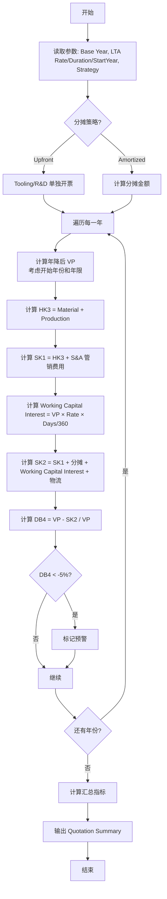

# Quotation Summary 计算逻辑

| 版本号 | 创建时间 | 更新时间 | 文档主题 | 创建人 |
|--------|----------|----------|----------|--------|
| v1.1   | 2026-02-03 | 2026-02-03 | Quotation Summary 计算逻辑 | Randy Luo |

---

## 1. 成本累加逻辑 (Cost Build-up)

这部分展示了成本是如何像"叠罗汉"一样一层层加上去的。

### 1.1 成本层级公式

| 列名 | 逻辑与公式 | 业务含义 |
|------|-----------|---------|
| **HK III /pic** | = Material Cost + Production | 制造成本 |
| **SK-1 /pic** | = HK III + (净销售额 × S&A Rate) | 完全成本（含基础管销费用） |
| **🆕 Tooling & Mould 1 /pic** | 来自 Tooling 表的分摊值（分组1） | 主模具分摊费 |
| **🆕 Tooling & Mould 2 /pic** | 来自 Tooling 表的分摊值（分组2） | 辅助模具分摊费 |
| **🆕 SAP Surcharge /pic** | = VP × SAP_Surcharge_Rate | SAP 系统附加费 |
| **Logistics /pic** | = VP × Logistics_Rate | 物流包装费 |
| **R&D Validation /pic** | 来自 R&D 表的分摊值 | 研发验证分摊费 |
| **Working Capital Interest...** | = VP × 利率 × (账期/360) | 营运资金利息（资金占用成本） |
| **🆕 Consign. Stock /pic** | = VP × Consign_Stock_Rate | 寄售库存/VMI 成本 |
| **SK-2 /pic** | = SK1 + ∑Tooling + SAP + Logistics + R&D + Interest + Consign | 项目全成本 (Project Full Cost) |

**🆕 SK-2 完整公式：**

$$SK\text{-}2 = SK\text{-}1 + Tooling\_1 + Tooling\_2 + SAP\_Surcharge + Logistics + R\&D + Interest_{Payment} + Consign\_Stock$$

### 1.2 数据示例解析

**2026年数据：**
- HK III: 46.238 = 27.055 (Material) + 19.18 (Production)
- S&A: 7.196 = 342,658 (Net Sales) × 2.1%
- SK-1: 53.434 = 46.238 + 7.196 (S&A)
- Tooling 1: 6.40（主模具，含 Capital Interest）
- Tooling 2: 1.80（辅助模具）
- SAP Surcharge: 0.29（0.5% of VP）
- Logistics: 0.56
- R&D: 0.54
- Interest: 0.73
- Consign. Stock: 1.16（2% of VP）
- SK-2: 53.434 + 6.40 + 1.80 + 0.29 + 0.56 + 0.54 + 0.73 + 1.16 = **64.81**

**关键观察：**
- 2026/27年有 Tooling 分摊，但 2028年变为 0
- 说明模具费在两年内摊销完了（与 BC 文档的摊销策略一致）
- 🆕 多模具分组支持不同生命周期的投资项

---

## 2. 销售与利润逻辑 (Sales & Margin)

这部分展示了卖多少钱，赚多少钱。

### 2.1 利润指标公式

| 列名 | 逻辑与公式 | 业务含义 |
|------|-----------|---------|
| **VP /pic** | 销售单价 | 给客户的开票价格 |
| **DB4** | = (VP - SK2) / VP | 净利率 (Net Margin) - 最关键指标 |
| **DB4 Value** | = DB4 × 销量 | 净利总额 |
| **DB1 considering all** | = (VP - HK3 - 分摊) / VP | 边际贡献 (含分摊) |

### 2.2 数据示例

**2026年：**
- VP: 57.90
- SK2: 63.85
- DB4: (57.90 - 63.85) / 57.90 = **-10.29%** ⚠️
- DB4 Value: -10.29% × 7,085 (销量) = **-72,952 元** (亏损)

**2027年：**
- VP: 56.16 (年降 3%)
- DB4: **-13.66%** ⚠️

**2028年：**
- VP: 54.48 (继续年降)
- SK2: 55.05 (模具摊销结束，成本下降)
- DB4: **-1.06%** (接近回正)

---

## 3. 关键数据现象解读 (Business Insights)

### 3.1 "前亏后盈"的策略 (Amortization Impact)

**亏损期 (2026/2027)：**
- SK-2 (63.85) 高于 VP (57.90)
- 原因：背负沉重的 Tooling (6.4) 和 R&D (0.54) 分摊
- 结果：DB4 为负 (-10.29%, -13.66%)

**盈利期 (2028)：**
- SK-2 (55.05) 降下来（模具摊销结束）
- VP (54.48) 虽然降价，但成本降得更多
- 结果：DB4 接近回正 (-1.06%)

### 3.2 年降 (Productivity / Price Reduction)

**VP /pic 列变化：**
- 57.90 (2026) → 56.16 (2027) → 54.48 (2028)
- 典型的 **3% 年降 (LTA)**

**Productivity 列：**
- 2027/2028 显示 "3.00%"
- 含义：Controlling 强制要求工厂每年提高 3% 生产效率

---

## 4. SmartQuote 系统开发建议

### 4.1 生命周期计算引擎

**需求：**
- 不能只算一个静态价格
- 必须输入：Start Year, End Year, **年降参数**
- 系统自动生成 3-5 年的表格

**年降参数定义：**

| 参数 | 说明 | 默认值 |
|------|------|--------|
| **LTA Rate (年降比例)** | 每年价格下降幅度 | 3% |
| **LTA Duration (年降年限)** | 年降持续的年数 | 3 年 |
| **LTA Start Year (开始年份)** | 从第几年开始年降 | 2（第二年） |

**年降计算公式：**

```python
def calculate_price_with_lta(
    base_price: Decimal,
    lta_rate: Decimal,       # 年降比例，如 0.03
    lta_duration: int,       # 年降年限，如 3
    lta_start_year: int,     # 开始年份，如 2
    current_year: int        # 当前年份（相对于 SOP）
) -> Decimal:
    """
    计算年降后价格

    业务规则：
    - 第 1 年（SOP）：使用基准价格，无年降
    - 第 N 年（N >= 开始年份 且 N < 开始年份 + 年降年限）：执行年降
    - 第 N 年（N >= 开始年份 + 年降年限）：保持最后一年的价格
    """
    if current_year < lta_start_year:
        # 年降开始前，使用基准价格
        return base_price
    elif current_year < lta_start_year + lta_duration:
        # 年降期间，累计降幅
        years_of_reduction = current_year - lta_start_year + 1
        total_reduction = lta_rate * years_of_reduction
        return base_price * (1 - total_reduction)
    else:
        # 年降结束后，保持最后价格
        final_reduction = lta_rate * lta_duration
        return base_price * (1 - final_reduction)

# 示例：
# base_price = 57.90, lta_rate = 3%, lta_duration = 3, lta_start_year = 2
# 第1年: 57.90 (无年降)
# 第2年: 57.90 × (1 - 0.03) = 56.16
# 第3年: 57.90 × (1 - 0.06) = 54.48
# 第4年: 57.90 × (1 - 0.09) = 52.69
# 第5年及以后: 52.69 (保持)
```

**示例计算：**

| 年份 | 单价 | 年降 | 累计降幅 |
|------|------|------|---------|
| 第1年 (SOP) | ¥57.90 | - | 0% |
| 第2年 | ¥56.16 | -3% | 3% |
| 第3年 | ¥54.48 | -3% | 6% |
| 第4年 | ¥52.69 | -3% | 9% |
| 第5年及以后 | ¥52.69 | - | 9% |

### 4.2 分摊策略配置

**前端选项：Amortization Strategy (分摊策略)**

| 策略 | 说明 | 效果 |
|------|------|------|
| **Upfront (一次性支付)** | 客户单独支付模具费 | Tooling 列为 0，第一年利润好看 |
| **Amortized (分摊进单价)** | 模具费分摊到单价中 | Tooling 列有数值，前两年利润通常为负 |

### 4.3 红色预警功能

**触发条件：**
- 如果计算出某年的 DB4 < -5%

**提示文案：**
> "⚠️ 注意！前两年亏损严重（DB4 = -10.29%），请确认是否包含战略意图。"

**业务价值：**
- 这部分数据是 Sales 和 Controlling 吵架最凶的地方
- Sales 想降价拿单，Controlling 指着负的 DB4 说不行
- 系统清晰呈现这一点，价值巨大

---

## 5. 数据模型定义

### 5.1 QuotationSummaryResponse 响应模型

```python
from typing import Literal
from pydantic import BaseModel, Field
from decimal import Decimal

class QuotationYearData(BaseModel):
    """单年度报价数据"""
    year: int
    volume: int

    # 成本
    material_cost: Decimal     # Material Cost
    production_cost: Decimal   # Production Cost
    hk_3: Decimal              # HK III 制造成本
    sk_1: Decimal              # SK-1 完全成本（不含分摊）
    tooling_amort: Decimal     # Tooling 分摊（含 Capital Interest）
    rnd_amort: Decimal         # R&D 分摊
    working_capital_interest: Decimal  # 营运资金利息（资金占用成本）
    logistics: Decimal         # 物流费用
    sk_2: Decimal              # SK-2 项目全成本

    # 销售
    vp: Decimal                # VP 销售单价
    net_sales: Decimal         # 净销售额 = VP × Volume

    # 利润
    db4_rate: Decimal          # DB4 净利率
    db4_value: Decimal         # DB4 净利总额
    db1_rate: Decimal          # DB1 边际贡献率

    # 预警
    is_warning: bool = False   # 是否预警 (DB4 < -5%)


class AmortizationStrategy(str):
    """分摊策略"""
    UPFRONT = "upfront"           # 一次性支付
    AMORTIZED = "amortized"       # 分摊进单价


class QuotationSummaryParams(BaseModel):
    """报价汇总参数"""
    project_id: str
    base_year: int
    end_year: int

    # 年降参数（三要素）
    lta_rate: Decimal = Field(default=Decimal("0.03"), description="年降比例")
    lta_duration: int = Field(default=3, description="年降年限（持续几年）")
    lta_start_year: int = Field(default=2, description="年降开始年份（相对于SOP，默认第2年）")

    sa_rate: Decimal = Field(default=Decimal("0.021"), description="管销费用率 (S&A Rate, 默认 2.1%)")
    payment_terms_days: int = Field(default=90, description="付款账期（天）")
    interest_rate: Decimal = Field(default=Decimal("0.05"), description="年利率")
    amortization_strategy: AmortizationStrategy
    amortization_years: int | None = Field(default=2, description="分摊年限")


class QuotationSummaryResponse(BaseModel):
    """Quotation Summary 计算响应"""
    params: QuotationSummaryParams
    yearly_data: list[QuotationYearData]

    # 汇总指标
    total_db4_value: Decimal     # 全生命周期净利总额
    weighted_db4_rate: Decimal   # 加权平均净利率
    break_even_year: int | None  # 盈亏平衡年份
    warning_years: list[int]     # 预警年份列表
```

### 5.2 计算公式汇总

```python
# 成本累加
hk_3 = material_cost + production_cost
sk_1 = hk_3 + (net_sales * sa_rate)  # S&A 管销费用

# 营运资金利息（Working Capital Interest）
working_capital_interest = vp * interest_rate * (payment_terms_days / 360)

# 项目全成本
# 注意：tooling_amort 已包含 Capital Interest（模具分摊中的资本利息）
sk_2 = sk_1 + tooling_amort + rnd_amort + working_capital_interest + logistics

# 净利率
db4_rate = (vp - sk_2) / vp

# 边际贡献率
db1_rate = (vp - hk_3 - tooling_amort - rnd_amort) / vp

# 年降后的价格（使用三参数年降逻辑）
def calculate_vp_with_lta(vp_base_year, lta_rate, lta_duration, lta_start_year, year_n):
    """
    计算第 N 年的 VP（销售单价）

    业务规则：
    - 第 1 年（SOP）：无年降
    - 第 N 年（N >= 开始年份 且 N < 开始年份 + 年降年限）：累计年降
    - 第 N 年（N >= 开始年份 + 年降年限）：保持最后价格
    """
    if year_n < lta_start_year:
        return vp_base_year
    elif year_n < lta_start_year + lta_duration:
        years_of_reduction = year_n - lta_start_year + 1
        total_reduction = lta_rate * years_of_reduction
        return vp_base_year * (1 - total_reduction)
    else:
        final_reduction = lta_rate * lta_duration
        return vp_base_year * (1 - final_reduction)

vp_year_n = calculate_vp_with_lta(vp_base_year, lta_rate, lta_duration, lta_start_year, n)
```

---

## 6. 计算流程图



---

## 7. 与其他文档的关联

| 文档 | 关联点 |
|------|--------|
| [数据库设计.md](数据库设计.md) | 依赖 `projects`, `quote_summaries` 表 |
| [商业案例计算逻辑.md](商业案例计算逻辑.md) | 共享 HK/SK/DB 计算公式（唯一来源）|
| [NRE投资成本计算逻辑.md](NRE投资成本计算逻辑.md) | 投资分摊计算公式（唯一来源）|
| [投资回收期计算逻辑.md](投资回收期计算逻辑.md) | DB4 数据用于投资回收期分析 |

### 7.1 数据流向

```
┌─────────────────────────────────────────────────────────────┐
│                    BOM 解析引擎                              │
│  Material Cost → HK3 → SK1 → SK2 → VP → DB4                 │
└─────────────────────────────────────────────────────────────┘
                              ↓
┌─────────────────────────────────────────────────────────────┐
│                 Quotation Summary                           │
│  展示每年: VP, SK2, DB4, 预警                               │
└─────────────────────────────────────────────────────────────┘
                              ↓
┌─────────────────────────────────────────────────────────────┐
│                 Business Case                                │
│  汇总: 全生命周期 DB4, 盈亏平衡点                            │
└─────────────────────────────────────────────────────────────┘
```

---

## 8. 界面展示建议

### 8.1 表格列布局

| Year | Volume | HK3 | SK1 | Tooling<sup>1</sup> | R&D | Working Cap Interest<sup>2</sup> | SK2 | VP | DB4% | DB4 Value | 预警 |
|------|--------|-----|-----|---------|-----|----------|-----|----|----|-----------|----|
| 2026 | 7,085 | 46.24 | 54.33 | 6.40 | 0.54 | 0.73 | 63.85 | 57.90 | -10.29% | -72,952 | ⚠️ |
| 2027 | 8,500 | 44.85 | 52.70 | 6.40 | 0.54 | 0.70 | 62.01 | 56.16 | -10.40% | -88,400 | ⚠️ |
| 2028 | 9,000 | 43.50 | 51.12 | 0 | 0 | 0.68 | 55.05 | 54.48 | -1.06% | -9,540 | |

**注：**
1. **Tooling 列**：投资分摊费用（含资本利息）。详细计算公式见 [NRE投资成本计算逻辑.md](NRE投资成本计算逻辑.md#分摊计算) - 唯一来源
2. **Working Cap Interest 列**：营运资金利息，独立计算的资金占用成本，公式：`VP × 利率 × (账期/360)`

### 8.2 预警样式

**DB4 < -5%:** 红色背景 + ⚠️ 图标
**DB4 < 0%:** 黄色背景
**DB4 >= 0%:** 绿色背景

### 8.3 汇总卡片

```
┌─────────────────────────────────────────────────────────────┐
│  Quotation Summary 汇总                                      │
├─────────────────────────────────────────────────────────────┤
│  全生命周期净利:    -€ 170,892  ⚠️                           │
│  加权平均净利率:    -7.52%                                   │
│  盈亏平衡年份:      2029 (预计)                              │
│  预警年份:          2026, 2027                              │
└─────────────────────────────────────────────────────────────┘
```

---

**文档结束**
